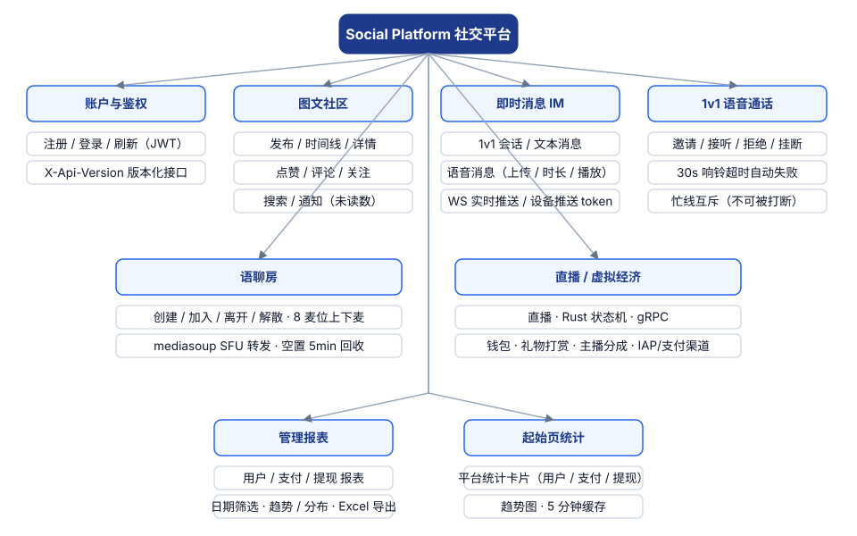
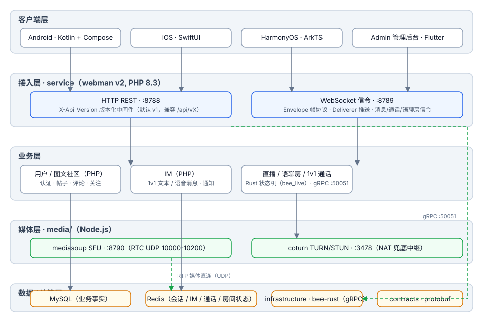
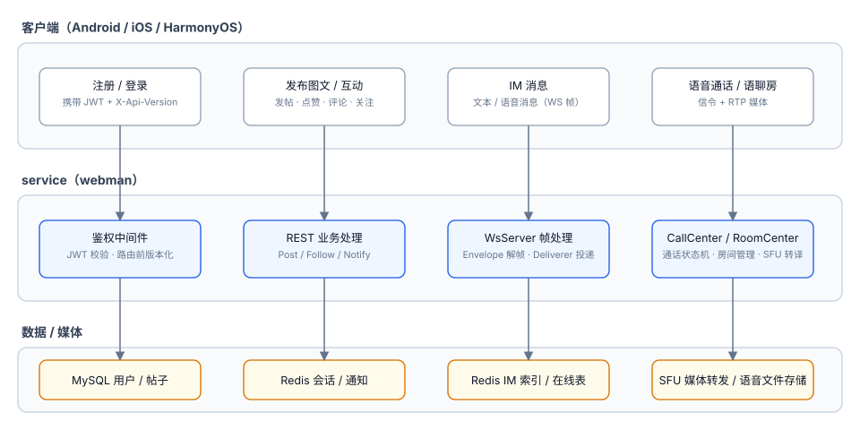
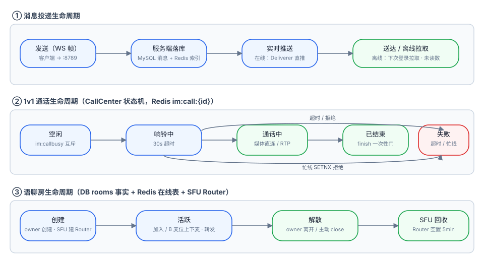
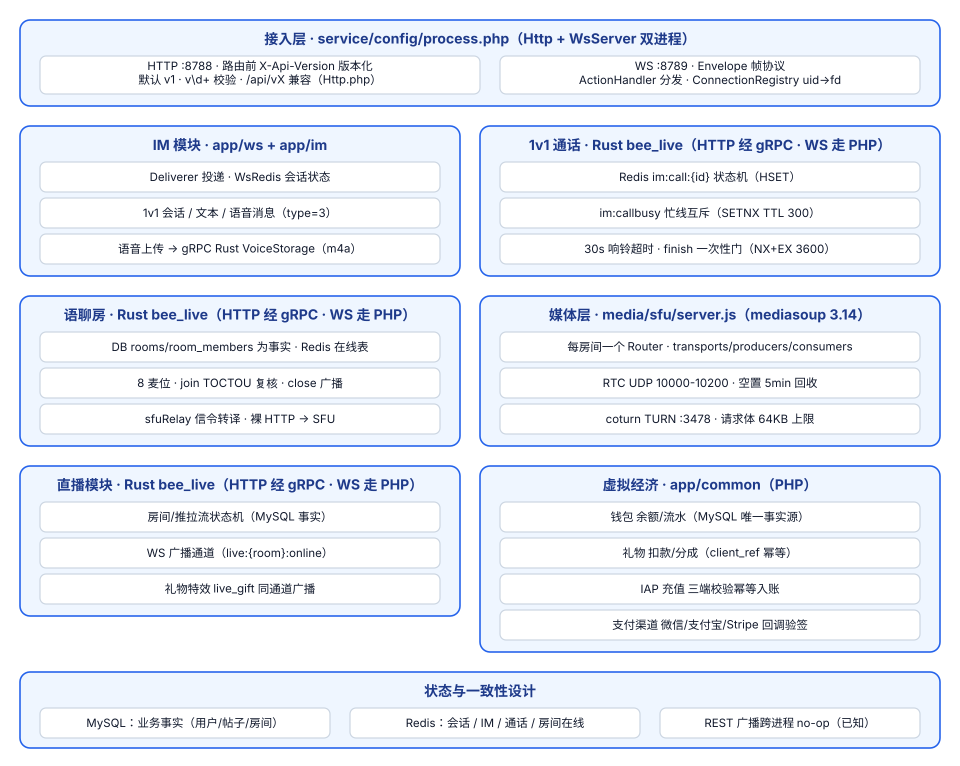

# Social Platform

**语言 / Languages:** [中文](README.md) · [English](README.en.md) · [한국어](README.ko.md) · [Русский](README.ru.md) · [Deutsch](README.de.md) · [Français](README.fr.md) · [Español](README.es.md) · [Português](README.pt.md) · [हिन्दी](README.hi.md) · [العربية](README.ar.md) · [বাংলা](README.bn.md) · [Bahasa Indonesia](README.id.md) · [日本語](README.ja.md)

多语言社交平台 monorepo：图文社区 + 即时消息 + 直播/语音 + 虚拟经济。

## 项目介绍

- **三端原生客户端**：Android（Kotlin + Compose）、iOS（SwiftUI）、HarmonyOS（ArkTS），另有 Flutter 管理后台
- **业务服务**：webman v2（PHP 8.3）承载 REST 与 WebSocket 双通道；API 通过 `X-Api-Version` 版本化（默认 v1，兼容 `/api/vX` 旧路径）
- **自建媒体层**：mediasoup SFU + coturn TURN，1v1 语音通话与语聊房（8 麦位）媒体转发
- **状态分层**：MySQL 为业务事实，Redis 承载会话 / IM / 通话 / 房间实时状态
- **里程碑**：M0–M4 已交付（语音消息、1v1 通话、语聊房）；M5 规划直播（SRS）与虚拟经济

## 功能总览



## 架构设计



## 业务核心流程



## 生命周期



## 功能设计



## 项目结构

| 目录 | 说明 | 技术 |
|------|------|------|
| contracts/ | gRPC 契约（proto，buf 生成入口） | protobuf / buf |
| service/ | 用户端业务服务（REST :8788 + WS :8789） | webman v2 (PHP 8.3) |
| admin/ | 管理后台（open-admin 改造） | webman v2 + Flutter |
| infrastructure/ | 高吞吐计算层 | bee-rust (tonic) |
| media/sfu/ | 自建媒体层（mediasoup SFU :8790 + coturn :3478） | Node.js（M4 启用） |
| apps/ | 三端原生客户端 | SwiftUI / Kotlin+Compose / ArkTS |

service 内部结构：

```
service/
├── app/
│   ├── controller/   # REST 控制器（auth/post/follow/im/voice/...）
│   ├── ws/           # WsServer · Envelope 帧协议 · Deliverer 推送 · ConnectionRegistry
│   ├── call/         # CallCenter：1v1 通话状态机（30s 响铃超时 · 忙线互斥）
│   ├── room/         # RoomCenter：语聊房（8 麦位 · SFU 信令转译）
│   ├── model/        # 数据模型
│   ├── process/      # Http / WsServer 自定义进程
│   └── storage/      # 语音文件存储（m4a，不入库）
├── config/           # route.php（/api/v1 路由组）· process.php（:8788/:8789）
└── tests/            # phpunit 单元测试 + im_e2e.php / voice_e2e.php 黑盒 E2E
```

## 使用说明

### 依赖

- PHP ≥ 8.3（composer）
- Redis（默认 127.0.0.1:6379）
- Node.js ≥ 18（SFU 本地调试）
- Docker（SFU / coturn 容器）

### 启动业务服务

```bash
cd service
composer install
php start.php start -d      # HTTP :8788 · WS :8789
```

按需在 `service/.env` 配置 `REDIS`、`SFU_URL`（默认 127.0.0.1:8790）。

### 启动媒体层

```bash
cd media/sfu
docker compose up -d --build   # SFU :8790（RTC UDP 10000-10200）· coturn :3478
```

### 客户端

| 端 | 打开 / 构建方式 | 平台要求 |
|----|----------------|----------|
| Android | `cd apps/android && ./gradlew assembleDebug` | Linux / macOS 可构建 |
| iOS | Xcode 打开 `apps/ios/SocialApp` | 需 macOS |
| HarmonyOS | DevEco Studio 打开 `apps/harmonyos` | 需 DevEco Studio |

### 测试

```bash
cd service
vendor/bin/phpunit                    # 单元测试（79 tests / 230 assertions）

php tests/im_e2e.php                  # IM 黑盒 E2E（需 :8788/:8789 运行中 + Redis）
php tests/voice_e2e.php               # 语音 E2E：版本化 / 语音消息 / 通话 / 语聊房

cd media/sfu
npm run smoke                         # SFU /signal 协议冒烟（需 Docker 容器或本地 node）
```

## 文档

- 总体设计：`docs/superpowers/specs/2026-08-16-social-platform-design.md`
- M4 语音设计：`docs/superpowers/specs/2026-08-17-m4-voice-design.md`
- 实施计划：`docs/superpowers/plans/2026-08-17-m4-voice.md`

## 欢迎支持

如果这个项目对你有帮助，欢迎扫描二维码打赏支持，谢谢！

**微信支付**


**支付宝**


**全球转账（Bank Transfer）**

**收款人信息**

| 项目 | 内容 |
|------|------|
| 收款人姓名 | WANG KEXUN |
| 收款账户号码 | 881015918251 |

**收款银行 — ZA Bank**

| 项目 | 内容 |
|------|------|
| SWIFT Code | AABLHKHHXXX |
| 银行名称 | ZA Bank Limited |
| 银行编号 | 387 |
| 银行地址 | Core F, Cyberport 3, 100 Cyberport Road, Hong Kong |

**跨境汇款代理银行（如需）**

> 以下为跨境汇款代理银行（中转银行）信息，非收款银行信息。请向汇款银行查询是否需要提供代理银行信息。

汇入港元、人民币及美元的代理银行为 **Citibank**：

| 项目 | 内容 |
|------|------|
| 银行名称 | Citibank N.A. Hong Kong |
| SWIFT Code | CITIHKHXXXX |
| 银行编号 | 006 |
| 分行名称 | Hong Kong Branch |
| 分行编号 | 391 |
| 银行地址 | Citibank Tower, Citibank Plaza, 3 Garden Road, Central, Hong Kong |

汇入其他币种时的代理银行为 **BNY Mellon**：

| 项目 | 内容 |
|------|------|
| 银行名称 | THE BANK OF NEW YORK MELLON |
| SWIFT Code | IRVTUS3NXXX |
| 银行地址 | THE BANK OF NEW YORK MELLON, 240 GREENWICH STREET, NEW YORK, United States |
