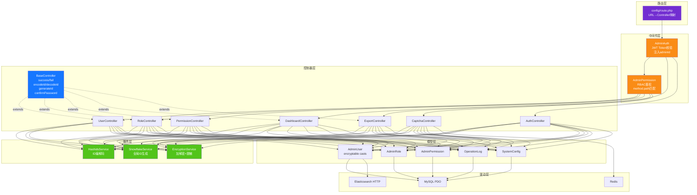

# 后端分层架构

```mermaid
flowchart TD
    subgraph route["路由层"]
        r1["config/route.php<br/>URL→Controller映射"]
    end

    subgraph middleware["中间件层"]
        m1["AdminAuth<br/>JWT Token校验<br/>注入adminId"]
        m2["AdminPermission<br/>RBAC鉴权<br/>method.path匹配"]
    end

    subgraph controller["控制器层"]
        base["BaseController<br/>success/fail<br/>encodeId/decodeId<br/>generateId<br/>confirmPassword"]
        user["UserController"]
        role["RoleController"]
        perm["PermissionController"]
        dash["DashboardController"]
        export["ExportController"]
        captcha["CaptchaController"]
        auth["AuthController"]
    end

    subgraph service["服务层"]
        s1["HashidsService<br/>ID编解码"]
        s2["SnowflakeService<br/>全局ID生成"]
        s3["EncryptionService<br/>加解密+脱敏"]
    end

    subgraph model["模型层"]
        md1["AdminUser<br/>encryptable casts"]
        md2["AdminRole"]
        md3["AdminPermission"]
        md4["OperationLog"]
        md5["SystemConfig"]
    end

    subgraph driver["驱动层"]
        d1["MySQL PDO"]
        d2["Elasticsearch HTTP"]
        d3["Redis"]
    end

    r1 --> m1 --> m2
    m2 --> user & role & perm & dash & export
    m1 --> captcha & auth
    base -.->|extends| user & role & perm & dash & export
    user & role & perm & dash & export & captcha & auth --> s1 & s2 & s3
    user & role & perm & dash & export & captcha & auth --> md1 & md2 & md3 & md4 & md5
    md1 & md2 & md3 & md4 & md5 --> d1
    md1 --> d2
    captcha --> d3

    style r1 fill:#722ED1,color:#fff
    style m1 fill:#FA8C16,color:#fff
    style m2 fill:#FA8C16,color:#fff
    style base fill:#1677FF,color:#fff
    style s1 fill:#52C41A,color:#fff
    style s2 fill:#52C41A,color:#fff
    style s3 fill:#52C41A,color:#fff
```
