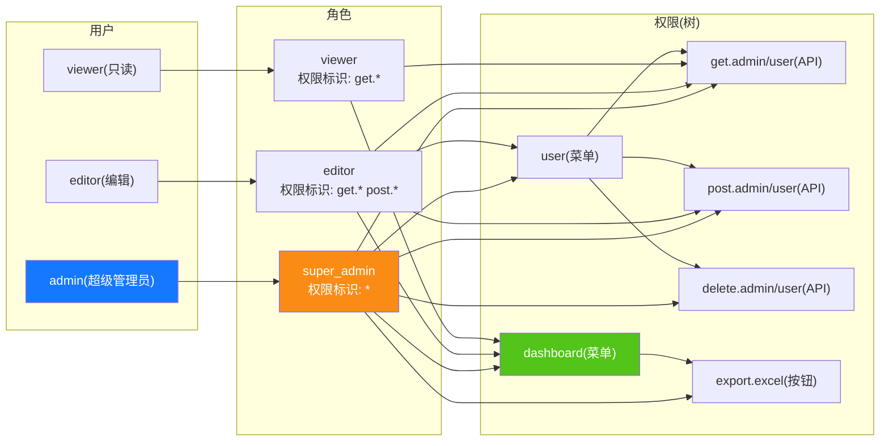
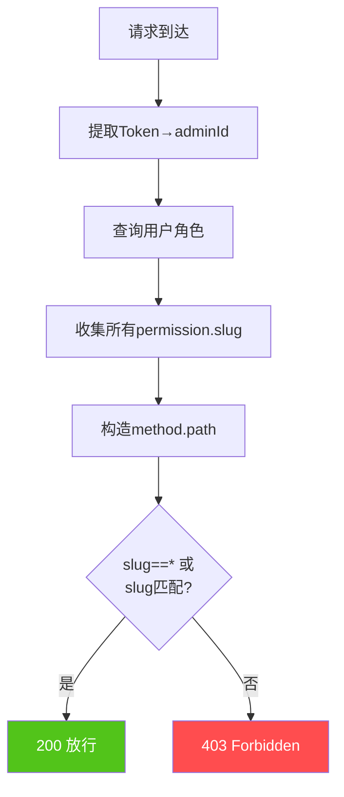
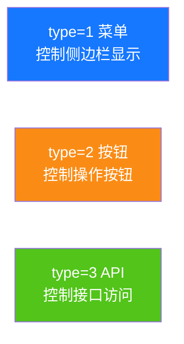

# RBAC 权限模型

## 用户-角色-权限关系

```mermaid
flowchart LR
    subgraph users["用户"]
        u1["admin(超级管理员)"]
        u2["editor(编辑)"]
        u3["viewer(只读)"]
    end

    subgraph roles["角色"]
        r1["super_admin<br/>权限标识: *"]
        r2["editor<br/>权限标识: get.* post.*"]
        r3["viewer<br/>权限标识: get.*"]
    end

    subgraph permissions["权限(树)"]
        p1["dashboard(菜单)"]
        p2["user(菜单)"]
        p3["get.admin/user(API)"]
        p4["post.admin/user(API)"]
        p5["delete.admin/user(API)"]
        p6["export.excel(按钮)"]
    end

    u1 --> r1
    u2 --> r2
    u3 --> r3
    r1 --> p1 & p2 & p3 & p4 & p5 & p6
    r2 --> p1 & p2 & p3 & p4
    r3 --> p1 & p3
    p2 --> p3 & p4 & p5
    p1 --> p6

    style u1 fill:#1677FF,color:#fff
    style r1 fill:#FA8C16,color:#fff
    style p1 fill:#52C41A,color:#fff
```

## 权限判定流程

```mermaid
flowchart TD
    start["请求到达"] --> extract["提取Token→adminId"]
    extract --> findRoles["查询用户角色"]
    findRoles --> collectSlug["收集所有permission.slug"]
    collectSlug --> buildKey["构造method.path"]
    buildKey --> check{"slug==* 或<br/>slug匹配?"}
    check -->|"是"| allow["200 放行"]
    check -->|"否"| deny["403 Forbidden"]

    style allow fill:#52C41A,color:#fff
    style deny fill:#FF4D4F,color:#fff
```

## 权限类型

```mermaid
flowchart LR
    t1["type=1 菜单<br/>控制侧边栏显示"]
    t2["type=2 按钮<br/>控制操作按钮"]
    t3["type=3 API<br/>控制接口访问"]

    style t1 fill:#1677FF,color:#fff
    style t2 fill:#FA8C16,color:#fff
    style t3 fill:#52C41A,color:#fff
```
