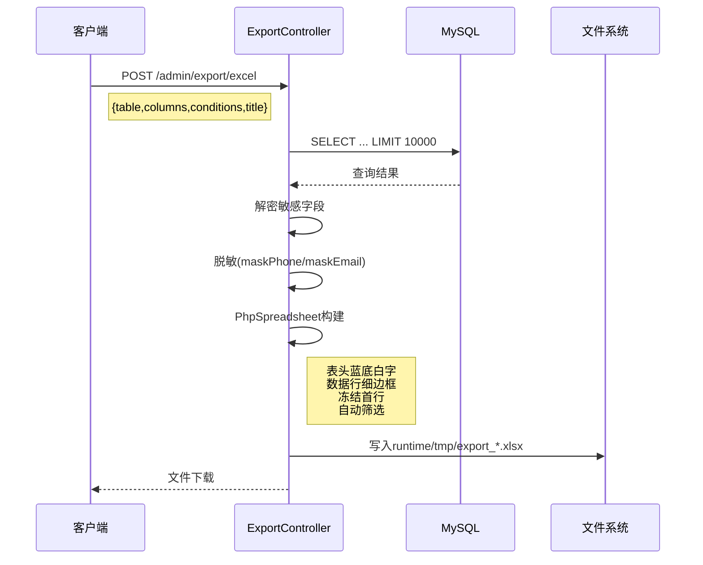
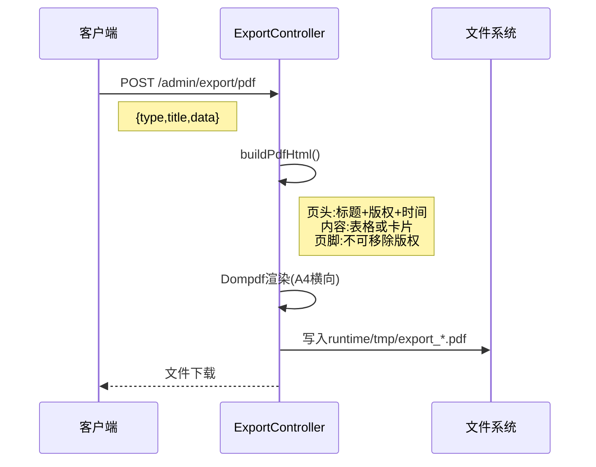

# 导出业务流程

## Excel 导出

```mermaid
sequenceDiagram
    participant C as 客户端
    participant CTL as ExportController
    participant DB as MySQL
    participant FS as 文件系统

    C->>CTL: POST /admin/export/excel
    Note right of C: {table,columns,conditions,title}
    CTL->>DB: SELECT ... LIMIT 10000
    DB-->>CTL: 查询结果
    CTL->>CTL: 解密敏感字段
    CTL->>CTL: 脱敏(maskPhone/maskEmail)
    CTL->>CTL: PhpSpreadsheet构建
    Note right of CTL: 表头蓝底白字<br/>数据行细边框<br/>冻结首行<br/>自动筛选
    CTL->>FS: 写入runtime/tmp/export_*.xlsx
    CTL-->>C: 文件下载
```

## PDF 导出

```mermaid
sequenceDiagram
    participant C as 客户端
    participant CTL as ExportController
    participant FS as 文件系统

    C->>CTL: POST /admin/export/pdf
    Note right of C: {type,title,data}
    CTL->>CTL: buildPdfHtml()
    Note right of CTL: 页头:标题+版权+时间<br/>内容:表格或卡片<br/>页脚:不可移除版权
    CTL->>CTL: Dompdf渲染(A4横向)
    CTL->>FS: 写入runtime/tmp/export_*.pdf
    CTL-->>C: 文件下载
```
