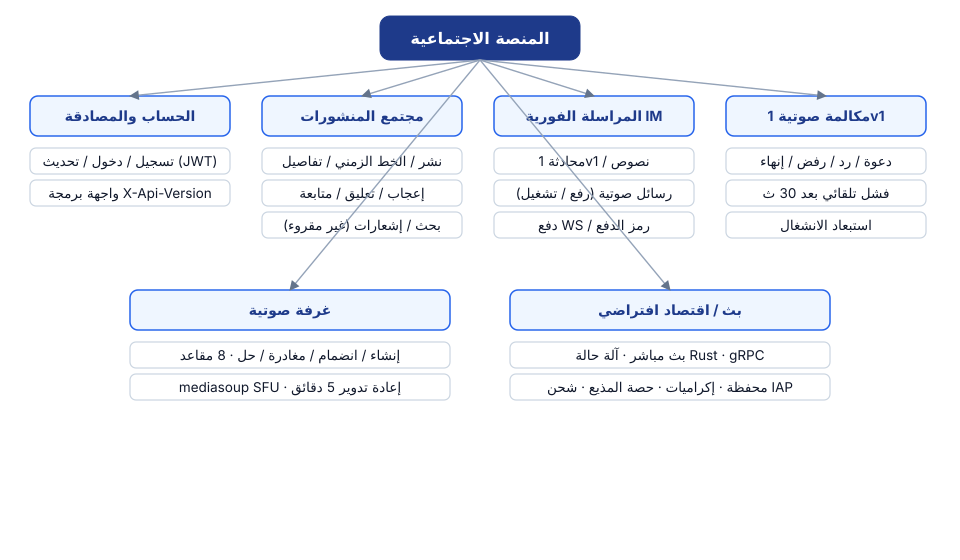
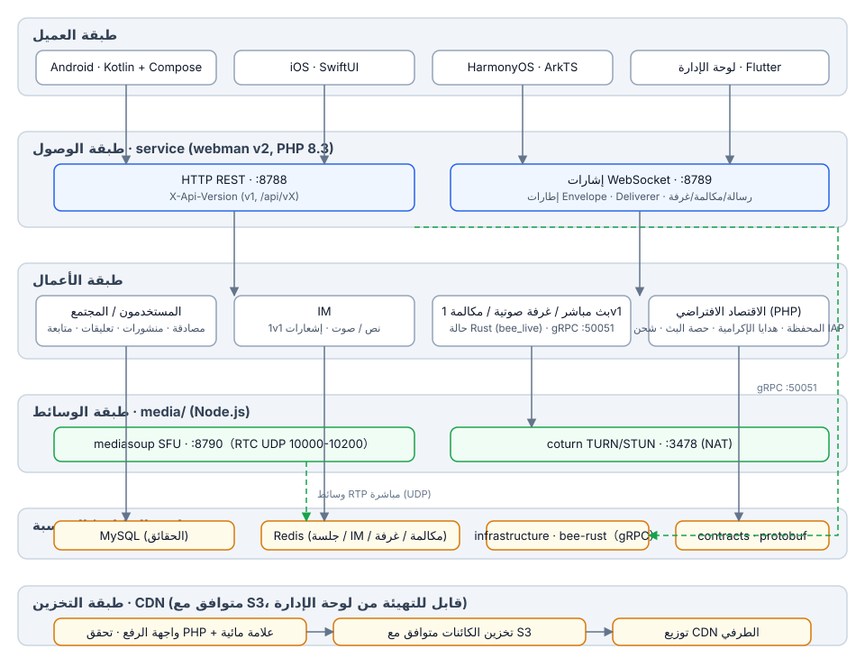
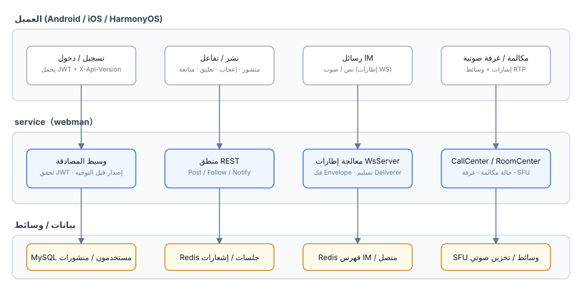
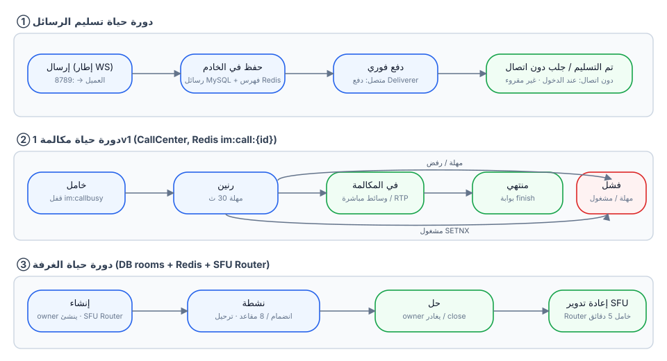
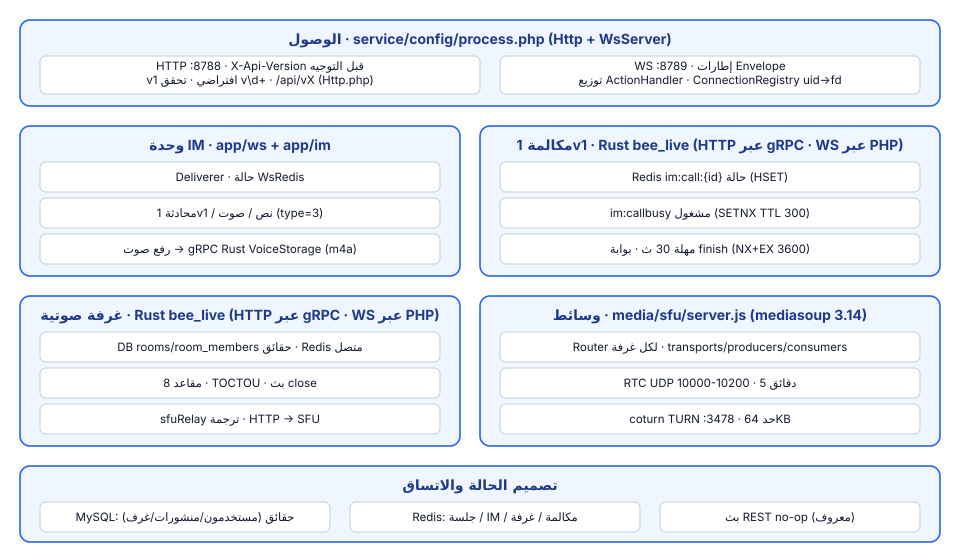

# منصة اجتماعية

**语言 / Languages:** [中文](../README.md) · [English](README.en.md) · [한국어](README.ko.md) · [Русский](README.ru.md) · [Deutsch](README.de.md) · [Français](README.fr.md) · [Español](README.es.md) · [Português](README.pt.md) · [हिन्दी](README.hi.md) · [العربية](README.ar.md) · [বাংলা](README.bn.md) · [Bahasa Indonesia](README.id.md) · [日本語](README.ja.md)

مستودع واحد (monorepo) لمنصة اجتماعية متعددة اللغات: مجتمع نصوص/صور + مراسلة فورية + بث مباشر/صوت + اقتصاد افتراضي.

## مقدمة المشروع

- **ثلاثة عملاء أصليون**: Android (Kotlin + Compose) وiOS (SwiftUI) وHarmonyOS (ArkTS)، بالإضافة إلى لوحة إدارة Flutter
- **خدمات الأعمال**: webman v2 (PHP 8.3) يقدم قناتي REST وWebSocket معًا؛ مآلات الحالة للبث المباشر/الغرف الصوتية/مكالمات 1v1 هُجرت إلى Rust (infrastructure/bee-rust)؛ وحدات التحكم PHP تتصل مباشرة عبر gRPC؛ إصدارات API عبر `X-Api-Version` (الافتراضي v1، متوافق مع المسارات القديمة `/api/vX`)
- **طبقة وسائط مبنية داخليًا**: mediasoup SFU + coturn TURN لنقل الوسائط في مكالمات الصوت 1v1 وغرف الدردشة الصوتية (8 مقاعد)
- **تقسيم الحالة**: MySQL كمصدر حقيقة للأعمال، وRedis لحالة الجلسة / المراسلة / المكالمة / الغرفة لحظيًا
- **المعالم**: اكتمل M0–M5 (الرسائل الصوتية، مكالمات 1v1، غرف الدردشة الصوتية، البث المباشر)؛ M6a يقدّم الاقتصاد الافتراضي: المحفظة (الرصيد/السجل، MySQL مصدر الحقيقة الوحيد)، هدايا الإكرامية مع حصة البث، والشحن عبر IAP (App Store / Google Play / Huawei)

## نظرة عامة على الميزات



## تصميم البنية



## العمليات الأساسية



## دورة الحياة



## تصميم الوحدات



## هيكل المشروع

| الدليل | الوصف | التقنية |
|------|------|------|
| contracts/ | عقود gRPC (proto، نقطة دخول توليد buf) | protobuf / buf |
| service/ | خدمة الأعمال لجهة المستخدم (REST :8788 + WS :8789) | webman v2 (PHP 8.3) |
| admin/ | لوحة الإدارة (مبنية على open-admin) | webman v2 + Flutter |
| infrastructure/ | طبقة الحوسبة عالية الإنتاجية (خدمات gRPC للبث/الصوت) | bee-rust (tonic) |
| media/sfu/ | طبقة الوسائط المبنية داخليًا (mediasoup SFU :8790 + coturn :3478) | Node.js (مفعّلة في M4) |
| apps/ | ثلاثة عملاء أصليين | SwiftUI / Kotlin+Compose / ArkTS |

البنية الداخلية لـ service:

```
service/
├── app/
│   ├── controller/   # وحدات تحكم REST (auth/post/follow/im/voice/wallet/gift/...)
│   ├── common/        # WalletService (الرصيد/السجل/القيود) · GiftService (الهدايا/الحصة)
│   ├── ws/           # WsServer · بروتوكول إطارات Envelope · دفع Deliverer · ConnectionRegistry
│   ├── call/         # CallCenter: آلة حالات مكالمات 1v1 (تم ترحيله إلى Rust في M6؛ جانب PHP محفوظ لإشارات WS)
│   ├── room/         # RoomCenter: غرف الدردشة الصوتية (تم ترحيله إلى Rust في M6؛ جانب PHP محفوظ لإشارات WS)
│   ├── live/         # LiveCenter: غرف البث المباشر (تم ترحيله إلى Rust في M6؛ جانب PHP محفوظ لإشارات WS)
│   ├── model/        # نماذج البيانات
│   ├── process/      # عمليات Http / WsServer المخصصة
│   └── storage/      # تخزين ملفات الصوت (m4a؛ تتولاه Rust VoiceStorage منذ M6)
├── config/           # route.php (مجموعة مسارات /api/v1) · process.php (:8788/:8789)
└── tests/            # اختبارات phpunit + اختبارات E2E للصندوق الأسود im_e2e.php / voice_e2e.php / live_e2e.php / wallet_e2e.php
```

## تعليمات الاستخدام

### المتطلبات

- PHP ≥ 8.3 (composer)
- Redis (الافتراضي 127.0.0.1:6379)
- Node.js ≥ 18 (تصحيح أخطاء SFU محليًا)
- Docker (حاويات SFU / coturn)

### تشغيل خدمة الأعمال

```bash
cd service
composer install
php start.php start -d      # HTTP :8788 · WS :8789
```

اضبط `REDIS` و`SFU_URL` (الافتراضي 127.0.0.1:8790) في `service/.env` حسب الحاجة.

### تشغيل طبقة الوسائط

```bash
cd media/sfu
docker compose up -d --build   # SFU :8790 (RTC UDP 10000-10200) · coturn :3478
```

### العملاء

| المنصة | طريقة الفتح / البناء | متطلبات المنصة |
|----|----------------|----------|
| Android | `cd apps/android && ./gradlew assembleDebug` | قابل للبناء على Linux / macOS |
| iOS | افتح `apps/ios/SocialApp` في Xcode | يتطلب macOS |
| HarmonyOS | افتح `apps/harmonyos` في DevEco Studio | يتطلب DevEco Studio |

### الاختبارات

```bash
cd service
vendor/bin/phpunit                    # اختبارات الوحدة (79 tests / 230 assertions)

php tests/im_e2e.php                  # اختبار E2E للصندوق الأسود للمراسلة (يتطلب تشغيل :8788/:8789 + Redis)
php tests/voice_e2e.php               # اختبار E2E للصوت: الإصدارات / الرسائل الصوتية / المكالمات / غرف الدردشة الصوتية
php tests/live_e2e.php                # E2E مباشر: الغرف / دانماكو / الميكروفونات / الإغلاق (دفع RTMP، سحب HLS)

cd media/sfu
npm run smoke                         # اختبار تدخيني لبروتوكول SFU /signal (يتطلب حاوية Docker أو node محلي)
```

## مرحباً بدعمكم

إذا كان هذا المشروع مفيداً لك، امسح رمز QR لدعمنا، شكراً!

**WeChat Pay**


**Alipay**


**تحويل مصرفي عالمي**


إذا وجدت هذا المشروع مفيدًا، فنحن نرحب بدعم التطوير عبر تحويل بنكي عالمي.

**معلومات المستلم**

| البند | المحتوى |
|------|------|
| اسم المستلم | WANG KEXUN |
| رقم حساب المستلم | 881015918251 |

**البنك المستلم — ZA Bank**

| البند | المحتوى |
|------|------|
| SWIFT Code | AABLHKHHXXX |
| اسم البنك | ZA Bank Limited |
| رقم البنك | 387 |
| عنوان البنك | Core F, Cyberport 3, 100 Cyberport Road, Hong Kong |

**البنك المراسل للتحويلات عبر الحدود (إذا لزم الأمر)**

> فيما يلي معلومات البنك المراسل (البنك الوسيط) للتحويلات عبر الحدود، وليست معلومات البنك المستلم. يرجى الاستفسار من البنك المُرسِل عما إذا كانت معلومات البنك المراسل مطلوبة.

البنك المراسل للتحويلات بالدولار الهونغ كونغي واليوان والدولار الأمريكي هو **Citibank**:

| البند | المحتوى |
|------|------|
| اسم البنك | Citibank N.A. Hong Kong |
| SWIFT Code | CITIHKHXXXX |
| رقم البنك | 006 |
| اسم الفرع | Hong Kong Branch |
| رقم الفرع | 391 |
| عنوان البنك | Citibank Tower, Citibank Plaza, 3 Garden Road, Central, Hong Kong |

البنك المراسل للتحويلات بالعملات الأخرى هو **BNY Mellon**:

| البند | المحتوى |
|------|------|
| اسم البنك | THE BANK OF NEW YORK MELLON |
| SWIFT Code | IRVTUS3NXXX |
| عنوان البنك | THE BANK OF NEW YORK MELLON, 240 GREENWICH STREET, NEW YORK, United States |


## التوثيق

- التصميم العام: `superpowers/specs/2026-08-16-social-platform-design.md`
- تصميم الصوت M4: `superpowers/specs/2026-08-17-m4-voice-design.md`
- خطة التنفيذ: `superpowers/plans/2026-08-17-m4-voice.md`
