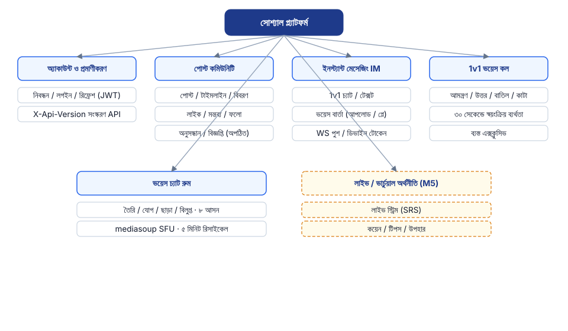
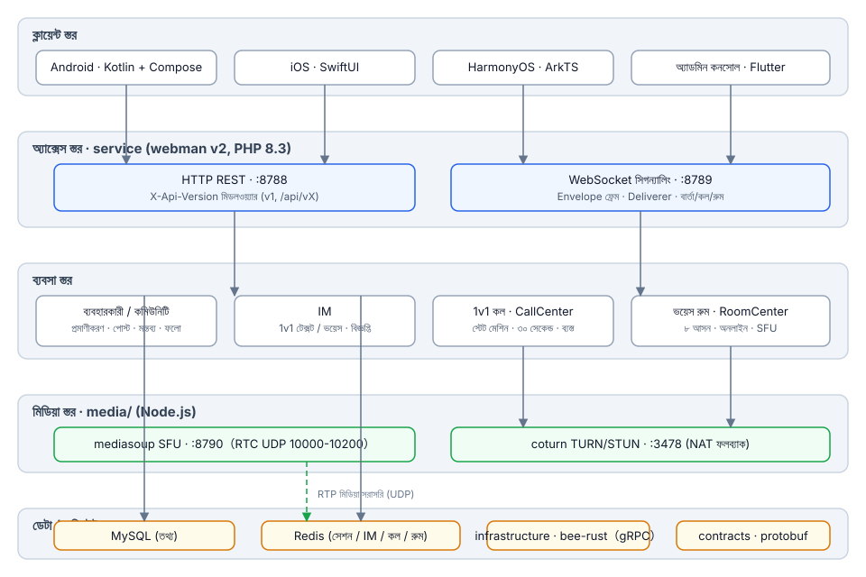
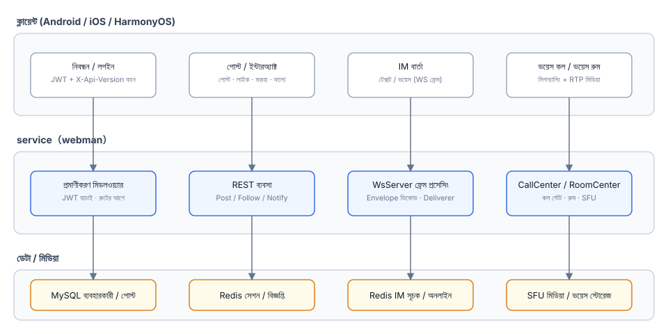
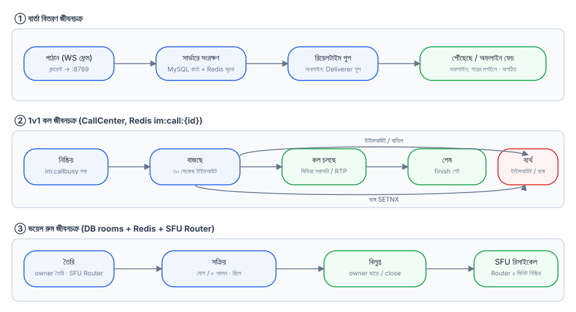
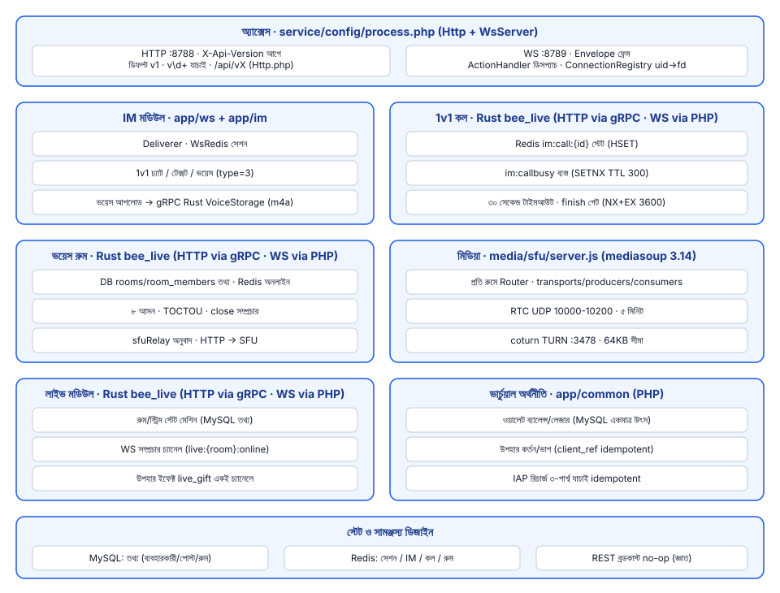

# সোশ্যাল প্ল্যাটফর্ম

**语言 / Languages:** [中文](../README.md) · [English](README.en.md) · [한국어](README.ko.md) · [Русский](README.ru.md) · [Deutsch](README.de.md) · [Français](README.fr.md) · [Español](README.es.md) · [Português](README.pt.md) · [हिन्दी](README.hi.md) · [العربية](README.ar.md) · [বাংলা](README.bn.md) · [Bahasa Indonesia](README.id.md) · [日本語](README.ja.md)

বহুভাষিক সোশ্যাল প্ল্যাটফর্ম মনোরিপো: টেক্সট/ইমেজ কমিউনিটি + ইনস্ট্যান্ট মেসেজিং + লাইভ/ভয়েস + ভার্চুয়াল ইকোনমি।

## প্রকল্প পরিচিতি

- **তিনটি নেটিভ ক্লায়েন্ট**: Android (Kotlin + Compose), iOS (SwiftUI), HarmonyOS (ArkTS), সাথে Flutter অ্যাডমিন কনসোল
- **বিজনেস সার্ভিস**: webman v2 (PHP 8.3) REST এবং WebSocket উভয় চ্যানেল পরিচালনা করে; লাইভ / ভয়েস রুম / 1v1 কল স্টেট মেশিন Rust-এ মাইগ্রেট হয়েছে (infrastructure/bee-rust); PHP কন্ট্রোলার gRPC-তে সরাসরি সংযুক্ত; API-র ভার্সন `X-Api-Version` দিয়ে হয় (ডিফল্ট v1, পুরনো `/api/vX` পাথের সাথে সামঞ্জস্যপূর্ণ)
- **নিজস্ব মিডিয়া লেয়ার**: mediasoup SFU + coturn TURN, 1v1 ভয়েস কল এবং ভয়েস চ্যাট রুম (৮টি সিট) এর মিডিয়া ফরওয়ার্ডিংয়ের জন্য
- **স্টেট লেয়ারিং**: MySQL ব্যবসার তথ্যের উৎস, Redis সেশন / IM / কল / রুমের রিয়েল-টাইম অবস্থার জন্য
- **মাইলস্টোন**: M0–M5 ডেলিভারি সম্পন্ন (ভয়েস মেসেজ, 1v1 কল, ভয়েস চ্যাট রুম, লাইভ স্ট্রিমিং); M6a ভার্চুয়াল অর্থনীতি ডেলিভারি করে: ওয়ালেট (ব্যালেন্স/লেজার, MySQL একমাত্র সত্যের উৎস), গিফট টিপিং ও স্ট্রিমার শেয়ার, মোবাইল IAP রিচার্জ (App Store / Google Play / Huawei); M6b পেমেন্ট চ্যানেল ডেলিভারি করে: টপ-আপ ক্রেডিট স্কেলটন (WeChat/Alipay/Stripe কলব্যাক স্বাক্ষর যাচাই, সার্ভার-সাইড প্রাইসিং, আইডেম্পোটেন্ট ক্রেডিট; উইথড্রয়াল/রিকনসিলিয়েশন পরে)

## ফিচার ওভারভিউ



## আর্কিটেকচার ডিজাইন



## মূল বিজনেস প্রক্রিয়া



## লাইফসাইকেল



## মডিউল ডিজাইন



## প্রজেক্ট স্ট্রাকচার

| ডিরেক্টরি | বিবরণ | প্রযুক্তি |
|------|------|------|
| contracts/ | gRPC কন্ট্রাক্ট (proto, buf জেনারেশন এন্ট্রি) | protobuf / buf |
| service/ | ইউজার-সাইড বিজনেস সার্ভিস (REST :8788 + WS :8789) | webman v2 (PHP 8.3) |
| admin/ | অ্যাডমিন কনসোল (open-admin ভিত্তিক) | webman v2 + Flutter |
| infrastructure/ | উচ্চ-থ্রুপুট কম্পিউট লেয়ার (live/voice gRPC পরিষেবা) | bee-rust (tonic) |
| media/sfu/ | নিজস্ব মিডিয়া লেয়ার (mediasoup SFU :8790 + coturn :3478) | Node.js (M4-এ সক্রিয়) |
| apps/ | তিনটি নেটিভ ক্লায়েন্ট | SwiftUI / Kotlin+Compose / ArkTS |

service-এর অভ্যন্তরীণ কাঠামো:

```
service/
├── app/
│   ├── controller/   # REST কন্ট্রোলার (auth/post/follow/im/voice/wallet/gift/...)
│   ├── common/        # WalletService (ব্যালেন্স/লেজার/আইডেম্পোটেন্ট) · GiftService (গিফট/শেয়ার)
│   ├── ws/           # WsServer · Envelope ফ্রেম প্রোটোকল · Deliverer পুশ · ConnectionRegistry
│   ├── call/         # CallCenter: 1v1 কল স্টেট মেশিন (M6-এ Rust-এ স্থানান্তরিত; WS সিগন্যালিংয়ের জন্য PHP পাশ রাখা হয়েছে)
│   ├── room/         # RoomCenter: ভয়েস চ্যাট রুম (M6-এ Rust-এ স্থানান্তরিত; WS সিগন্যালিংয়ের জন্য PHP পাশ রাখা হয়েছে)
│   ├── live/         # LiveCenter: লাইভ রুম (M6-এ Rust-এ স্থানান্তরিত; WS সিগন্যালিংয়ের জন্য PHP পাশ রাখা হয়েছে)
│   ├── model/        # ডেটা মডেল
│   ├── process/      # Http / WsServer কাস্টম প্রসেস
│   └── storage/      # ভয়েস ফাইল স্টোরেজ (m4a; M6 থেকে Rust VoiceStorage পরিচালনা করে)
├── config/           # route.php (/api/v1 রুট গ্রুপ) · process.php (:8788/:8789)
└── tests/            # phpunit ইউনিট টেস্ট + im_e2e.php / voice_e2e.php / live_e2e.php / wallet_e2e.php ব্ল্যাক-বক্স E2E
```

## ব্যবহার নির্দেশিকা

### নির্ভরতা

- PHP ≥ 8.3 (composer)
- Redis (ডিফল্ট 127.0.0.1:6379)
- Node.js ≥ 18 (SFU লোকাল ডিবাগিং)
- Docker (SFU / coturn কন্টেইনার)

### বিজনেস সার্ভিস চালু করুন

```bash
cd service
composer install
php start.php start -d      # HTTP :8788 · WS :8789
```

প্রয়োজন অনুযায়ী `service/.env`-এ `REDIS`, `SFU_URL` (ডিফল্ট 127.0.0.1:8790) কনফিগার করুন।

### মিডিয়া লেয়ার চালু করুন

```bash
cd media/sfu
docker compose up -d --build   # SFU :8790 (RTC UDP 10000-10200) · coturn :3478
```

### ক্লায়েন্ট

| প্ল্যাটফর্ম | খোলার / বিল্ড করার উপায় | প্ল্যাটফর্ম প্রয়োজনীয়তা |
|----|----------------|----------|
| Android | `cd apps/android && ./gradlew assembleDebug` | Linux / macOS-এ বিল্ড করা যায় |
| iOS | Xcode-এ `apps/ios/SocialApp` খুলুন | macOS প্রয়োজন |
| HarmonyOS | DevEco Studio-এ `apps/harmonyos` খুলুন | DevEco Studio প্রয়োজন |

### টেস্ট

```bash
cd service
vendor/bin/phpunit                    # ইউনিট টেস্ট (79 tests / 230 assertions)

php tests/im_e2e.php                  # IM ব্ল্যাক-বক্স E2E (:8788/:8789 চলমান + Redis প্রয়োজন)
php tests/voice_e2e.php               # ভয়েস E2E: ভার্সনিং / ভয়েস মেসেজ / কল / ভয়েস চ্যাট রুম
php tests/live_e2e.php                # লাইভ E2E: রুম / দানমাকু / মাইক / বন্ধ (RTMP পুশ, HLS পুল)

cd media/sfu
npm run smoke                         # SFU /signal প্রোটোকল স্মোক টেস্ট (Docker কন্টেইনার বা লোকাল node প্রয়োজন)
```

## সমর্থন স্বাগতম

এই প্রজেক্টটি আপনার কাজে লাগলে QR কোড স্ক্যান করে আমাদের সমর্থন করুন, ধন্যবাদ!

**WeChat Pay**


**Alipay**


**গ্লোবাল ব্যাংক ট্রান্সফার**


প্রজেক্টটি আপনার কাজে লাগলে, গ্লোবাল ব্যাংক ট্রান্সফারের মাধ্যমে ডেভেলপমেন্ট সাপোর্ট করতে স্বাগতম।

**প্রাপকের তথ্য**

| আইটেম | বিবরণ |
|------|------|
| প্রাপকের নাম | WANG KEXUN |
| প্রাপকের অ্যাকাউন্ট নম্বর | 881015918251 |

**প্রাপক ব্যাংক — ZA Bank**

| আইটেম | বিবরণ |
|------|------|
| SWIFT Code | AABLHKHHXXX |
| ব্যাংকের নাম | ZA Bank Limited |
| ব্যাংক কোড | 387 |
| ব্যাংকের ঠিকানা | Core F, Cyberport 3, 100 Cyberport Road, Hong Kong |

**ক্রস-বর্ডার রেমিট্যান্সের জন্য করেসপন্ডেন্ট ব্যাংক (প্রয়োজন হলে)**

> নিচে ক্রস-বর্ডার রেমিট্যান্সের জন্য করেসপন্ডেন্ট (মধ্যস্থ) ব্যাংকের তথ্য দেওয়া হলো, প্রাপক ব্যাংকের নয়। রেমিটিং ব্যাংকে জিজ্ঞেস করুন করেসপন্ডেন্ট ব্যাংকের তথ্য প্রয়োজন কিনা।

হংকং ডলার, রেনমিনবি ও মার্কিন ডলার রেমিট্যান্সের করেসপন্ডেন্ট ব্যাংক হল **Citibank**:

| আইটেম | বিবরণ |
|------|------|
| ব্যাংকের নাম | Citibank N.A. Hong Kong |
| SWIFT Code | CITIHKHXXXX |
| ব্যাংক কোড | 006 |
| শাখার নাম | Hong Kong Branch |
| শাখা কোড | 391 |
| ব্যাংকের ঠিকানা | Citibank Tower, Citibank Plaza, 3 Garden Road, Central, Hong Kong |

অন্যান্য মুদ্রায় রেমিট্যান্সের করেসপন্ডেন্ট ব্যাংক হল **BNY Mellon**:

| আইটেম | বিবরণ |
|------|------|
| ব্যাংকের নাম | THE BANK OF NEW YORK MELLON |
| SWIFT Code | IRVTUS3NXXX |
| ব্যাংকের ঠিকানা | THE BANK OF NEW YORK MELLON, 240 GREENWICH STREET, NEW YORK, United States |


## ডকুমেন্টেশন

- সামগ্রিক ডিজাইন: `superpowers/specs/2026-08-16-social-platform-design.md`
- M4 ভয়েস ডিজাইন: `superpowers/specs/2026-08-17-m4-voice-design.md`
- বাস্তবায়ন পরিকল্পনা: `superpowers/plans/2026-08-17-m4-voice.md`
