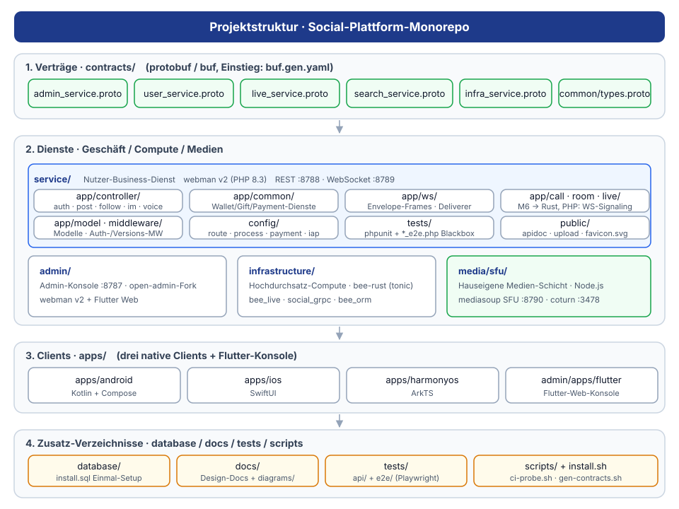

# Soziale Plattform

**语言 / Languages:** [中文](../README.md) · [English](README.en.md) · [한국어](README.ko.md) · [Русский](README.ru.md) · [Deutsch](README.de.md) · [Français](README.fr.md) · [Español](README.es.md) · [Português](README.pt.md) · [हिन्दी](README.hi.md) · [العربية](README.ar.md) · [বাংলা](README.bn.md) · [Bahasa Indonesia](README.id.md) · [日本語](README.ja.md)

Monorepo einer mehrsprachigen Social-Plattform: Bild/Text-Community + Instant Messaging + Live-/Sprachfunktionen + virtuelle Wirtschaft; PHP- und Rust-Stack, drei native Clients.

## Projekt-Maskottchen


**Bub** · eine Sprechblase. Die kleinste Einheit der Plattform: Beiträge, Sprachnachrichten, Live-Danmaku und Geschenke gehen alle in einer Blase auf die Reise; sie lächelt, winkt, und der Zipfel unten links zeigt, wohin die Nachricht geht.

Vektorquelle: [`diagrams/mascot.svg`](diagrams/mascot.svg); die vereinfachte Marke [`mascot-mark.svg`](diagrams/mascot-mark.svg) wird zusätzlich als `favicon.svg` auf den service-/admin-Seiten und im Installationsassistenten ausgeliefert.

## Projektvorstellung

- **Drei native Clients**: Android (Kotlin + Compose), iOS (SwiftUI), HarmonyOS (ArkTS), dazu ein Flutter-Admin-Panel
- **Business-Services**: webman v2 (PHP 8.3) bedient sowohl REST als auch WebSocket; Live-/Voice- und 1v1-Anruf-Zustandsmaschinen wurden nach Rust migriert (infrastructure/bee-rust); PHP-Controller verbinden sich direkt per gRPC; die API wird über `X-Api-Version` versioniert (Standard v1, kompatibel mit alten `/api/vX`-Pfaden)
- **Eigene Medienebene**: mediasoup SFU + coturn TURN für die Medienweiterleitung bei 1v1-Sprachanrufen und Sprachräumen (8 Plätze: Host + 7 Mikrofone)
- **Status-Schichtung**: MySQL als Quelle der Geschäftsdaten, Redis für den Echtzeitstatus von Sitzung / IM / Anruf / Raum
- **Meilensteine**: M0–M5 geliefert (Sprachnachrichten, 1v1-Anrufe, Sprachräume, Live-Streaming); M6a liefert die virtuelle Ökonomie: Wallet (Guthaben/Journal, MySQL als einzige Wahrheitsquelle), Geschenke-Trinkgeld mit Streamer-Anteil und mobiles IAP-Aufladen (App Store / Google Play / Huawei); M6b liefert Zahlungskanäle: Gerüst für Auflade-Gutschrift (WeChat/Alipay/Stripe-Callback-Signaturprüfung, serverseitige Preisgestaltung, idempotente Gutschrift; Auszahlung und Abgleich geliefert); M6c liefert CDN-Speicher: Anbieter über das Admin-Panel konfigurierbar (S3-kompatibel: AWS S3 / Cloudflare R2 / Aliyun OSS / Tencent COS / Backblaze B2); Bilder/Sprachaufnahmen/Dateien werden über Objektspeicher + CDN ausgeliefert; M6d liefert Verwaltungsberichte und Dashboard-Statistiken: Berichtsmodul (Benutzer/Zahlungen/Auszahlungen — Datumsfilter, Summen, Trends, Verteilungen, Excel-Export) sowie Plattform-Statistik-Karten auf der Startseite; v1.1 liefert die Primärschlüssel-Governance: Die drei MySQL-Schreibvorgänge in bee_live übergeben jetzt explizite idgen_rs-Snowflake-IDs, die Abhängigkeit von last_insert_id() entfällt; die betreffenden Tabellen verlieren AUTO_INCREMENT; v1.1.1–v1.1.6 sind Doku-/CI-/Stabilitätskorrekturen ohne neue Funktionen

## Funktionsübersicht


## Architektur


## Kern-Geschäftsprozesse


## Lebenszyklus


## Funktionsdesign


## Projektstruktur



| Verzeichnis | Beschreibung | Technologie |
|------|------|------|
| contracts/ | gRPC-Verträge (proto, buf-Generierungseinstieg) | protobuf / buf |
| service/ | Benutzer-Business-Service (REST :8788 + WS :8789) | webman v2 (PHP 8.3) |
| admin/ | Admin-Panel (auf Basis von open-admin) | webman v2 + Flutter |
| infrastructure/ | Rechenebene für hohen Durchsatz (Live/Voice-gRPC-Dienste) | bee-rust (tonic) |
| media/sfu/ | Eigene Medienebene (mediasoup SFU :8790 + coturn :3478) | Node.js (ab M4 aktiviert) |
| apps/ | Drei native Clients | SwiftUI / Kotlin+Compose / ArkTS |

Interne Struktur von service:

```
service/
├── app/
│   ├── controller/   # REST-Controller (auth/post/follow/im/voice/wallet/gift/...)
│   ├── common/        # WalletService (Guthaben/Journal/idempotent) · GiftService (Geschenke/Split)
│   ├── ws/           # WsServer · Envelope-Frame-Protokoll · Deliverer-Push · ConnectionRegistry
│   ├── call/         # CallCenter: 1v1-Anruf-Zustandsmaschine (M6 nach Rust migriert; PHP-Seite für WS-Signalisierung beibehalten)
│   ├── room/         # RoomCenter: Sprachräume (M6 nach Rust migriert; PHP-Seite für WS-Signalisierung beibehalten)
│   ├── live/         # LiveCenter: Live-Räume (M6 nach Rust migriert; PHP-Seite für WS-Signalisierung beibehalten)
│   ├── model/        # Datenmodelle
│   ├── process/      # Benutzerdefinierte Http-/WsServer-Prozesse
│   └── storage/      # Speicherung von Sprachdateien (m4a; seit M6 von Rust VoiceStorage getragen)
├── config/           # route.php (/api/v1-Routengruppe) · process.php (:8788/:8789)
└── tests/            # phpunit-Unit-Tests + Blackbox-E2E im_e2e.php / voice_e2e.php / live_e2e.php / wallet_e2e.php
```

## Ein-Klick-Installation

Voraussetzungen: PHP ≥ 8.3 (composer), MySQL, Redis (Docker optional, für die Medienebene).

```bash
./install.sh
```

Das Skript: führt `composer install` je einmal für `service/` und `admin/` aus; legt die Datenbank aus `database/install.sql` an (idempotent, CREATE IF NOT EXISTS); erzeugt für beide Dienste eine `.env` (zufällige JWT-/APP-Schlüssel, vorhandene Dateien werden nicht überschrieben); startet optional die Medienebene (`docker compose up -d` für media/sfu und coturn, `--skip-media` zum Überspringen); gibt abschließend die Startbefehle für alle Dienste und die Zugriffsadressen aus.

## Manuelle Installation

1. Abhängigkeiten installieren:

```bash
cd service && composer install
cd admin && composer install
```

2. Datenbank anlegen:

```bash
mysql -u root -p < database/install.sql
```

3. Umgebung konfigurieren: `service/.env.example` und `admin/.env.example` nach `.env` kopieren und DB-/Redis-/JWT-/APP-Schlüssel eintragen (in Produktion immer zufällige Schlüssel verwenden).

4. Dienste starten:

```bash
cd service && php start.php start -d   # HTTP :8788 · WS :8789
cd admin && php start.php start -d     # admin :8787
```

5. Medienebene starten (optional):

```bash
cd media/sfu && docker compose up -d --build   # SFU :8790 · coturn :3478
```

## Verwendung

### Abhängigkeiten

- PHP ≥ 8.3 (composer)
- Redis (Standard: 127.0.0.1:6379)
- Node.js ≥ 18 (lokales SFU-Debugging)
- Docker (SFU-/coturn-Container)

### Business-Service starten

```bash
cd service
composer install
php start.php start -d      # HTTP :8788 · WS :8789
```

Konfigurieren Sie bei Bedarf `REDIS` und `SFU_URL` (Standard 127.0.0.1:8790) in `service/.env`.

### Medienebene starten

```bash
cd media/sfu
docker compose up -d --build   # SFU :8790 (RTC UDP 10000-10200) · coturn :3478
```

### Clients

| Plattform | Öffnen / Build | Plattform-Anforderungen |
|----|----------------|----------|
| Android | `cd apps/android && ./gradlew assembleDebug` | Build unter Linux / macOS möglich |
| iOS | `apps/ios/SocialApp` in Xcode öffnen | macOS erforderlich |
| HarmonyOS | `apps/harmonyos` in DevEco Studio öffnen | DevEco Studio erforderlich |

### Tests

```bash
cd service && vendor/bin/phpunit      # Unit-Tests (229 tests / 660 assertions; Live- und Sprachfälle brauchen den laufenden Rust-gRPC-Dienst)
cd admin   && vendor/bin/phpunit      # Admin-Unit-Tests (98 tests / 340 assertions)
cd infrastructure && cargo test --workspace   # Rust, 17 crates (204 tests)
DB_PASS='' php tests/api/run.php      # API-Automatisierung (116 Fälle; admin :8791 / service :8788 müssen laufen)
cd tests/e2e && npx playwright test   # UI-End-to-End (41 Fälle)

cd service                            # die Blackbox-E2E unten brauchen den laufenden Dienst (:8788/:8789) + Redis
php tests/im_e2e.php                  # IM: WS-Senden/Empfangen zweier Nutzer / gelesen / zurückgezogen / Offline-Queue
php tests/voice_e2e.php               # Sprache: API-Versionierung / Sprachnachrichten / 1v1-Signalisierung / Sprachräume
php tests/live_e2e.php                # Live: Start / Beitritt / Danmaku / Mikrofon auf-ab / Ende
php tests/wallet_e2e.php              # Wallet: Guthaben / Aufladen / Geschenke / Streamer-Anteil
php tests/payment_e2e.php             # Zahlung: Bestellung / Callback-Prüfung + Gutschrift / Idempotenz / Betragsprüfung
php tests/storage_e2e.php             # Speicher: Bild-Upload / local und s3 / URL-Präfix passend zum aktiven Anbieter

cd media/sfu
npm run smoke                         # Smoke-Test des SFU-/signal-Protokolls (erfordert Docker-Container oder lokalen node)
```

## Unterstützung willkommen

Wenn dieses Projekt Ihnen hilft, scannen Sie den QR-Code und unterstützen Sie uns, danke!

**WeChat Pay**


**Alipay**


**Überweisung (Banküberweisung)**


Wenn Ihnen dieses Projekt hilft, unterstützen Sie die Entwicklung gerne per internationaler Banküberweisung.

**Empfängerinformationen**

| Feld | Inhalt |
|------|------|
| Name des Empfängers | WANG KEXUN |
| Kontonummer des Empfängers | 881015918251 |

**Empfängerbank — ZA Bank**

| Feld | Inhalt |
|------|------|
| SWIFT Code | AABLHKHHXXX |
| Bankname | ZA Bank Limited |
| Bankleitzahl | 387 |
| Bankadresse | Core F, Cyberport 3, 100 Cyberport Road, Hong Kong |

**Korrespondenzbank für grenzüberschreitende Überweisungen (falls erforderlich)**

> Nachfolgend die Daten der Korrespondenzbank (Zwischenbank) für grenzüberschreitende Überweisungen – nicht die der Empfängerbank. Fragen Sie Ihre überweisende Bank, ob Korrespondenzbankdaten benötigt werden.

Die Korrespondenzbank für Überweisungen in Hongkong-Dollar, Renminbi und US-Dollar ist **Citibank**:

| Feld | Inhalt |
|------|------|
| Bankname | Citibank N.A. Hong Kong |
| SWIFT Code | CITIHKHXXXX |
| Bankleitzahl | 006 |
| Filialname | Hong Kong Branch |
| Filialnummer | 391 |
| Bankadresse | Citibank Tower, Citibank Plaza, 3 Garden Road, Central, Hong Kong |

Bei Überweisungen in anderen Währungen ist die Korrespondenzbank **BNY Mellon**:

| Feld | Inhalt |
|------|------|
| Bankname | THE BANK OF NEW YORK MELLON |
| SWIFT Code | IRVTUS3NXXX |
| Bankadresse | THE BANK OF NEW YORK MELLON, 240 GREENWICH STREET, NEW YORK, United States |

### Krypto-Spenden (Crypto Donation)

Wenn dieses Projekt Ihnen hilft, scannen Sie gerne den QR-Code, um zu spenden. Vielen Dank!

| Netzwerk (Network) | QR-Code (QR Code) | Wallet-Adresse (Wallet Address) |
|---|---|---|
| BNB Smart Chain (BEP20) | [](coin/1.jpg) | `0x355d429f97511897ccb4e271ec888205f9ab6629` |
| Tron (TRC20) | [](coin/2.jpg) | `TEdDHWLajt1XvqtPDWmQctdrJaC3pzZZzz` |
| Ethereum (ERC20) | [](coin/3.jpg) | `0x355d429f97511897ccb4e271ec888205f9ab6629` |
| Aptos | [](coin/4.jpg) | `0x836e3780edfc3f7b2372b39e2a1a3a5d7adfaccd96c726f21cfde1b50dd68030` |
| Plasma | [](coin/5.jpg) | `0x355d429f97511897ccb4e271ec888205f9ab6629` |
| Polygon POS | [](coin/6.jpg) | `0x355d429f97511897ccb4e271ec888205f9ab6629` |
| Solana | [](coin/7.jpg) | `2hfhboHdmdrYsY25XfQSsEWxq5ip4EQsR7f4AzSRMUyr` |
| The Open Network (TON) | [](coin/8.jpg) | `UQB9kFQohzmXUir9QSSZq01iwl9aQZIDdBpNmDklljRtCoGK` |
| Arbitrum One | [](coin/9.jpg) | `0x355d429f97511897ccb4e271ec888205f9ab6629` |
| AVAX C-Chain | [](coin/10.jpg) | `0x355d429f97511897ccb4e271ec888205f9ab6629` |

## Dokumentation

- Gesamtdesign: `superpowers/specs/2026-08-16-social-platform-design.md`
- M4-Sprachdesign: `superpowers/specs/2026-08-17-m4-voice-design.md`
- Umsetzungsplan: `superpowers/plans/2026-08-17-m4-voice.md`
