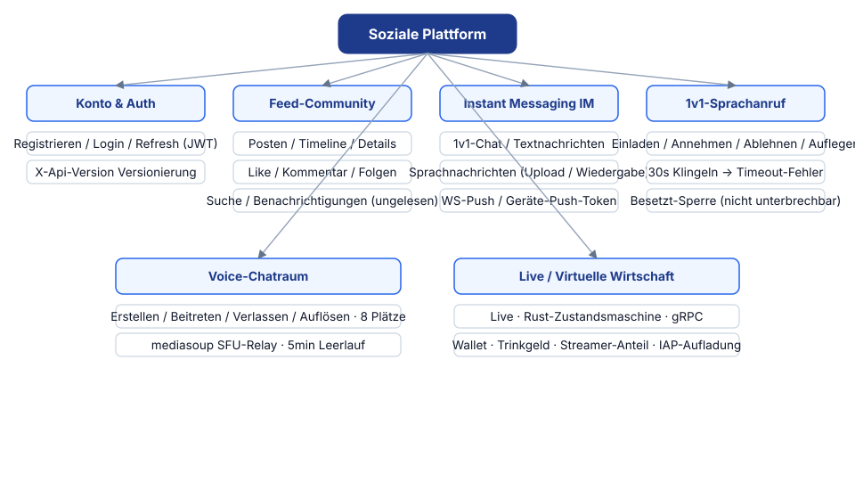
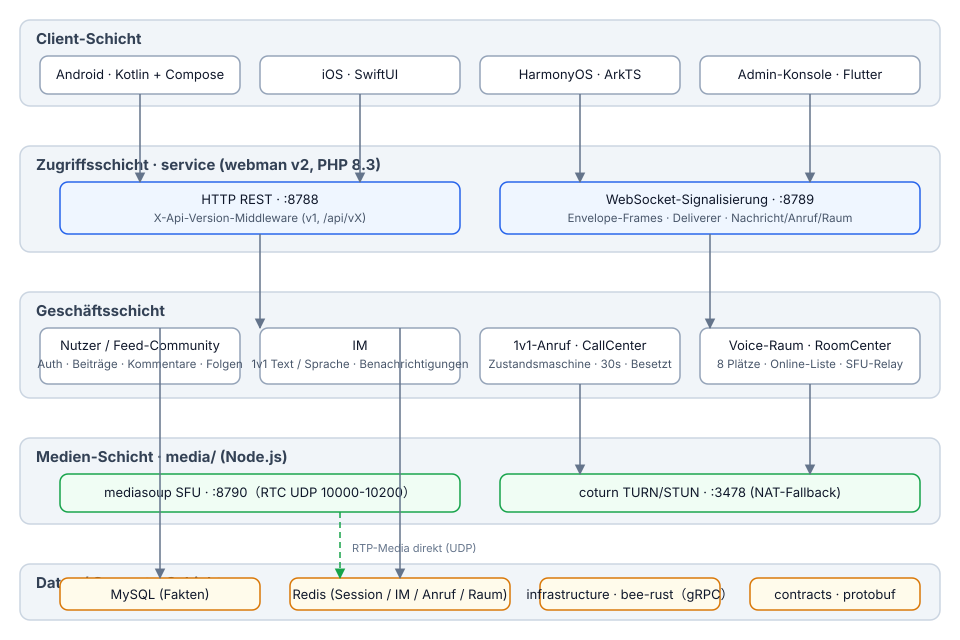
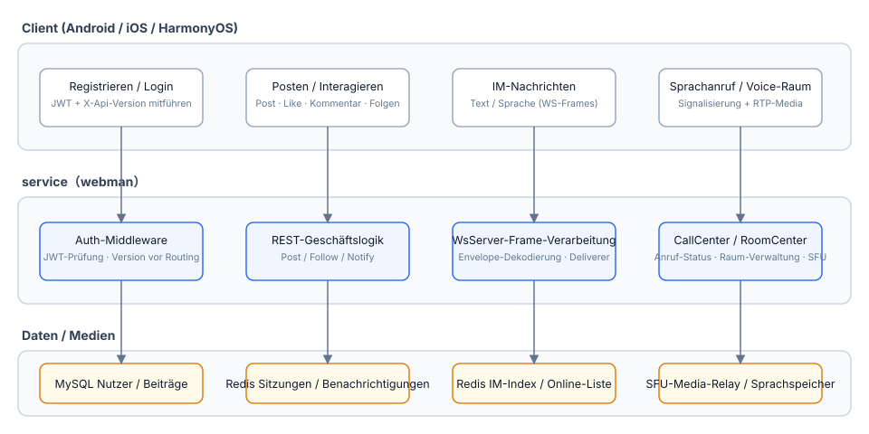
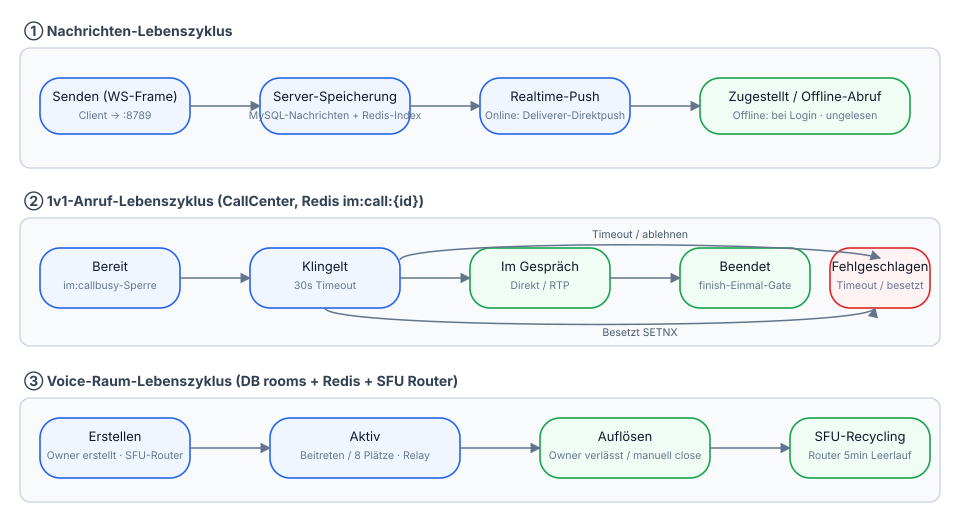
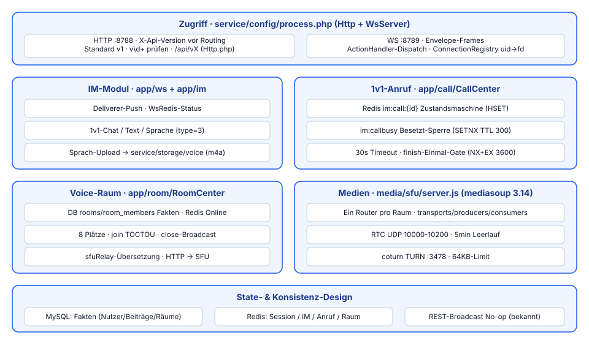

# Soziale Plattform

**语言 / Languages:** [中文](../README.md) · [English](README.en.md) · [한국어](README.ko.md) · [Русский](README.ru.md) · [Deutsch](README.de.md) · [Français](README.fr.md) · [Español](README.es.md) · [Português](README.pt.md) · [हिन्दी](README.hi.md) · [العربية](README.ar.md) · [বাংলা](README.bn.md) · [Bahasa Indonesia](README.id.md) · [日本語](README.ja.md)

Monorepo einer mehrsprachigen Social-Plattform: Bild/Text-Community + Instant Messaging + Live-/Sprachfunktionen + virtuelle Wirtschaft.

## Projektvorstellung

- **Drei native Clients**: Android (Kotlin + Compose), iOS (SwiftUI), HarmonyOS (ArkTS), dazu ein Flutter-Admin-Panel
- **Business-Services**: webman v2 (PHP 8.3) bedient sowohl REST als auch WebSocket; die API wird über `X-Api-Version` versioniert (Standard v1, kompatibel mit alten `/api/vX`-Pfaden)
- **Eigene Medienebene**: mediasoup SFU + coturn TURN für die Medienweiterleitung bei 1v1-Sprachanrufen und Sprachräumen (8 Plätze)
- **Status-Schichtung**: MySQL als Quelle der Geschäftsdaten, Redis für den Echtzeitstatus von Sitzung / IM / Anruf / Raum
- **Meilensteine**: M0–M4 geliefert (Sprachnachrichten, 1v1-Anrufe, Sprachräume); M5 plant Live-Streaming (SRS) und virtuelle Wirtschaft

## Funktionsübersicht



## Architektur



## Kern-Geschäftsprozesse



## Lebenszyklus



## Funktionsdesign



## Projektstruktur

| Verzeichnis | Beschreibung | Technologie |
|------|------|------|
| contracts/ | gRPC-Verträge (proto, buf-Generierungseinstieg) | protobuf / buf |
| service/ | Benutzer-Business-Service (REST :8788 + WS :8789) | webman v2 (PHP 8.3) |
| admin/ | Admin-Panel (auf Basis von open-admin) | webman v2 + Flutter |
| infrastructure/ | Rechenebene für hohen Durchsatz | bee-rust (tonic) |
| media/sfu/ | Eigene Medienebene (mediasoup SFU :8790 + coturn :3478) | Node.js (ab M4 aktiviert) |
| apps/ | Drei native Clients | SwiftUI / Kotlin+Compose / ArkTS |

Interne Struktur von service:

```
service/
├── app/
│   ├── controller/   # REST-Controller (auth/post/follow/im/voice/...)
│   ├── ws/           # WsServer · Envelope-Frame-Protokoll · Deliverer-Push · ConnectionRegistry
│   ├── call/         # CallCenter: 1v1-Anruf-Zustandsmaschine (30s Klingel-Timeout · Besetzt-Mutex)
│   ├── room/         # RoomCenter: Sprachräume (8 Plätze · SFU-Signalübersetzung)
│   ├── model/        # Datenmodelle
│   ├── process/      # Benutzerdefinierte Http-/WsServer-Prozesse
│   └── storage/      # Speicherung von Sprachdateien (m4a, nicht in der DB)
├── config/           # route.php (/api/v1-Routengruppe) · process.php (:8788/:8789)
└── tests/            # phpunit-Unit-Tests + Blackbox-E2E im_e2e.php / voice_e2e.php
```

## Verwendung

### Abhängigkeiten

- PHP ≥ 8.3 (composer)
- Redis (Standard: 127.0.0.1:6379)
- Node.js ≥ 18 (lokales SFU-Debugging)
- Docker (SFU-/coturn-Container)

### Business-Service starten

```bash
cd service
composer install
php start.php start -d      # HTTP :8788 · WS :8789
```

Konfigurieren Sie bei Bedarf `REDIS` und `SFU_URL` (Standard 127.0.0.1:8790) in `service/.env`.

### Medienebene starten

```bash
cd media/sfu
docker compose up -d --build   # SFU :8790 (RTC UDP 10000-10200) · coturn :3478
```

### Clients

| Plattform | Öffnen / Build | Plattform-Anforderungen |
|----|----------------|----------|
| Android | `cd apps/android && ./gradlew assembleDebug` | Build unter Linux / macOS möglich |
| iOS | `apps/ios/SocialApp` in Xcode öffnen | macOS erforderlich |
| HarmonyOS | `apps/harmonyos` in DevEco Studio öffnen | DevEco Studio erforderlich |

### Tests

```bash
cd service
vendor/bin/phpunit                    # Unit-Tests (79 tests / 230 assertions)

php tests/im_e2e.php                  # IM-Blackbox-E2E (erfordert laufende :8788/:8789 + Redis)
php tests/voice_e2e.php               # Sprach-E2E: Versionierung / Sprachnachrichten / Anrufe / Sprachräume

cd media/sfu
npm run smoke                         # Smoke-Test des SFU-/signal-Protokolls (erfordert Docker-Container oder lokalen node)
```

## Unterstützung willkommen

Wenn dieses Projekt Ihnen hilft, scannen Sie den QR-Code und unterstützen Sie uns, danke!

**WeChat Pay**


**Alipay**


**Überweisung (Banküberweisung)**


Wenn Ihnen dieses Projekt hilft, unterstützen Sie die Entwicklung gerne per internationaler Banküberweisung.

**Empfängerinformationen**

| Feld | Inhalt |
|------|------|
| Name des Empfängers | WANG KEXUN |
| Kontonummer des Empfängers | 881015918251 |

**Empfängerbank — ZA Bank**

| Feld | Inhalt |
|------|------|
| SWIFT Code | AABLHKHHXXX |
| Bankname | ZA Bank Limited |
| Bankleitzahl | 387 |
| Bankadresse | Core F, Cyberport 3, 100 Cyberport Road, Hong Kong |

**Korrespondenzbank für grenzüberschreitende Überweisungen (falls erforderlich)**

> Nachfolgend die Daten der Korrespondenzbank (Zwischenbank) für grenzüberschreitende Überweisungen – nicht die der Empfängerbank. Fragen Sie Ihre überweisende Bank, ob Korrespondenzbankdaten benötigt werden.

Die Korrespondenzbank für Überweisungen in Hongkong-Dollar, Renminbi und US-Dollar ist **Citibank**:

| Feld | Inhalt |
|------|------|
| Bankname | Citibank N.A. Hong Kong |
| SWIFT Code | CITIHKHXXXX |
| Bankleitzahl | 006 |
| Filialname | Hong Kong Branch |
| Filialnummer | 391 |
| Bankadresse | Citibank Tower, Citibank Plaza, 3 Garden Road, Central, Hong Kong |

Bei Überweisungen in anderen Währungen ist die Korrespondenzbank **BNY Mellon**:

| Feld | Inhalt |
|------|------|
| Bankname | THE BANK OF NEW YORK MELLON |
| SWIFT Code | IRVTUS3NXXX |
| Bankadresse | THE BANK OF NEW YORK MELLON, 240 GREENWICH STREET, NEW YORK, United States |


## Dokumentation

- Gesamtdesign: `superpowers/specs/2026-08-16-social-platform-design.md`
- M4-Sprachdesign: `superpowers/specs/2026-08-17-m4-voice-design.md`
- Umsetzungsplan: `superpowers/plans/2026-08-17-m4-voice.md`
