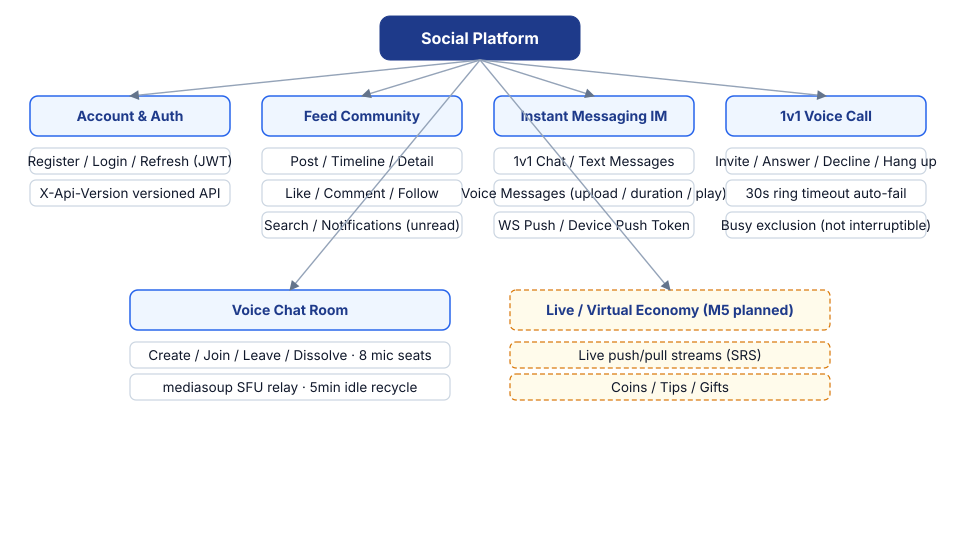
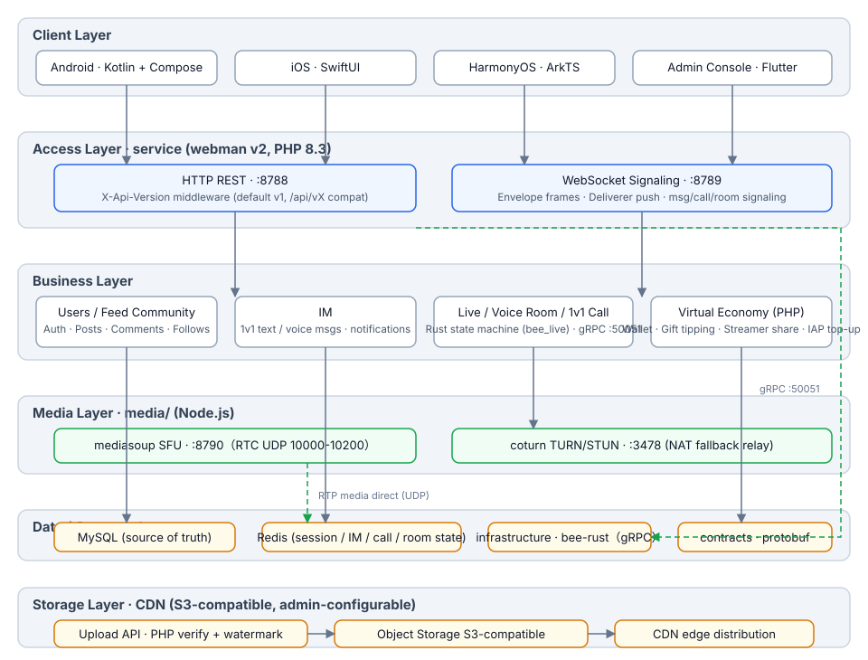
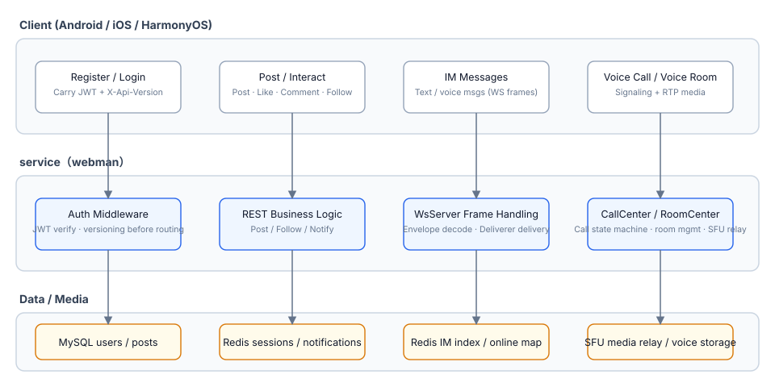
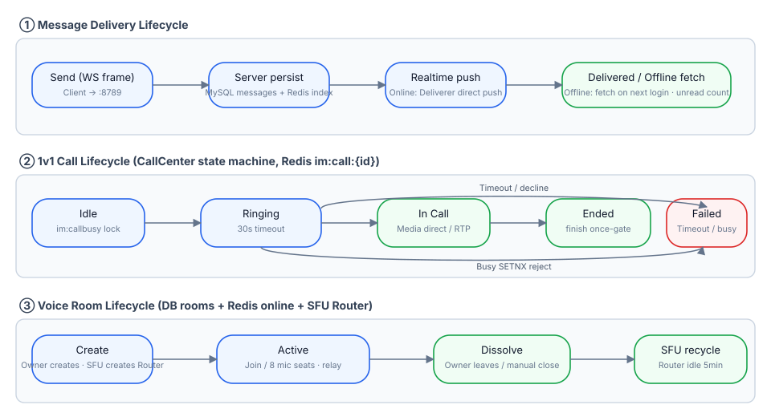
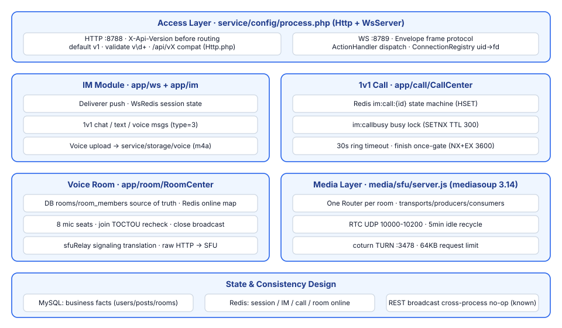

# Social Platform

**语言 / Languages:** [中文](../README.md) · [English](README.en.md) · [한국어](README.ko.md) · [Русский](README.ru.md) · [Deutsch](README.de.md) · [Français](README.fr.md) · [Español](README.es.md) · [Português](README.pt.md) · [हिन्दी](README.hi.md) · [العربية](README.ar.md) · [বাংলা](README.bn.md) · [Bahasa Indonesia](README.id.md) · [日本語](README.ja.md)

Multilingual social platform monorepo: image/text community + instant messaging + live/voice + virtual economy.

## Introduction

- **Three native clients**: Android (Kotlin + Compose), iOS (SwiftUI), HarmonyOS (ArkTS), plus a Flutter admin console
- **Business services**: webman v2 (PHP 8.3) serving both REST and WebSocket channels; live/voice-call state machines migrated to Rust (infrastructure/bee-rust); PHP controllers connect via gRPC; the API is versioned via `X-Api-Version` (default v1, compatible with legacy `/api/vX` paths)
- **In-house media layer**: mediasoup SFU + coturn TURN for media forwarding in 1v1 voice calls and voice chat rooms (8 seats)
- **State layering**: MySQL as the source of truth for business data, Redis for real-time session / IM / call / room state
- **Milestones**: M0–M5 delivered (voice messages, 1v1 calls, voice chat rooms, live streaming); M6 delivers the Rust migration of live/voice state machines (PHP calls Rust directly over gRPC; circuit breaker / degradation / rate limiting); M6a delivers the virtual economy: wallet (balance/ledger, MySQL as single source of truth), gift tipping with streamer share, and mobile IAP top-up (App Store / Google Play / Huawei); M6b delivers payment channels: top-up crediting skeleton (WeChat/Alipay/Stripe callback signature verification, server-side pricing, idempotent crediting; withdrawals and reconciliation delivered); M6c delivers CDN storage: providers configurable from admin panel (S3-compatible: AWS S3 / Cloudflare R2 / Aliyun OSS / Tencent COS / Backblaze B2), images/voice/files served via object storage + CDN; M6d delivers admin reports and dashboard statistics: report module (users/payments/withdrawals — date filtering, totals, trends, distributions, Excel export) plus platform-statistics cards on the home page

## Feature Overview



## Architecture



## Core Business Flows



## Lifecycle



## Module Design



## Project Structure

| Directory | Description | Tech |
|------|------|------|
| contracts/ | gRPC contracts (proto, buf generation entry) | protobuf / buf |
| service/ | User-facing business service (REST :8788 + WS :8789) | webman v2 (PHP 8.3) |
| admin/ | Admin console (built on open-admin) | webman v2 + Flutter |
| infrastructure/ | High-throughput compute layer (live/voice gRPC services) | bee-rust (tonic) |
| media/sfu/ | In-house media layer (mediasoup SFU :8790 + coturn :3478) | Node.js (enabled in M4) |
| apps/ | Three native clients | SwiftUI / Kotlin+Compose / ArkTS |

Internal structure of service:

```
service/
├── app/
│   ├── controller/   # REST controllers (auth/post/follow/im/voice/wallet/gift/payment/...)
│   ├── common/        # WalletService (balance/ledger/idempotent) · GiftService (gift/split) · PaymentService (idempotent order/credit) · PaymentVerifier (3-channel verify)
│   ├── ws/           # WsServer · Envelope frame protocol · Deliverer push · ConnectionRegistry
│   ├── call/         # CallCenter: 1v1 call state machine (M6 migrated to Rust; PHP side kept for WS signaling)
│   ├── room/         # RoomCenter: voice chat rooms (M6 migrated to Rust; PHP side kept for WS signaling)
│   ├── live/         # LiveCenter: live rooms (M6 migrated to Rust; PHP side kept for WS signaling)
│   ├── model/        # Data models
│   ├── process/      # Custom Http / WsServer processes
│   └── storage/      # Voice file storage (m4a; carried by Rust VoiceStorage since M6)
├── config/           # route.php (/api/v1 route group) · process.php (:8788/:8789) · payment.php (channel keys/pricing)
└── tests/            # phpunit unit tests (incl. PaymentServiceTest) + im_e2e.php / voice_e2e.php / live_e2e.php / wallet_e2e.php / payment_e2e.php black-box E2E
```

## One-Click Install

Prerequisites: PHP ≥ 8.3 (composer), MySQL, Redis (Docker optional, for the media layer).

```bash
./install.sh
```

The script: runs `composer install` once for each of `service/` and `admin/`; creates the database from `database/install.sql` (idempotent, CREATE IF NOT EXISTS); generates `.env` for both services (random JWT / APP keys, never overwrites existing files); optionally starts the media layer (`docker compose up -d` for media/sfu and coturn, `--skip-media` to skip); finally prints the commands to start each service and the access URLs.

## Manual Install

1. Install dependencies:

```bash
cd service && composer install
cd admin && composer install
```

2. Create the database:

```bash
mysql -u root -p < database/install.sql
```

3. Configure environment: copy `service/.env.example` and `admin/.env.example` to `.env`, fill in DB / Redis / JWT / APP keys (always use random keys in production).

4. Start the services:

```bash
cd service && php start.php start -d   # HTTP :8788 · WS :8789
cd admin && php start.php start -d     # admin :8787
```

5. Start the media layer (optional):

```bash
cd media/sfu && docker compose up -d --build   # SFU :8790 · coturn :3478
```

## Getting Started

### Dependencies

- PHP ≥ 8.3 (composer)
- Redis (default 127.0.0.1:6379)
- Node.js ≥ 18 (local SFU debugging)
- Docker (SFU / coturn containers)

### Start the business service

```bash
cd service
composer install
php start.php start -d      # HTTP :8788 · WS :8789
```

Configure `REDIS` and `SFU_URL` (default 127.0.0.1:8790) in `service/.env` as needed.

### Start the media layer

```bash
cd media/sfu
docker compose up -d --build   # SFU :8790 (RTC UDP 10000-10200) · coturn :3478
```

### Clients

| Platform | How to open / build | Platform requirements |
|----|----------------|----------|
| Android | `cd apps/android && ./gradlew assembleDebug` | Buildable on Linux / macOS |
| iOS | Open `apps/ios/SocialApp` in Xcode | Requires macOS |
| HarmonyOS | Open `apps/harmonyos` in DevEco Studio | Requires DevEco Studio |

### Tests

```bash
cd service
vendor/bin/phpunit                    # Unit tests (79 tests / 230 assertions)

php tests/im_e2e.php                  # IM black-box E2E (requires :8788/:8789 running + Redis)
php tests/voice_e2e.php               # Voice E2E: versioned / voice messages / calls / voice chat rooms
php tests/live_e2e.php                # Live E2E: rooms / danmaku / mic / close (RTMP push, HLS pull)

cd media/sfu
npm run smoke                         # SFU /signal protocol smoke test (requires Docker container or local node)
```

## Welcome Support

If this project helps you, scan the QR code to support us, thank you!

**WeChat Pay**


**Alipay**


**Global Transfer (Bank Transfer)**


If you find this project helpful, you are welcome to support development via global bank transfer.

**Payee Information**

| Item | Details |
|------|------|
| Payee Name | WANG KEXUN |
| Payee Account Number | 881015918251 |

**Receiving Bank — ZA Bank**

| Item | Details |
|------|------|
| SWIFT Code | AABLHKHHXXX |
| Bank Name | ZA Bank Limited |
| Bank Code | 387 |
| Bank Address | Core F, Cyberport 3, 100 Cyberport Road, Hong Kong |

**Correspondent Bank for Cross-Border Remittance (if needed)**

> The following is the correspondent (intermediary) bank information for cross-border remittance, not the receiving bank. Please check with your remitting bank whether correspondent bank information is required.

The correspondent bank for remittances in Hong Kong dollars, renminbi, and US dollars is **Citibank**:

| Item | Details |
|------|------|
| Bank Name | Citibank N.A. Hong Kong |
| SWIFT Code | CITIHKHXXXX |
| Bank Code | 006 |
| Branch Name | Hong Kong Branch |
| Branch Code | 391 |
| Bank Address | Citibank Tower, Citibank Plaza, 3 Garden Road, Central, Hong Kong |

The correspondent bank for remittances in other currencies is **BNY Mellon**:

| Item | Details |
|------|------|
| Bank Name | THE BANK OF NEW YORK MELLON |
| SWIFT Code | IRVTUS3NXXX |
| Bank Address | THE BANK OF NEW YORK MELLON, 240 GREENWICH STREET, NEW YORK, United States |

### Crypto Donation

If this project helps you, scan the QR code to donate, thank you!

| Network | QR Code | Wallet Address |
|---|---|---|
| BNB Smart Chain (BEP20) | [](coin/1.jpg) | `0x355d429f97511897ccb4e271ec888205f9ab6629` |
| Tron (TRC20) | [](coin/2.jpg) | `TEdDHWLajt1XvqtPDWmQctdrJaC3pzZZzz` |
| Ethereum (ERC20) | [](coin/3.jpg) | `0x355d429f97511897ccb4e271ec888205f9ab6629` |
| Aptos | [](coin/4.jpg) | `0x836e3780edfc3f7b2372b39e2a1a3a5d7adfaccd96c726f21cfde1b50dd68030` |
| Plasma | [](coin/5.jpg) | `0x355d429f97511897ccb4e271ec888205f9ab6629` |
| Polygon POS | [](coin/6.jpg) | `0x355d429f97511897ccb4e271ec888205f9ab6629` |
| Solana | [](coin/7.jpg) | `2hfhboHdmdrYsY25XfQSsEWxq5ip4EQsR7f4AzSRMUyr` |
| The Open Network (TON) | [](coin/8.jpg) | `UQB9kFQohzmXUir9QSSZq01iwl9aQZIDdBpNmDklljRtCoGK` |
| Arbitrum One | [](coin/9.jpg) | `0x355d429f97511897ccb4e271ec888205f9ab6629` |
| AVAX C-Chain | [](coin/10.jpg) | `0x355d429f97511897ccb4e271ec888205f9ab6629` |


## Documentation

- Overall design: `superpowers/specs/2026-08-16-social-platform-design.md`
- M4 voice design: `superpowers/specs/2026-08-17-m4-voice-design.md`
- Implementation plan: `superpowers/plans/2026-08-17-m4-voice.md`
