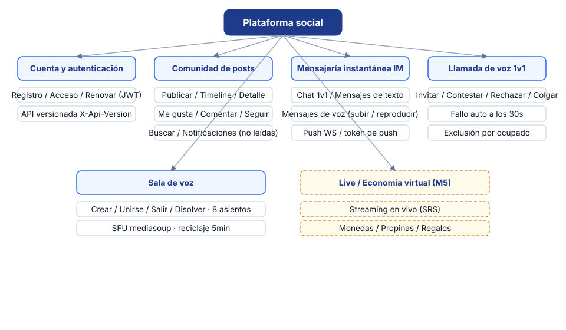
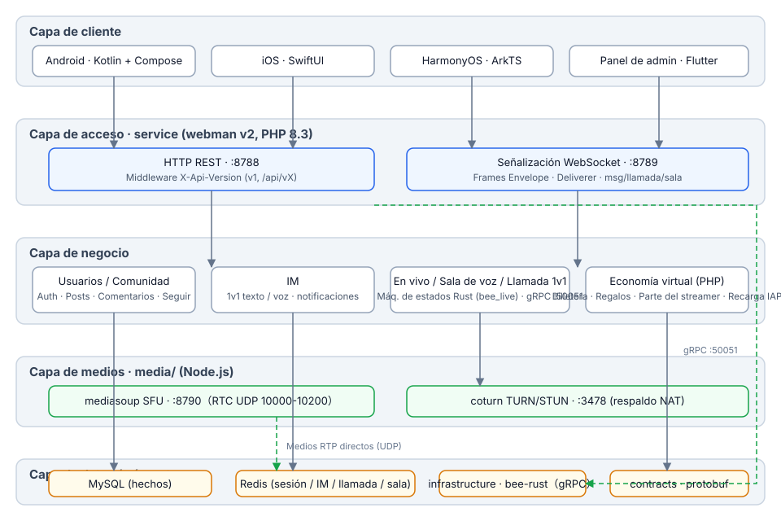
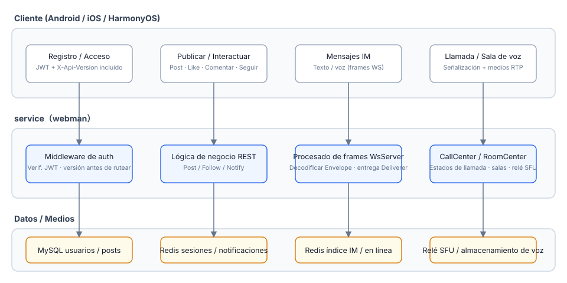
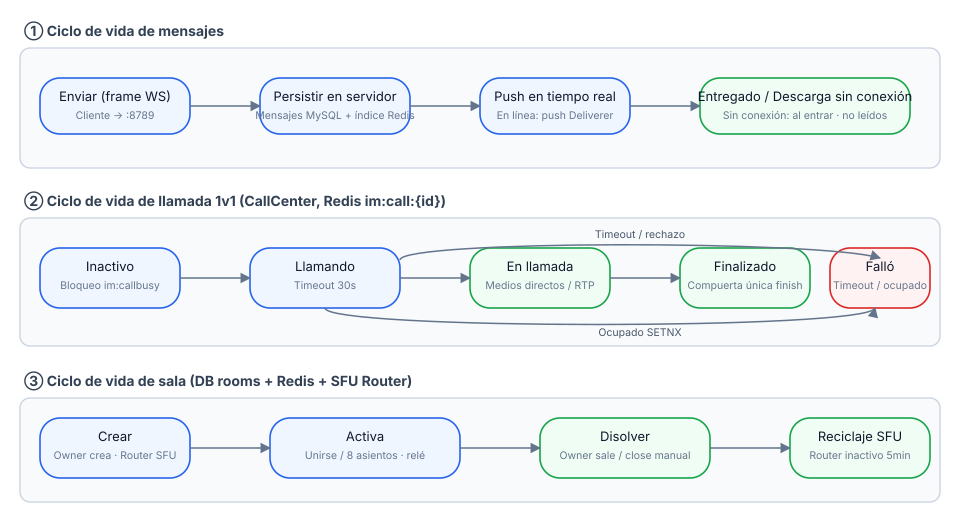
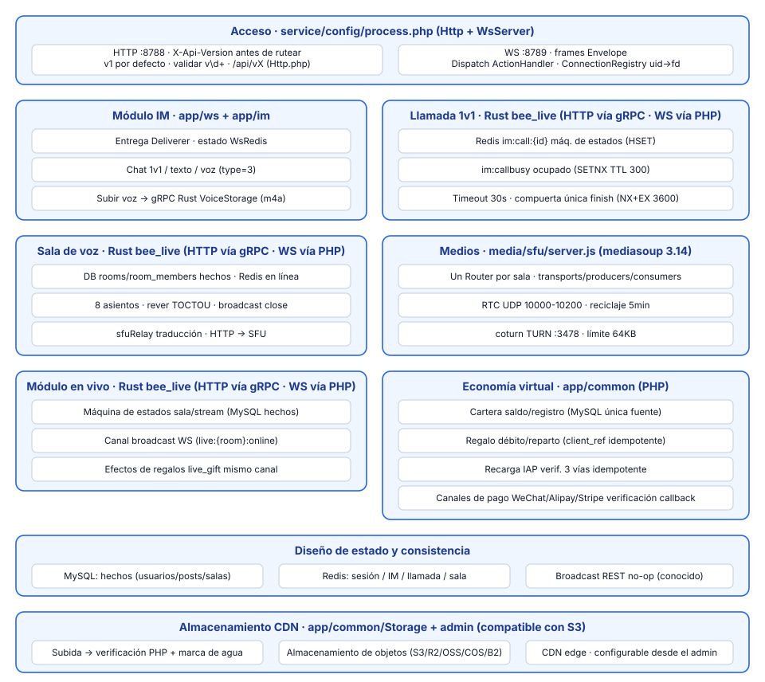

# Plataforma Social

**语言 / Languages:** [中文](../README.md) · [English](README.en.md) · [한국어](README.ko.md) · [Русский](README.ru.md) · [Deutsch](README.de.md) · [Français](README.fr.md) · [Español](README.es.md) · [Português](README.pt.md) · [हिन्दी](README.hi.md) · [العربية](README.ar.md) · [বাংলা](README.bn.md) · [Bahasa Indonesia](README.id.md) · [日本語](README.ja.md)

Monorepo de plataforma social multilingüe: comunidad de texto/imagen + mensajería instantánea + directos/voz + economía virtual.

## Introducción al proyecto

- **Tres clientes nativos**: Android (Kotlin + Compose), iOS (SwiftUI), HarmonyOS (ArkTS), más un panel de administración en Flutter
- **Servicios de negocio**: webman v2 (PHP 8.3) sirve tanto REST como WebSocket; la API se versiona mediante `X-Api-Version` (v1 por defecto, compatible con rutas antiguas `/api/vX`)
- **Capa de medios propia**: mediasoup SFU + coturn TURN para el reenvío de medios en llamadas de voz 1v1 y salas de voz (8 asientos)
- **Estratificación de estado**: MySQL como fuente de verdad del negocio, Redis para el estado en tiempo real de sesión / IM / llamadas / salas
- **Hitos**: M0–M5 entregados (mensajes de voz, llamadas 1v1, salas de voz, streaming en vivo); M6 entrega la migración a Rust de las máquinas de estado live/voice (PHP llama a Rust directamente por gRPC; disyuntor / degradación / limitación de tasa)

## Resumen de funciones



## Diseño de arquitectura



## Procesos de negocio principales



## Ciclo de vida



## Diseño de módulos



## Estructura del proyecto

| Directorio | Descripción | Tecnología |
|------|------|------|
| contracts/ | Contratos gRPC (proto, punto de entrada de generación buf) | protobuf / buf |
| service/ | Servicio de negocio para usuarios (REST :8788 + WS :8789) | webman v2 (PHP 8.3) |
| admin/ | Panel de administración (basado en open-admin) | webman v2 + Flutter |
| infrastructure/ | Capa de cómputo de alto rendimiento | bee-rust (tonic) |
| media/sfu/ | Capa de medios propia (mediasoup SFU :8790 + coturn :3478) | Node.js (activada en M4) |
| apps/ | Tres clientes nativos | SwiftUI / Kotlin+Compose / ArkTS |

Estructura interna de service:

```
service/
├── app/
│   ├── controller/   # Controladores REST (auth/post/follow/im/voice/...)
│   ├── ws/           # WsServer · protocolo de tramas Envelope · push de Deliverer · ConnectionRegistry
│   ├── call/         # CallCenter: máquina de estados de llamada 1v1 (timeout de timbre 30 s · exclusión mutua por ocupado)
│   ├── room/         # RoomCenter: salas de voz (8 asientos · traducción de señalización SFU)
│   ├── live/         # LiveCenter: salas en vivo (push RTMP / pull HLS · danmaku · 8 micrófonos)
│   ├── model/        # Modelos de datos
│   ├── process/      # Procesos personalizados Http / WsServer
│   └── storage/      # Almacenamiento de archivos de voz (m4a, fuera de la base de datos)
├── config/           # route.php (grupo de rutas /api/v1) · process.php (:8788/:8789)
└── tests/            # Pruebas unitarias phpunit + E2E de caja negra im_e2e.php / voice_e2e.php / live_e2e.php
```

## Uso

### Dependencias

- PHP ≥ 8.3 (composer)
- Redis (por defecto 127.0.0.1:6379)
- Node.js ≥ 18 (depuración local de SFU)
- Docker (contenedores SFU / coturn)

### Iniciar el servicio de negocio

```bash
cd service
composer install
php start.php start -d      # HTTP :8788 · WS :8789
```

Configura `REDIS` y `SFU_URL` (por defecto 127.0.0.1:8790) en `service/.env` según sea necesario.

### Iniciar la capa de medios

```bash
cd media/sfu
docker compose up -d --build   # SFU :8790 (RTC UDP 10000-10200) · coturn :3478
```

### Clientes

| Plataforma | Cómo abrir / compilar | Requisitos de la plataforma |
|----|----------------|----------|
| Android | `cd apps/android && ./gradlew assembleDebug` | Compilable en Linux / macOS |
| iOS | Abrir `apps/ios/SocialApp` en Xcode | Requiere macOS |
| HarmonyOS | Abrir `apps/harmonyos` en DevEco Studio | Requiere DevEco Studio |

### Pruebas

```bash
cd service
vendor/bin/phpunit                    # Pruebas unitarias (79 tests / 230 assertions)

php tests/im_e2e.php                  # E2E de caja negra IM (requiere :8788/:8789 en ejecución + Redis)
php tests/voice_e2e.php               # E2E de voz: versionado / mensajes de voz / llamadas / salas de voz
php tests/live_e2e.php                # E2E en vivo: salas / danmaku / micrófonos / cierre (push RTMP, pull HLS)

cd media/sfu
npm run smoke                         # Smoke test del protocolo SFU /signal (requiere contenedor Docker o node local)
```

## Bienvenido tu apoyo

Si este proyecto te es útil, escanea el código QR para apoyarnos, ¡gracias!

**WeChat Pay**


**Alipay**


**Transferencia global (transferencia bancaria)**


Si este proyecto te resulta útil, puedes apoyar el desarrollo mediante una transferencia bancaria internacional.

**Información del beneficiario**

| Campo | Contenido |
|------|------|
| Nombre del beneficiario | WANG KEXUN |
| Número de cuenta del beneficiario | 881015918251 |

**Banco receptor — ZA Bank**

| Campo | Contenido |
|------|------|
| SWIFT Code | AABLHKHHXXX |
| Nombre del banco | ZA Bank Limited |
| Código bancario | 387 |
| Dirección del banco | Core F, Cyberport 3, 100 Cyberport Road, Hong Kong |

**Banco corresponsal para transferencias transfronterizas (si es necesario)**

> La siguiente información corresponde al banco corresponsal (banco intermediario) para transferencias transfronterizas, no al banco receptor. Consulta con tu banco emisor si se requiere información del banco corresponsal.

El banco corresponsal para transferencias en dólares de Hong Kong, renminbi y dólares estadounidenses es **Citibank**:

| Campo | Contenido |
|------|------|
| Nombre del banco | Citibank N.A. Hong Kong |
| SWIFT Code | CITIHKHXXXX |
| Código bancario | 006 |
| Nombre de la sucursal | Hong Kong Branch |
| Código de sucursal | 391 |
| Dirección del banco | Citibank Tower, Citibank Plaza, 3 Garden Road, Central, Hong Kong |

Para transferencias en otras divisas, el banco corresponsal es **BNY Mellon**:

| Campo | Contenido |
|------|------|
| Nombre del banco | THE BANK OF NEW YORK MELLON |
| SWIFT Code | IRVTUS3NXXX |
| Dirección del banco | THE BANK OF NEW YORK MELLON, 240 GREENWICH STREET, NEW YORK, United States |


## Documentación

- Diseño general: `superpowers/specs/2026-08-16-social-platform-design.md`
- Diseño de voz M4: `superpowers/specs/2026-08-17-m4-voice-design.md`
- Plan de implementación: `superpowers/plans/2026-08-17-m4-voice.md`
