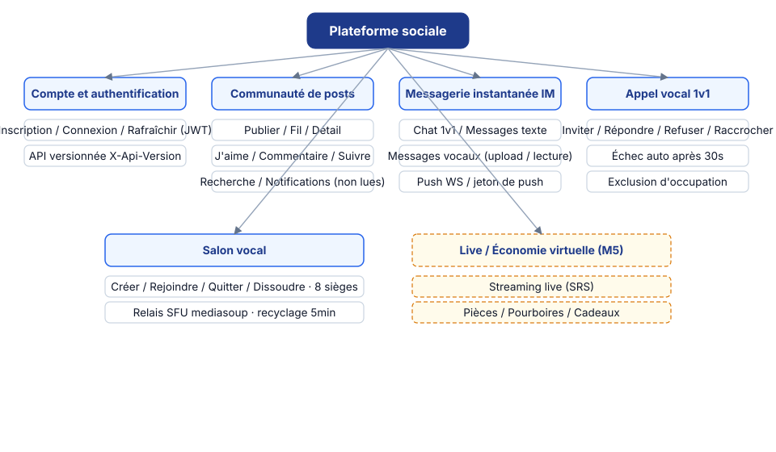
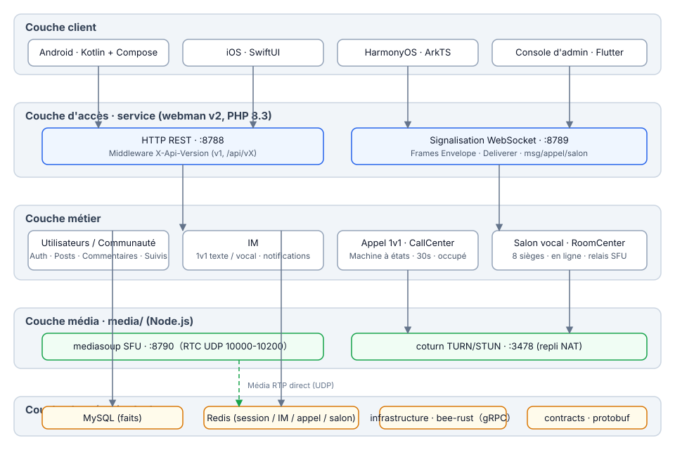
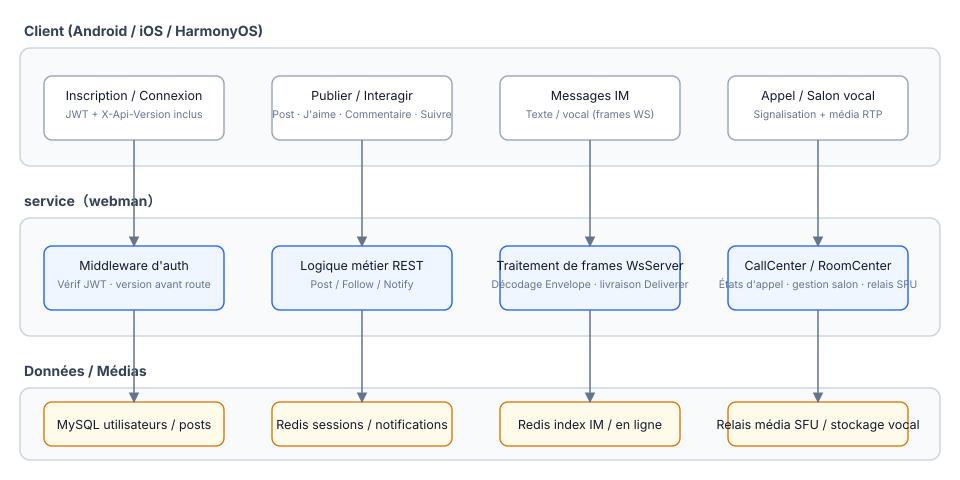
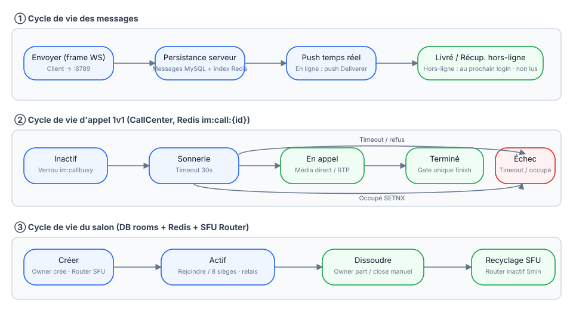
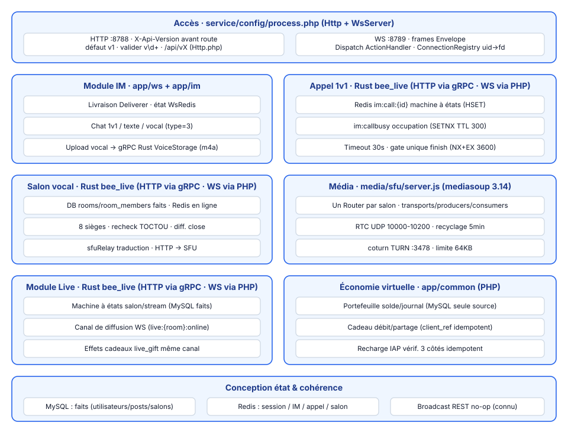

# Plateforme Sociale

**语言 / Languages:** [中文](../README.md) · [English](README.en.md) · [한국어](README.ko.md) · [Русский](README.ru.md) · [Deutsch](README.de.md) · [Français](README.fr.md) · [Español](README.es.md) · [Português](README.pt.md) · [हिन्दी](README.hi.md) · [العربية](README.ar.md) · [বাংলা](README.bn.md) · [Bahasa Indonesia](README.id.md) · [日本語](README.ja.md)

Monorepo de plateforme sociale multilingue : communauté texte/image + messagerie instantanée + live/voix + économie virtuelle.

## Présentation du projet

- **Trois clients natifs** : Android (Kotlin + Compose), iOS (SwiftUI), HarmonyOS (ArkTS), plus une console d'administration Flutter
- **Services métier** : webman v2 (PHP 8.3) sert à la fois REST et WebSocket ; l'API est versionnée via `X-Api-Version` (v1 par défaut, compatible avec les anciens chemins `/api/vX`)
- **Couche média maison** : mediasoup SFU + coturn TURN pour le relais média des appels vocaux 1v1 et des salons vocaux (8 sièges)
- **Stratification des états** : MySQL comme source de vérité métier, Redis pour l'état temps réel des sessions / IM / appels / salons
- **Jalons** : M0–M5 livrés (messages vocaux, appels 1v1, salons vocaux, live streaming) ; M6 prévoit l'économie virtuelle

## Aperçu des fonctionnalités



## Architecture



## Processus métier essentiels



## Cycle de vie



## Conception des modules



## Structure du projet

| Répertoire | Description | Technologie |
|------|------|------|
| contracts/ | Contrats gRPC (proto, point d'entrée de génération buf) | protobuf / buf |
| service/ | Service métier côté utilisateur (REST :8788 + WS :8789) | webman v2 (PHP 8.3) |
| admin/ | Console d'administration (basée sur open-admin) | webman v2 + Flutter |
| infrastructure/ | Couche de calcul à haut débit | bee-rust (tonic) |
| media/sfu/ | Couche média maison (mediasoup SFU :8790 + coturn :3478) | Node.js (activée en M4) |
| apps/ | Trois clients natifs | SwiftUI / Kotlin+Compose / ArkTS |

Structure interne de service :

```
service/
├── app/
│   ├── controller/   # Contrôleurs REST (auth/post/follow/im/voice/...)
│   ├── ws/           # WsServer · protocole de trames Envelope · push Deliverer · ConnectionRegistry
│   ├── call/         # CallCenter : machine à états d'appel 1v1 (timeout sonnerie 30 s · mutex d'occupation)
│   ├── room/         # RoomCenter : salons vocaux (8 sièges · traduction de signalisation SFU)
│   ├── live/         # LiveCenter : salles en direct (push RTMP / pull HLS · danmaku · 8 micros en liaison)
│   ├── model/        # Modèles de données
│   ├── process/      # Processus personnalisés Http / WsServer
│   └── storage/      # Stockage des fichiers vocaux (m4a, hors base de données)
├── config/           # route.php (groupe de routes /api/v1) · process.php (:8788/:8789)
└── tests/            # Tests unitaires phpunit + E2E boîte noire im_e2e.php / voice_e2e.php / live_e2e.php
```

## Utilisation

### Dépendances

- PHP ≥ 8.3 (composer)
- Redis (par défaut 127.0.0.1:6379)
- Node.js ≥ 18 (débogage local SFU)
- Docker (conteneurs SFU / coturn)

### Démarrer le service métier

```bash
cd service
composer install
php start.php start -d      # HTTP :8788 · WS :8789
```

Configurez `REDIS` et `SFU_URL` (par défaut 127.0.0.1:8790) dans `service/.env` selon vos besoins.

### Démarrer la couche média

```bash
cd media/sfu
docker compose up -d --build   # SFU :8790 (RTC UDP 10000-10200) · coturn :3478
```

### Clients

| Plateforme | Ouvrir / construire | Exigences de la plateforme |
|----|----------------|----------|
| Android | `cd apps/android && ./gradlew assembleDebug` | Compilable sous Linux / macOS |
| iOS | Ouvrir `apps/ios/SocialApp` dans Xcode | macOS requis |
| HarmonyOS | Ouvrir `apps/harmonyos` dans DevEco Studio | DevEco Studio requis |

### Tests

```bash
cd service
vendor/bin/phpunit                    # Tests unitaires (79 tests / 230 assertions)

php tests/im_e2e.php                  # E2E boîte noire IM (nécessite :8788/:8789 en cours d'exécution + Redis)
php tests/voice_e2e.php               # E2E voix : versionnage / messages vocaux / appels / salons vocaux
php tests/live_e2e.php                # E2E live : salles / danmaku / micros / fermeture (push RTMP, pull HLS)

cd media/sfu
npm run smoke                         # Smoke test du protocole SFU /signal (nécessite conteneur Docker ou node local)
```

## Votre soutien est le bienvenu

Si ce projet vous aide, scannez le code QR pour nous soutenir, merci !

**WeChat Pay**


**Alipay**


**Virement international (virement bancaire)**


Si ce projet vous est utile, soutenez son développement par virement bancaire international.

**Informations sur le bénéficiaire**

| Champ | Contenu |
|------|------|
| Nom du bénéficiaire | WANG KEXUN |
| Numéro de compte du bénéficiaire | 881015918251 |

**Banque réceptrice — ZA Bank**

| Champ | Contenu |
|------|------|
| SWIFT Code | AABLHKHHXXX |
| Nom de la banque | ZA Bank Limited |
| Code bancaire | 387 |
| Adresse de la banque | Core F, Cyberport 3, 100 Cyberport Road, Hong Kong |

**Banque correspondante pour virements transfrontaliers (si nécessaire)**

> Les informations ci-dessous concernent la banque correspondante (banque intermédiaire) pour les virements transfrontaliers, et non la banque réceptrice. Renseignez-vous auprès de votre banque émettrice pour savoir si les informations de la banque correspondante sont requises.

La banque correspondante pour les virements en dollars de Hong Kong, en renminbi et en dollars américains est **Citibank** :

| Champ | Contenu |
|------|------|
| Nom de la banque | Citibank N.A. Hong Kong |
| SWIFT Code | CITIHKHXXXX |
| Code bancaire | 006 |
| Nom de l'agence | Hong Kong Branch |
| Code d'agence | 391 |
| Adresse de la banque | Citibank Tower, Citibank Plaza, 3 Garden Road, Central, Hong Kong |

Pour les virements dans d'autres devises, la banque correspondante est **BNY Mellon** :

| Champ | Contenu |
|------|------|
| Nom de la banque | THE BANK OF NEW YORK MELLON |
| SWIFT Code | IRVTUS3NXXX |
| Adresse de la banque | THE BANK OF NEW YORK MELLON, 240 GREENWICH STREET, NEW YORK, United States |


## Documentation

- Conception générale : `superpowers/specs/2026-08-16-social-platform-design.md`
- Conception voix M4 : `superpowers/specs/2026-08-17-m4-voice-design.md`
- Plan d'implémentation : `superpowers/plans/2026-08-17-m4-voice.md`
