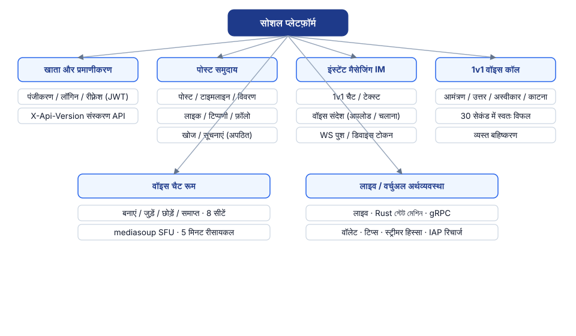
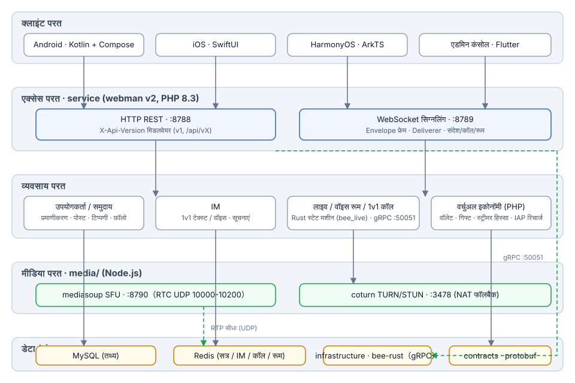
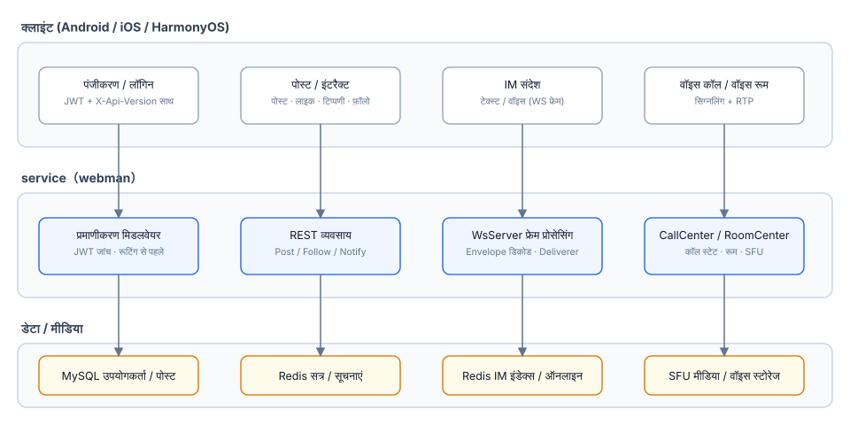
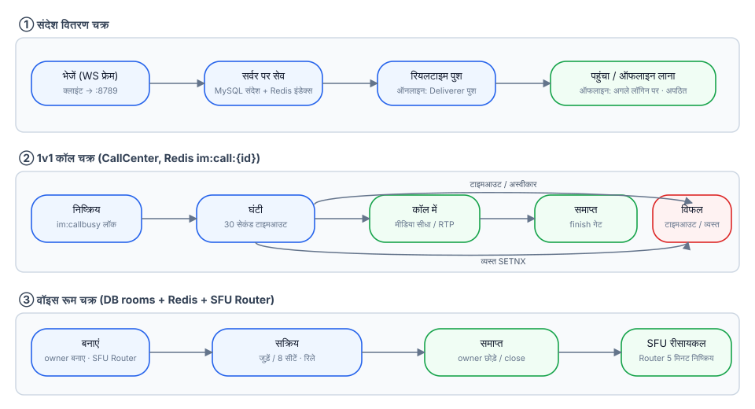
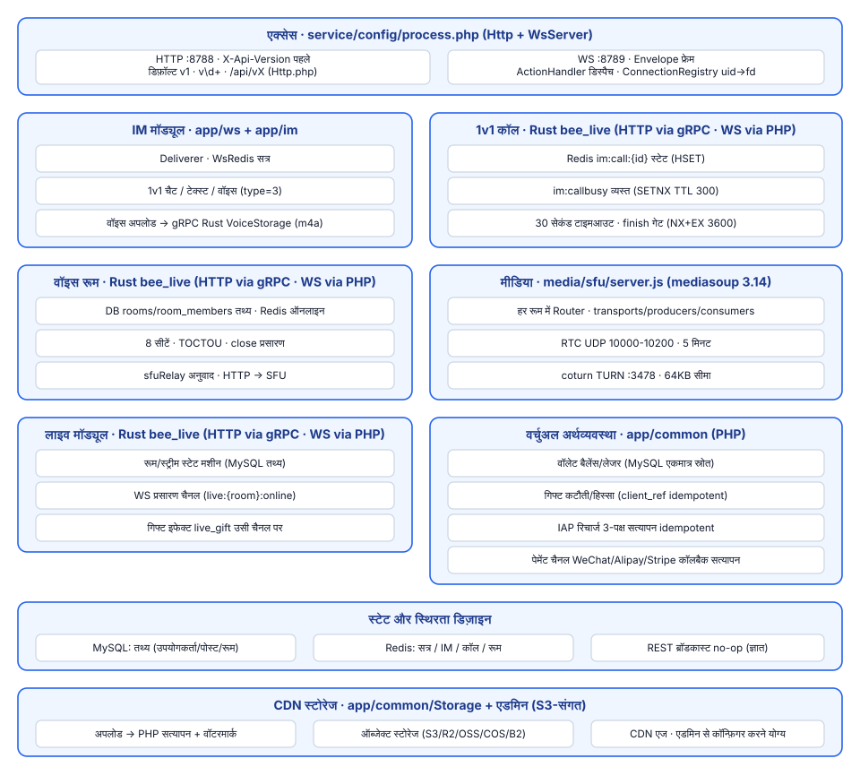

# सोशल प्लेटफ़ॉर्म

**语言 / Languages:** [中文](../README.md) · [English](README.en.md) · [한국어](README.ko.md) · [Русский](README.ru.md) · [Deutsch](README.de.md) · [Français](README.fr.md) · [Español](README.es.md) · [Português](README.pt.md) · [हिन्दी](README.hi.md) · [العربية](README.ar.md) · [বাংলা](README.bn.md) · [Bahasa Indonesia](README.id.md) · [日本語](README.ja.md)

बहुभाषी सोशल प्लेटफ़ॉर्म मोनोरिपो: टेक्स्ट/इमेज कम्युनिटी + इंस्टेंट मैसेजिंग + लाइव/वॉइस + वर्चुअल इकोनॉमी।

## परियोजना परिचय

- **तीन नेटिव क्लाइंट**: Android (Kotlin + Compose), iOS (SwiftUI), HarmonyOS (ArkTS), साथ ही Flutter एडमिन कंसोल
- **बिज़नेस सेवाएँ**: webman v2 (PHP 8.3) REST और WebSocket दोनों चैनल संभालता है; API का वर्ज़न `X-Api-Version` से होता है (डिफ़ॉल्ट v1, पुराने `/api/vX` पाथ से संगत)
- **स्वनिर्मित मीडिया लेयर**: mediasoup SFU + coturn TURN, 1v1 वॉइस कॉल और वॉइस चैट रूम (8 सीटें) के मीडिया फ़ॉरवर्डिंग के लिए
- **स्टेट लेयरिंग**: MySQL बिज़नेस डेटा का स्रोत, Redis सेशन / IM / कॉल / रूम की रियल-टाइम स्थिति के लिए
- **माइलस्टोन**: M0–M4 डिलीवर हो चुके (वॉइस मैसेज, 1v1 कॉल, वॉइस चैट रूम); M5 में लाइव स्ट्रीमिंग (SRS) और वर्चुअल इकोनॉमी की योजना

## फ़ीचर अवलोकन



## आर्किटेक्चर डिज़ाइन



## मुख्य बिज़नेस प्रक्रियाएँ



## लाइफ़साइकल



## मॉड्यूल डिज़ाइन



## प्रोजेक्ट संरचना

| निर्देशिका | विवरण | तकनीक |
|------|------|------|
| contracts/ | gRPC कॉन्ट्रैक्ट (proto, buf जनरेशन एंट्री) | protobuf / buf |
| service/ | यूज़र-साइड बिज़नेस सेवा (REST :8788 + WS :8789) | webman v2 (PHP 8.3) |
| admin/ | एडमिन कंसोल (open-admin पर आधारित) | webman v2 + Flutter |
| infrastructure/ | हाई-थ्रूपुट कंप्यूट लेयर | bee-rust (tonic) |
| media/sfu/ | स्वनिर्मित मीडिया लेयर (mediasoup SFU :8790 + coturn :3478) | Node.js (M4 में सक्रिय) |
| apps/ | तीन नेटिव क्लाइंट | SwiftUI / Kotlin+Compose / ArkTS |

service की आंतरिक संरचना:

```
service/
├── app/
│   ├── controller/   # REST कंट्रोलर (auth/post/follow/im/voice/...)
│   ├── ws/           # WsServer · Envelope फ्रेम प्रोटोकॉल · Deliverer पुश · ConnectionRegistry
│   ├── call/         # CallCenter: 1v1 कॉल स्टेट मशीन (30 सेकंड रिंग टाइमआउट · व्यस्त होने पर परस्पर बहिष्करण)
│   ├── room/         # RoomCenter: वॉइस चैट रूम (8 सीटें · SFU सिग्नलिंग अनुवाद)
│   ├── model/        # डेटा मॉडल
│   ├── process/      # Http / WsServer कस्टम प्रोसेस
│   └── storage/      # वॉइस फ़ाइल स्टोरेज (m4a, डेटाबेस में नहीं)
├── config/           # route.php (/api/v1 रूट ग्रुप) · process.php (:8788/:8789)
└── tests/            # phpunit यूनिट टेस्ट + im_e2e.php / voice_e2e.php ब्लैक-बॉक्स E2E
```

## उपयोग निर्देश

### निर्भरताएँ

- PHP ≥ 8.3 (composer)
- Redis (डिफ़ॉल्ट 127.0.0.1:6379)
- Node.js ≥ 18 (SFU लोकल डिबगिंग)
- Docker (SFU / coturn कंटेनर)

### बिज़नेस सेवा शुरू करें

```bash
cd service
composer install
php start.php start -d      # HTTP :8788 · WS :8789
```

आवश्यकता अनुसार `service/.env` में `REDIS`, `SFU_URL` (डिफ़ॉल्ट 127.0.0.1:8790) कॉन्फ़िगर करें।

### मीडिया लेयर शुरू करें

```bash
cd media/sfu
docker compose up -d --build   # SFU :8790 (RTC UDP 10000-10200) · coturn :3478
```

### क्लाइंट

| प्लेटफ़ॉर्म | खोलने / बिल्ड करने का तरीका | प्लेटफ़ॉर्म आवश्यकताएँ |
|----|----------------|----------|
| Android | `cd apps/android && ./gradlew assembleDebug` | Linux / macOS पर बिल्ड हो सकता है |
| iOS | Xcode में `apps/ios/SocialApp` खोलें | macOS आवश्यक |
| HarmonyOS | DevEco Studio में `apps/harmonyos` खोलें | DevEco Studio आवश्यक |

### टेस्ट

```bash
cd service
vendor/bin/phpunit                    # यूनिट टेस्ट (79 tests / 230 assertions)

php tests/im_e2e.php                  # IM ब्लैक-बॉक्स E2E (:8788/:8789 चालू होना + Redis आवश्यक)
php tests/voice_e2e.php               # वॉइस E2E: वर्ज़निंग / वॉइस मैसेज / कॉल / वॉइस चैट रूम

cd media/sfu
npm run smoke                         # SFU /signal प्रोटोकॉल स्मोक टेस्ट (Docker कंटेनर या लोकल node आवश्यक)
```

## समर्थन का स्वागत है

अगर यह प्रोजेक्ट आपके काम आया है, तो QR कोड स्कैन करके हमें सपोर्ट करें, धन्यवाद!

**WeChat Pay**


**Alipay**


**ग्लोबल बैंक ट्रांसफर**


अगर यह प्रोजेक्ट आपके लिए उपयोगी है, तो वैश्विक बैंक ट्रांसफ़र के ज़रिए डेवलपमेंट को सपोर्ट करें।

**प्राप्तकर्ता जानकारी**

| आइटम | विवरण |
|------|------|
| प्राप्तकर्ता का नाम | WANG KEXUN |
| प्राप्तकर्ता खाता संख्या | 881015918251 |

**प्राप्तकर्ता बैंक — ZA Bank**

| आइटम | विवरण |
|------|------|
| SWIFT Code | AABLHKHHXXX |
| बैंक का नाम | ZA Bank Limited |
| बैंक कोड | 387 |
| बैंक का पता | Core F, Cyberport 3, 100 Cyberport Road, Hong Kong |

**क्रॉस-बॉर्डर रेमिटेंस के लिए कॉरेस्पॉन्डेंट बैंक (यदि आवश्यक हो)**

> नीचे क्रॉस-बॉर्डर रेमिटेंस के लिए कॉरेस्पॉन्डेंट (मध्यस्थ) बैंक की जानकारी है, प्राप्तकर्ता बैंक की नहीं। कृपया रेमिटिंग बैंक से पूछें कि क्या कॉरेस्पॉन्डेंट बैंक की जानकारी आवश्यक है।

हांगकांग डॉलर, रेनमिनबी और अमेरिकी डॉलर की रेमिटेंस के लिए कॉरेस्पॉन्डेंट बैंक **Citibank** है:

| आइटम | विवरण |
|------|------|
| बैंक का नाम | Citibank N.A. Hong Kong |
| SWIFT Code | CITIHKHXXXX |
| बैंक कोड | 006 |
| शाखा का नाम | Hong Kong Branch |
| शाखा कोड | 391 |
| बैंक का पता | Citibank Tower, Citibank Plaza, 3 Garden Road, Central, Hong Kong |

अन्य मुद्राओं में रेमिटेंस के लिए कॉरेस्पॉन्डेंट बैंक **BNY Mellon** है:

| आइटम | विवरण |
|------|------|
| बैंक का नाम | THE BANK OF NEW YORK MELLON |
| SWIFT Code | IRVTUS3NXXX |
| बैंक का पता | THE BANK OF NEW YORK MELLON, 240 GREENWICH STREET, NEW YORK, United States |


## दस्तावेज़

- समग्र डिज़ाइन: `superpowers/specs/2026-08-16-social-platform-design.md`
- M4 वॉइस डिज़ाइन: `superpowers/specs/2026-08-17-m4-voice-design.md`
- कार्यान्वयन योजना: `superpowers/plans/2026-08-17-m4-voice.md`
