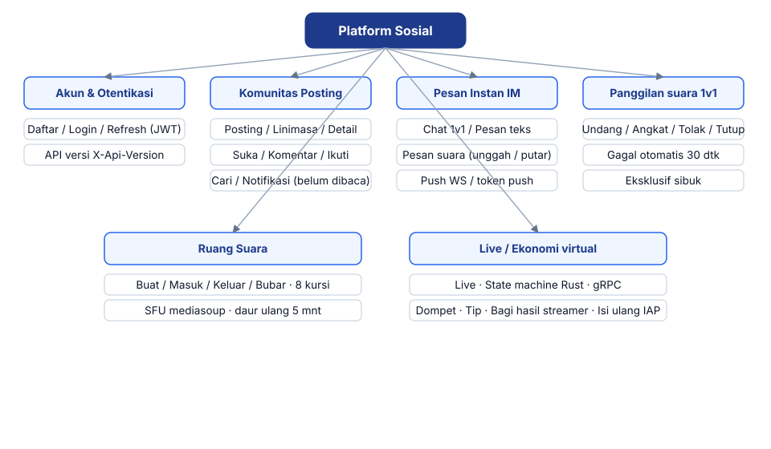
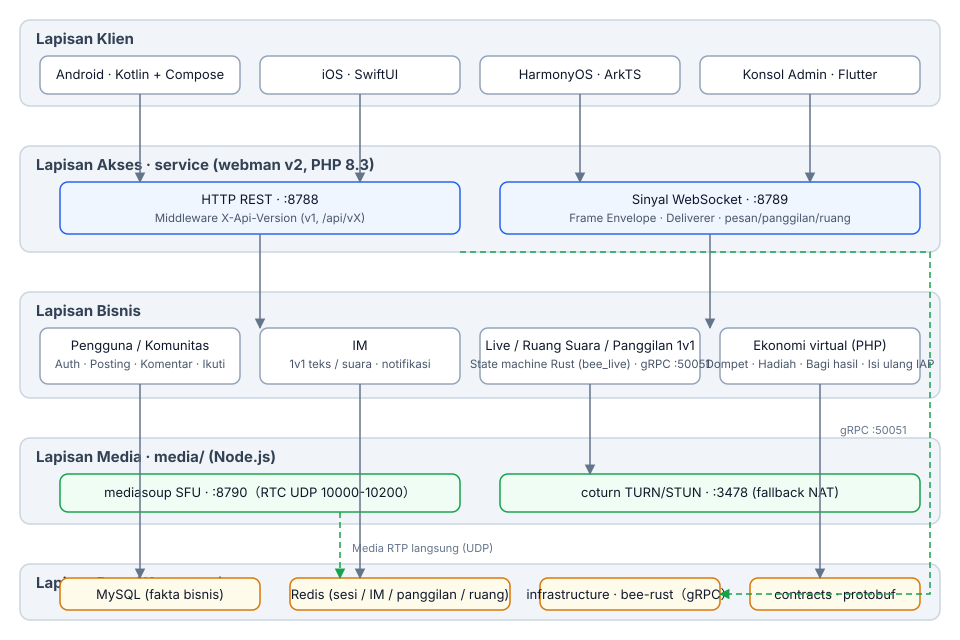
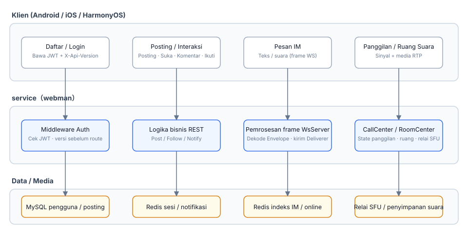
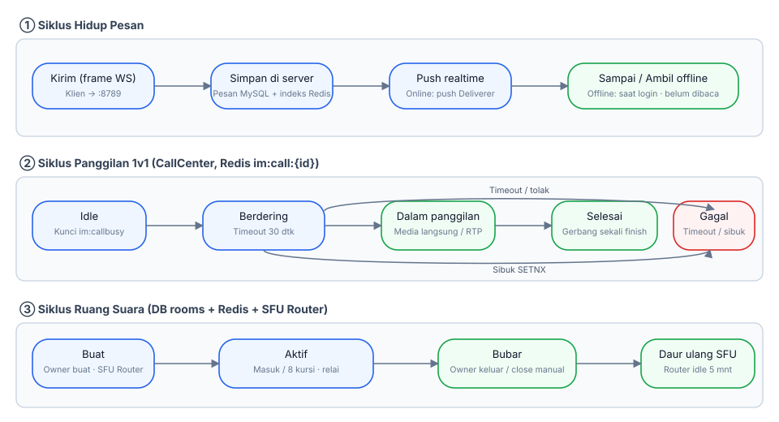
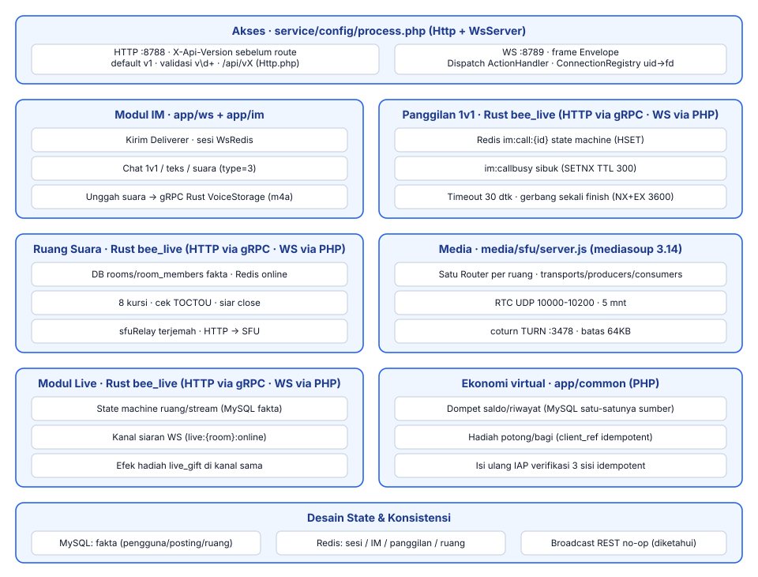

# Platform Sosial

**语言 / Languages:** [中文](../README.md) · [English](README.en.md) · [한국어](README.ko.md) · [Русский](README.ru.md) · [Deutsch](README.de.md) · [Français](README.fr.md) · [Español](README.es.md) · [Português](README.pt.md) · [हिन्दी](README.hi.md) · [العربية](README.ar.md) · [বাংলা](README.bn.md) · [Bahasa Indonesia](README.id.md) · [日本語](README.ja.md)

Monorepo platform sosial multibahasa: komunitas teks/gambar + pesan instan + live/suara + ekonomi virtual.

## Pengenalan Proyek

- **Tiga klien native**: Android (Kotlin + Compose), iOS (SwiftUI), HarmonyOS (ArkTS), plus konsol admin Flutter
- **Layanan bisnis**: webman v2 (PHP 8.3) melayani saluran REST dan WebSocket; state machine live/ruang suara/panggilan 1v1 dimigrasikan ke Rust (infrastructure/bee-rust); kontroler PHP terhubung langsung via gRPC; API diveri melalui `X-Api-Version` (default v1, kompatibel dengan path lama `/api/vX`)
- **Lapisan media sendiri**: mediasoup SFU + coturn TURN untuk penerusan media panggilan suara 1v1 dan ruang obrolan suara (8 kursi)
- **Pelapisan status**: MySQL sebagai sumber fakta bisnis, Redis untuk status real-time sesi / IM / panggilan / ruang
- **Pencapaian**: M0–M5 selesai (pesan suara, panggilan 1v1, ruang obrolan suara, live streaming); M6a menghadirkan ekonomi virtual: dompet (saldo/riwayat, MySQL sebagai sumber kebenaran tunggal), hadiah dengan bagi hasil streamer, dan isi ulang IAP seluler (App Store / Google Play / Huawei); M6b menghadirkan kanal pembayaran: kerangka kredit isi ulang (verifikasi tanda tangan callback WeChat/Alipay/Stripe, harga di sisi server, kredit idempoten; penarikan dan rekonsiliasi selesai); M6c menghadirkan penyimpanan CDN: penyedia dapat dikonfigurasi dari panel admin (kompatibel S3: AWS S3 / Cloudflare R2 / Aliyun OSS / Tencent COS / Backblaze B2), gambar/suara/berkas disajikan melalui penyimpanan objek + CDN; M6d menghadirkan laporan admin dan statistik dasbor: modul laporan (pengguna/pembayaran/penarikan — filter tanggal, total, tren, distribusi, ekspor Excel) dan kartu statistik platform di halaman beranda

## Ringkasan Fitur



## Desain Arsitektur



## Proses Bisnis Inti



## Siklus Hidup



## Desain Modul



## Struktur Proyek

| Direktori | Deskripsi | Teknologi |
|------|------|------|
| contracts/ | Kontrak gRPC (proto, titik masuk pembuatan buf) | protobuf / buf |
| service/ | Layanan bisnis sisi pengguna (REST :8788 + WS :8789) | webman v2 (PHP 8.3) |
| admin/ | Konsol admin (berbasis open-admin) | webman v2 + Flutter |
| infrastructure/ | Lapisan komputasi throughput tinggi (layanan gRPC live/suara) | bee-rust (tonic) |
| media/sfu/ | Lapisan media sendiri (mediasoup SFU :8790 + coturn :3478) | Node.js (diaktifkan di M4) |
| apps/ | Tiga klien native | SwiftUI / Kotlin+Compose / ArkTS |

Struktur internal service:

```
service/
├── app/
│   ├── controller/   # Kontroler REST (auth/post/follow/im/voice/wallet/gift/...)
│   ├── common/        # WalletService (saldo/riwayat/idempoten) · GiftService (hadiah/bagian)
│   ├── ws/           # WsServer · protokol frame Envelope · push Deliverer · ConnectionRegistry
│   ├── call/         # CallCenter: state machine panggilan 1v1 (dimigrasikan ke Rust di M6; sisi PHP dipertahankan untuk sinyal WS)
│   ├── room/         # RoomCenter: ruang obrolan suara (dimigrasikan ke Rust di M6; sisi PHP dipertahankan untuk sinyal WS)
│   ├── live/         # LiveCenter: ruang live (dimigrasikan ke Rust di M6; sisi PHP dipertahankan untuk sinyal WS)
│   ├── model/        # Model data
│   ├── process/      # Proses kustom Http / WsServer
│   └── storage/      # Penyimpanan file suara (m4a; ditangani Rust VoiceStorage sejak M6)
├── config/           # route.php (grup rute /api/v1) · process.php (:8788/:8789)
└── tests/            # Unit test phpunit + E2E black-box im_e2e.php / voice_e2e.php / live_e2e.php / wallet_e2e.php
```

## Instalasi Satu Klik

Prasyarat: PHP ≥ 8.3 (composer), MySQL, Redis (Docker opsional, untuk lapisan media).

```bash
./install.sh
```

Isi skrip: menjalankan `composer install` sekali untuk `service/` dan sekali untuk `admin/`; membuat database dari `database/install.sql` (idempoten, CREATE IF NOT EXISTS); membuat `.env` untuk kedua layanan (kunci JWT / APP acak, tidak pernah menimpa file yang ada); secara opsional menjalankan lapisan media (`docker compose up -d` untuk media/sfu dan coturn, `--skip-media` untuk melewati); terakhir mencetak perintah menjalankan setiap layanan dan alamat akses.

## Instalasi Manual

1. Pasang dependensi:

```bash
cd service && composer install
cd admin && composer install
```

2. Buat database:

```bash
mysql -u root -p < database/install.sql
```

3. Konfigurasi lingkungan: salin `service/.env.example` dan `admin/.env.example` ke `.env`, isi kunci DB / Redis / JWT / APP (di produksi selalu gunakan kunci acak).

4. Jalankan layanan:

```bash
cd service && php start.php start -d   # HTTP :8788 · WS :8789
cd admin && php start.php start -d     # admin :8787
```

5. Jalankan lapisan media (opsional):

```bash
cd media/sfu && docker compose up -d --build   # SFU :8790 · coturn :3478
```

## Petunjuk Penggunaan

### Dependensi

- PHP ≥ 8.3 (composer)
- Redis (default 127.0.0.1:6379)
- Node.js ≥ 18 (debug lokal SFU)
- Docker (kontainer SFU / coturn)

### Menjalankan layanan bisnis

```bash
cd service
composer install
php start.php start -d      # HTTP :8788 · WS :8789
```

Konfigurasikan `REDIS`, `SFU_URL` (default 127.0.0.1:8790) di `service/.env` sesuai kebutuhan.

### Menjalankan lapisan media

```bash
cd media/sfu
docker compose up -d --build   # SFU :8790 (RTC UDP 10000-10200) · coturn :3478
```

### Klien

| Platform | Cara membuka / membangun | Persyaratan platform |
|----|----------------|----------|
| Android | `cd apps/android && ./gradlew assembleDebug` | Dapat dibangun di Linux / macOS |
| iOS | Buka `apps/ios/SocialApp` di Xcode | Perlu macOS |
| HarmonyOS | Buka `apps/harmonyos` di DevEco Studio | Perlu DevEco Studio |

### Pengujian

```bash
cd service
vendor/bin/phpunit                    # Unit test (79 tests / 230 assertions)

php tests/im_e2e.php                  # E2E black-box IM (perlu :8788/:8789 berjalan + Redis)
php tests/voice_e2e.php               # E2E suara: versi / pesan suara / panggilan / ruang obrolan suara
php tests/live_e2e.php                # E2E live: ruang / danmaku / mikrofon / tutup (push RTMP, pull HLS)

cd media/sfu
npm run smoke                         # Smoke test protokol SFU /signal (perlu kontainer Docker atau node lokal)
```

## Dukungan sangat diterima

Jika proyek ini membantu Anda, pindai kode QR untuk mendukung kami, terima kasih!

**WeChat Pay**


**Alipay**


**Transfer global (transfer bank)**


Jika proyek ini bermanfaat bagi Anda, silakan dukung pengembangannya melalui transfer bank global.

**Informasi Penerima**

| Item | Isi |
|------|------|
| Nama Penerima | WANG KEXUN |
| Nomor Rekening Penerima | 881015918251 |

**Bank Penerima — ZA Bank**

| Item | Isi |
|------|------|
| SWIFT Code | AABLHKHHXXX |
| Nama Bank | ZA Bank Limited |
| Kode Bank | 387 |
| Alamat Bank | Core F, Cyberport 3, 100 Cyberport Road, Hong Kong |

**Bank Koresponden untuk Transfer Lintas Negara (jika diperlukan)**

> Berikut adalah informasi bank koresponden (bank perantara) untuk transfer lintas negara, bukan bank penerima. Silakan tanyakan ke bank pengirim apakah informasi bank koresponden diperlukan.

Bank koresponden untuk transfer dolar Hong Kong, renminbi, dan dolar AS adalah **Citibank**:

| Item | Isi |
|------|------|
| Nama Bank | Citibank N.A. Hong Kong |
| SWIFT Code | CITIHKHXXXX |
| Kode Bank | 006 |
| Nama Cabang | Hong Kong Branch |
| Kode Cabang | 391 |
| Alamat Bank | Citibank Tower, Citibank Plaza, 3 Garden Road, Central, Hong Kong |

Untuk transfer mata uang lainnya, bank korespondennya adalah **BNY Mellon**:

| Item | Isi |
|------|------|
| Nama Bank | THE BANK OF NEW YORK MELLON |
| SWIFT Code | IRVTUS3NXXX |
| Alamat Bank | THE BANK OF NEW YORK MELLON, 240 GREENWICH STREET, NEW YORK, United States |

### Donasi Kripto (Crypto Donation)

Jika proyek ini membantu Anda, silakan pindai kode QR untuk berdonasi, terima kasih!

| Jaringan (Network) | Kode QR (QR Code) | Alamat dompet (Wallet Address) |
|---|---|---|
| BNB Smart Chain (BEP20) | [](coin/1.jpg) | `0x355d429f97511897ccb4e271ec888205f9ab6629` |
| Tron (TRC20) | [](coin/2.jpg) | `TEdDHWLajt1XvqtPDWmQctdrJaC3pzZZzz` |
| Ethereum (ERC20) | [](coin/3.jpg) | `0x355d429f97511897ccb4e271ec888205f9ab6629` |
| Aptos | [](coin/4.jpg) | `0x836e3780edfc3f7b2372b39e2a1a3a5d7adfaccd96c726f21cfde1b50dd68030` |
| Plasma | [](coin/5.jpg) | `0x355d429f97511897ccb4e271ec888205f9ab6629` |
| Polygon POS | [](coin/6.jpg) | `0x355d429f97511897ccb4e271ec888205f9ab6629` |
| Solana | [](coin/7.jpg) | `2hfhboHdmdrYsY25XfQSsEWxq5ip4EQsR7f4AzSRMUyr` |
| The Open Network (TON) | [](coin/8.jpg) | `UQB9kFQohzmXUir9QSSZq01iwl9aQZIDdBpNmDklljRtCoGK` |
| Arbitrum One | [](coin/9.jpg) | `0x355d429f97511897ccb4e271ec888205f9ab6629` |
| AVAX C-Chain | [](coin/10.jpg) | `0x355d429f97511897ccb4e271ec888205f9ab6629` |

## Dokumentasi

- Desain keseluruhan: `superpowers/specs/2026-08-16-social-platform-design.md`
- Desain suara M4: `superpowers/specs/2026-08-17-m4-voice-design.md`
- Rencana implementasi: `superpowers/plans/2026-08-17-m4-voice.md`
