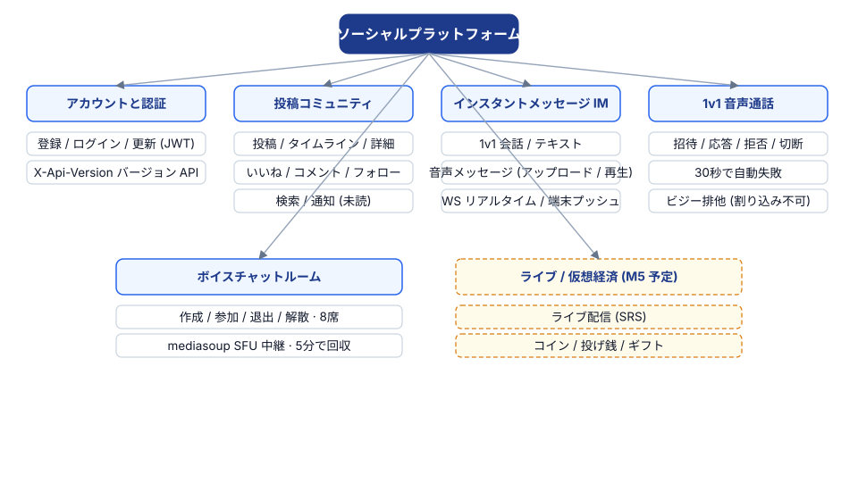
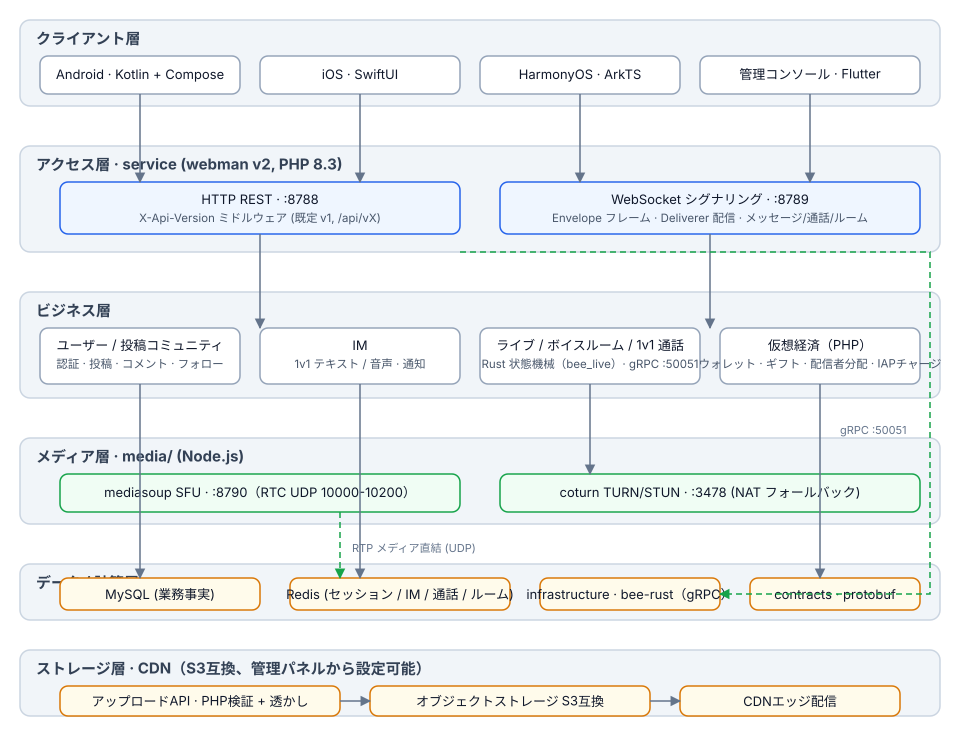
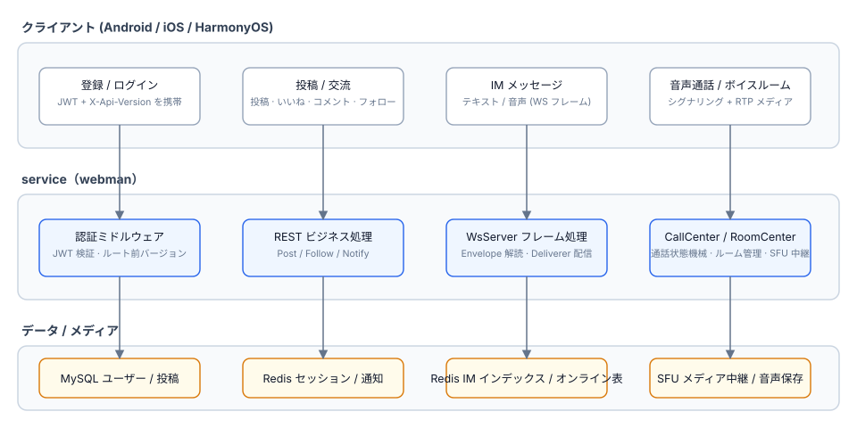
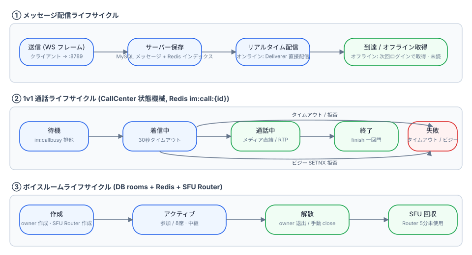
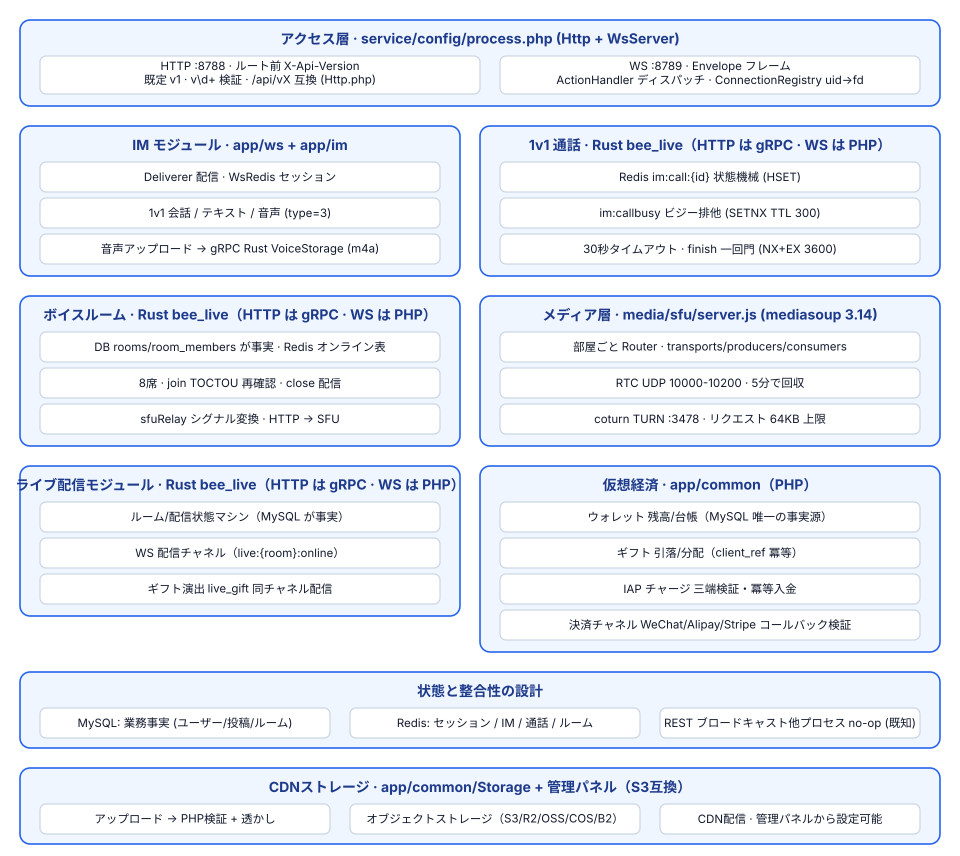

# ソーシャルプラットフォーム

**语言 / Languages:** [中文](../README.md) · [English](README.en.md) · [한국어](README.ko.md) · [Русский](README.ru.md) · [Deutsch](README.de.md) · [Français](README.fr.md) · [Español](README.es.md) · [Português](README.pt.md) · [हिन्दी](README.hi.md) · [العربية](README.ar.md) · [বাংলা](README.bn.md) · [Bahasa Indonesia](README.id.md) · [日本語](README.ja.md)

多言語ソーシャルプラットフォームのモノレポ：テキスト/画像コミュニティ + インスタントメッセージ + ライブ/ボイス + 仮想経済。

## プロジェクト紹介

- **3つのネイティブクライアント**：Android（Kotlin + Compose）、iOS（SwiftUI）、HarmonyOS（ArkTS）。Flutter製の管理コンソールもあり
- **ビジネスサービス**：webman v2（PHP 8.3）がRESTとWebSocketの両チャネルを提供。APIは `X-Api-Version` でバージョン管理（デフォルトv1、旧 `/api/vX` パスと互換）
- **自前メディア層**：mediasoup SFU + coturn TURNによる1v1音声通話・ボイスチャットルーム（8席）のメディア中継
- **状態の階層化**：MySQLはビジネスの事実、Redisはセッション / IM / 通話 / ルームのリアルタイム状態を担当
- **マイルストーン**：M0–M5を納品済み（音声メッセージ、1v1通話、ボイスチャットルーム、ライブ配信）。M6はlive/voice状態機械のRust移行を納品（PHPはgRPC経由でRustを直接呼び出し、サーキットブレーカー／デグレード／レート制限）

## 機能概要



## アーキテクチャ設計



## ビジネスコアフロー



## ライフサイクル



## 機能設計



## プロジェクト構成

| ディレクトリ | 説明 | 技術 |
|------|------|------|
| contracts/ | gRPC契約（proto、buf生成エントリ） | protobuf / buf |
| service/ | ユーザー向けビジネスサービス（REST :8788 + WS :8789） | webman v2 (PHP 8.3) |
| admin/ | 管理コンソール（open-adminベース） | webman v2 + Flutter |
| infrastructure/ | 高スループット計算層 | bee-rust (tonic) |
| media/sfu/ | 自前メディア層（mediasoup SFU :8790 + coturn :3478） | Node.js（M4で有効化） |
| apps/ | 3つのネイティブクライアント | SwiftUI / Kotlin+Compose / ArkTS |

service の内部構造：

```
service/
├── app/
│   ├── controller/   # RESTコントローラ（auth/post/follow/im/voice/...）
│   ├── ws/           # WsServer · Envelopeフレームプロトコル · Deliverer配信 · ConnectionRegistry
│   ├── call/         # CallCenter：1v1通話ステートマシン（30秒着信タイムアウト · 通話中は相互排他）
│   ├── room/         # RoomCenter：ボイスチャットルーム（8席 · SFUシグナリング変換）
│   ├── live/         # LiveCenter：ライブルーム（RTMPプッシュ / HLSプル · 弾幕 · 8席マイク接続）
│   ├── model/        # データモデル
│   ├── process/      # Http / WsServer カスタムプロセス
│   └── storage/      # 音声ファイル保存（m4a、DB非保存）
├── config/           # route.php（/api/v1 ルートグループ）· process.php（:8788/:8789）
└── tests/            # phpunit単体テスト + im_e2e.php / voice_e2e.php / live_e2e.php ブラックボックスE2E
```

## 使い方

### 依存関係

- PHP ≥ 8.3（composer）
- Redis（デフォルト 127.0.0.1:6379）
- Node.js ≥ 18（SFUローカルデバッグ用）
- Docker（SFU / coturn コンテナ）

### ビジネスサービスの起動

```bash
cd service
composer install
php start.php start -d      # HTTP :8788 · WS :8789
```

必要に応じて `service/.env` で `REDIS`、`SFU_URL`（デフォルト 127.0.0.1:8790）を設定してください。

### メディア層の起動

```bash
cd media/sfu
docker compose up -d --build   # SFU :8790（RTC UDP 10000-10200）· coturn :3478
```

### クライアント

| 端 | 開き方 / ビルド方法 | プラットフォーム要件 |
|----|----------------|----------|
| Android | `cd apps/android && ./gradlew assembleDebug` | Linux / macOS でビルド可能 |
| iOS | Xcode で `apps/ios/SocialApp` を開く | macOS が必要 |
| HarmonyOS | DevEco Studio で `apps/harmonyos` を開く | DevEco Studio が必要 |

### テスト

```bash
cd service
vendor/bin/phpunit                    # 単体テスト（79 tests / 230 assertions）

php tests/im_e2e.php                  # IMブラックボックスE2E（:8788/:8789 起動中 + Redis が必要）
php tests/voice_e2e.php               # 音声E2E：バージョン管理 / 音声メッセージ / 通話 / ボイスチャットルーム
php tests/live_e2e.php                # ライブE2E：ルーム / 弾幕 / マイク / クローズ（RTMPプッシュ、HLSプル）

cd media/sfu
npm run smoke                         # SFU /signal プロトコルのスモークテスト（Dockerコンテナまたはローカル node が必要）
```

## サポート歓迎

このプロジェクトが役に立ったら、QRコードをスキャンしてご支援ください。ありがとうございます！

**微信支付**


**支付宝**


**国際送金（銀行振込）**


このプロジェクトがお役に立ったなら、グローバル銀行送金での開発支援を歓迎します。

**受取人情報**

| 項目 | 内容 |
|------|------|
| 受取人名 | WANG KEXUN |
| 受取口座番号 | 881015918251 |

**受取銀行 — ZA Bank**

| 項目 | 内容 |
|------|------|
| SWIFT Code | AABLHKHHXXX |
| 銀行名 | ZA Bank Limited |
| 銀行番号 | 387 |
| 銀行住所 | Core F, Cyberport 3, 100 Cyberport Road, Hong Kong |

**クロスボーダー送金のコルレス銀行（必要な場合）**

> 以下はクロスボーダー送金用のコルレス銀行（中継銀行）の情報であり、受取銀行の情報ではありません。送金銀行にコルレス銀行の情報が必要かどうかお問い合わせください。

香港ドル・人民元・米ドルの送金におけるコルレス銀行は **Citibank** です：

| 項目 | 内容 |
|------|------|
| 銀行名 | Citibank N.A. Hong Kong |
| SWIFT Code | CITIHKHXXXX |
| 銀行番号 | 006 |
| 支店名 | Hong Kong Branch |
| 支店番号 | 391 |
| 銀行住所 | Citibank Tower, Citibank Plaza, 3 Garden Road, Central, Hong Kong |

その他の通貨での送金におけるコルレス銀行は **BNY Mellon** です：

| 項目 | 内容 |
|------|------|
| 銀行名 | THE BANK OF NEW YORK MELLON |
| SWIFT Code | IRVTUS3NXXX |
| 銀行住所 | THE BANK OF NEW YORK MELLON, 240 GREENWICH STREET, NEW YORK, United States |


## ドキュメント

- 全体設計：`superpowers/specs/2026-08-16-social-platform-design.md`
- M4音声設計：`superpowers/specs/2026-08-17-m4-voice-design.md`
- 実装計画：`superpowers/plans/2026-08-17-m4-voice.md`
