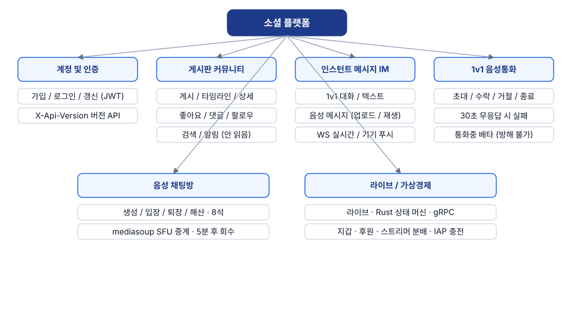
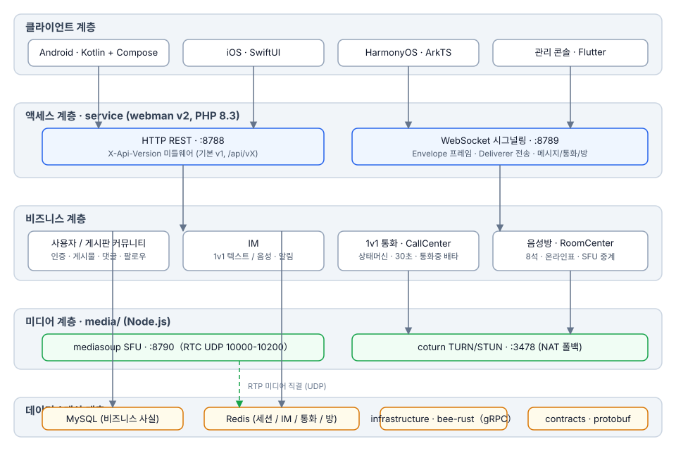
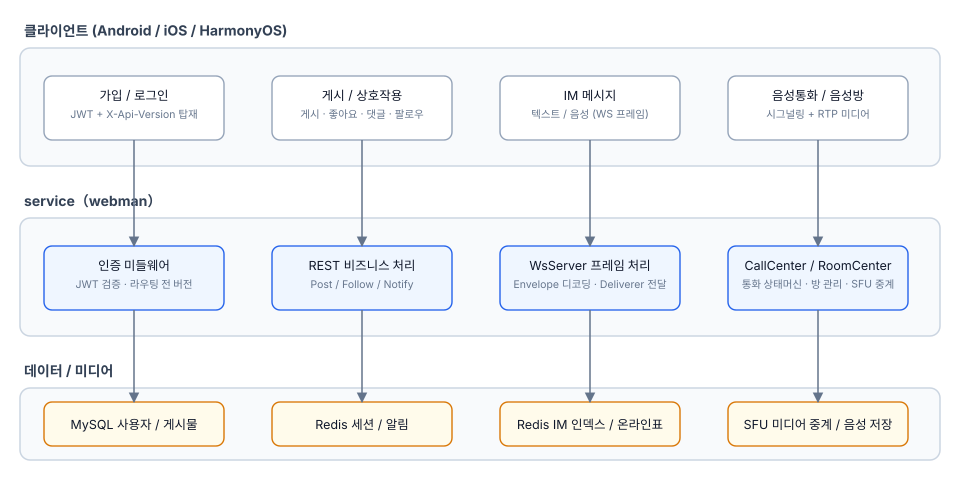
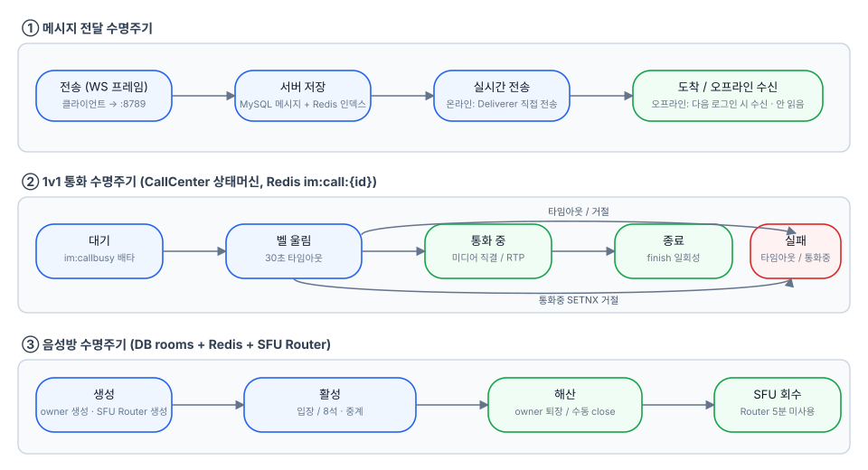
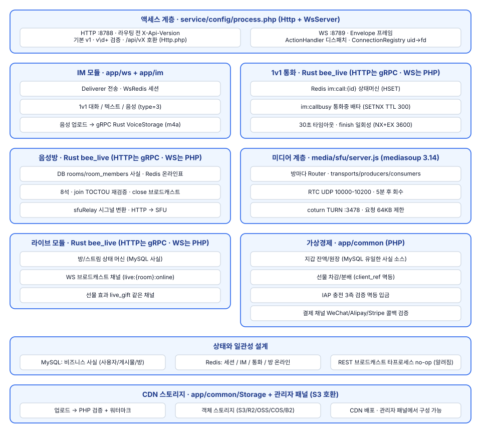

# 소셜 플랫폼

**语言 / Languages:** [中文](../README.md) · [English](README.en.md) · [한국어](README.ko.md) · [Русский](README.ru.md) · [Deutsch](README.de.md) · [Français](README.fr.md) · [Español](README.es.md) · [Português](README.pt.md) · [हिन्दी](README.hi.md) · [العربية](README.ar.md) · [বাংলা](README.bn.md) · [Bahasa Indonesia](README.id.md) · [日本語](README.ja.md)

다국어 소셜 플랫폼 모노레포: 텍스트/이미지 커뮤니티 + 인스턴트 메시징 + 라이브/음성 + 가상 경제.

## 프로젝트 소개

- **네이티브 클라이언트 3종**: Android(Kotlin + Compose), iOS(SwiftUI), HarmonyOS(ArkTS), Flutter 관리자 콘솔 포함
- **비즈니스 서비스**: webman v2(PHP 8.3)가 REST와 WebSocket 양 채널을 제공. 라이브 / 음성방 / 1v1 통화 상태 머신은 Rust로 마이그레이션됨(infrastructure/bee-rust). PHP 컨트롤러는 gRPC로 직접 연결; API는 `X-Api-Version`으로 버전 관리(기본 v1, 기존 `/api/vX` 경로와 호환)
- **자체 구축 미디어 계층**: mediasoup SFU + coturn TURN, 1v1 음성 통화 및 보이스 채팅방(8개 마이크 슬롯) 미디어 중계
- **상태 계층화**: MySQL은 비즈니스 데이터의 원천, Redis는 세션 / IM / 통화 / 룸의 실시간 상태 담당
- **마일스톤**: M0–M5 완료(음성 메시지, 1v1 통화, 보이스 채팅방, 라이브 스트리밍); M6a는 가상 경제 제공(지갑(잔액/원장, MySQL 단일 진실 소스), 선물 팁과 스트리머 분배, 모바일 IAP 충전(App Store / Google Play / Huawei)); M6b는 결제 채널 제공(충전 입금 골격(WeChat/Alipay/Stripe 콜백 서명 검증, 서버 측 가격 책정, 멱등 입금; 출금과 대사 제공 완료)); M6c는 CDN 스토리지 제공: 공급자를 관리자 패널에서 구성 가능(S3 호환: AWS S3 / Cloudflare R2 / Aliyun OSS / Tencent COS / Backblaze B2), 이미지/음성/파일은 객체 스토리지 + CDN으로 제공; M6d는 관리 보고서와 대시보드 통계를 제공: 보고서 모듈(사용자/결제/출금 — 날짜 필터, 집계, 추세, 분포, Excel 내보내기)과 시작 페이지의 플랫폼 통계 카드

## 기능 개요



## 아키텍처 설계



## 핵심 비즈니스 프로세스



## 라이프사이클



## 기능 설계



## 프로젝트 구조

| 디렉터리 | 설명 | 기술 |
|------|------|------|
| contracts/ | gRPC 계약(proto, buf 생성 진입점) | protobuf / buf |
| service/ | 사용자용 비즈니스 서비스(REST :8788 + WS :8789) | webman v2 (PHP 8.3) |
| admin/ | 관리자 콘솔(open-admin 기반) | webman v2 + Flutter |
| infrastructure/ | 고처리량 계산 계층(live/voice gRPC 서비스) | bee-rust (tonic) |
| media/sfu/ | 자체 구축 미디어 계층(mediasoup SFU :8790 + coturn :3478) | Node.js(M4에서 활성화) |
| apps/ | 네이티브 클라이언트 3종 | SwiftUI / Kotlin+Compose / ArkTS |

service 내부 구조:

```
service/
├── app/
│   ├── controller/   # REST 컨트롤러 (auth/post/follow/im/voice/wallet/gift/...)
│   ├── common/        # WalletService(잔액/원장/멱등) · GiftService(선물/분배)
│   ├── ws/           # WsServer · Envelope 프레임 프로토콜 · Deliverer 푸시 · ConnectionRegistry
│   ├── call/         # CallCenter: 1v1 통화 상태 머신 (M6에서 Rust로 마이그레이션, PHP 쪽은 WS 시그널링용으로 유지)
│   ├── room/         # RoomCenter: 보이스 채팅방 (M6에서 Rust로 마이그레이션, PHP 쪽은 WS 시그널링용으로 유지)
│   ├── live/         # LiveCenter: 라이브 룸 (M6에서 Rust로 마이그레이션, PHP 쪽은 WS 시그널링용으로 유지)
│   ├── model/        # 데이터 모델
│   ├── process/      # Http / WsServer 커스텀 프로세스
│   └── storage/      # 음성 파일 저장소(m4a, M6부터 Rust VoiceStorage가 담당)
├── config/           # route.php(/api/v1 라우트 그룹) · process.php(:8788/:8789)
└── tests/            # phpunit 단위 테스트 + im_e2e.php / voice_e2e.php / live_e2e.php / wallet_e2e.php 블랙박스 E2E
```

## 원클릭 설치

사전 요구 사항: PHP ≥ 8.3(composer), MySQL, Redis(Docker는 선택 사항, 미디어 계층용).

```bash
./install.sh
```

스크립트 내용: `service/`와 `admin/`에서 각각 `composer install` 실행; `database/install.sql`로 데이터베이스 생성(멱등, CREATE IF NOT EXISTS); 두 서비스의 `.env` 생성(랜덤 JWT / APP 키, 기존 파일은 덮어쓰지 않음); 선택적으로 미디어 계층 시작(`docker compose up -d`로 media/sfu와 coturn, `--skip-media`로 건너뛰기); 마지막으로 각 서비스의 시작 명령과 접속 주소 출력.

## 수동 설치

1. 의존성 설치:

```bash
cd service && composer install
cd admin && composer install
```

2. 데이터베이스 생성:

```bash
mysql -u root -p < database/install.sql
```

3. 환경 구성: `service/.env.example`와 `admin/.env.example`를 `.env`로 복사하고 DB / Redis / JWT / APP 키 입력(프로덕션에서는 반드시 랜덤 키 사용).

4. 서비스 시작:

```bash
cd service && php start.php start -d   # HTTP :8788 · WS :8789
cd admin && php start.php start -d     # admin :8787
```

5. 미디어 계층 시작(선택 사항):

```bash
cd media/sfu && docker compose up -d --build   # SFU :8790 · coturn :3478
```

## 사용 방법

### 의존성

- PHP ≥ 8.3(composer)
- Redis(기본 127.0.0.1:6379)
- Node.js ≥ 18(SFU 로컬 디버깅)
- Docker(SFU / coturn 컨테이너)

### 비즈니스 서비스 시작

```bash
cd service
composer install
php start.php start -d      # HTTP :8788 · WS :8789
```

필요에 따라 `service/.env`에서 `REDIS`, `SFU_URL`(기본 127.0.0.1:8790)을 구성하세요.

### 미디어 계층 시작

```bash
cd media/sfu
docker compose up -d --build   # SFU :8790(RTC UDP 10000-10200) · coturn :3478
```

### 클라이언트

| 플랫폼 | 열기 / 빌드 방법 | 플랫폼 요구사항 |
|----|----------------|----------|
| Android | `cd apps/android && ./gradlew assembleDebug` | Linux / macOS에서 빌드 가능 |
| iOS | Xcode에서 `apps/ios/SocialApp` 열기 | macOS 필요 |
| HarmonyOS | DevEco Studio에서 `apps/harmonyos` 열기 | DevEco Studio 필요 |

### 테스트

```bash
cd service
vendor/bin/phpunit                    # 단위 테스트(79 tests / 230 assertions)

php tests/im_e2e.php                  # IM 블랙박스 E2E(:8788/:8789 실행 중 + Redis 필요)
php tests/voice_e2e.php               # 음성 E2E: 버전 관리 / 음성 메시지 / 통화 / 보이스 채팅방
php tests/live_e2e.php                # 라이브 E2E: 룸 / 단마쿠 / 마이크 / 닫기(RTMP 푸시, HLS 풀)

cd media/sfu
npm run smoke                         # SFU /signal 프로토콜 스모크(Docker 컨테이너 또는 로컬 node 필요)
```

## 후원

이 프로젝트가 도움이 되셨다면 QR 코드를 스캔하여 후원해 주세요, 감사합니다!

**위챗페이**


**알리페이**


**글로벌 송금 (은행 송금)**


이 프로젝트가 도움이 되셨다면 글로벌 은행 송금으로 개발을 지원해 주세요.

**수취인 정보**

| 항목 | 내용 |
|------|------|
| 수취인 이름 | WANG KEXUN |
| 수취인 계좌 번호 | 881015918251 |

**수취 은행 — ZA Bank**

| 항목 | 내용 |
|------|------|
| SWIFT Code | AABLHKHHXXX |
| 은행 이름 | ZA Bank Limited |
| 은행 번호 | 387 |
| 은행 주소 | Core F, Cyberport 3, 100 Cyberport Road, Hong Kong |

**해외 송금 중개 은행(필요 시)**

> 아래는 해외 송금 중개 은행(중계 은행) 정보이며, 수취 은행 정보가 아닙니다. 송금 은행에 중개 은행 정보가 필요한지 문의하세요.

홍콩 달러, 위안화, 미 달러 송금의 중개 은행은 **Citibank**입니다:

| 항목 | 내용 |
|------|------|
| 은행 이름 | Citibank N.A. Hong Kong |
| SWIFT Code | CITIHKHXXXX |
| 은행 번호 | 006 |
| 지점 이름 | Hong Kong Branch |
| 지점 번호 | 391 |
| 은행 주소 | Citibank Tower, Citibank Plaza, 3 Garden Road, Central, Hong Kong |

기타 통화 송금 시 중개 은행은 **BNY Mellon**입니다:

| 항목 | 내용 |
|------|------|
| 은행 이름 | THE BANK OF NEW YORK MELLON |
| SWIFT Code | IRVTUS3NXXX |
| 은행 주소 | THE BANK OF NEW YORK MELLON, 240 GREENWICH STREET, NEW YORK, United States |

### 암호화폐 후원 (Crypto Donation)

이 프로젝트가 도움이 되셨다면, QR 코드를 스캔하여 후원해 주세요. 감사합니다!

| 네트워크 (Network) | QR 코드 (QR Code) | 지갑 주소 (Wallet Address) |
|---|---|---|
| BNB Smart Chain (BEP20) | [](coin/1.jpg) | `0x355d429f97511897ccb4e271ec888205f9ab6629` |
| Tron (TRC20) | [](coin/2.jpg) | `TEdDHWLajt1XvqtPDWmQctdrJaC3pzZZzz` |
| Ethereum (ERC20) | [](coin/3.jpg) | `0x355d429f97511897ccb4e271ec888205f9ab6629` |
| Aptos | [](coin/4.jpg) | `0x836e3780edfc3f7b2372b39e2a1a3a5d7adfaccd96c726f21cfde1b50dd68030` |
| Plasma | [](coin/5.jpg) | `0x355d429f97511897ccb4e271ec888205f9ab6629` |
| Polygon POS | [](coin/6.jpg) | `0x355d429f97511897ccb4e271ec888205f9ab6629` |
| Solana | [](coin/7.jpg) | `2hfhboHdmdrYsY25XfQSsEWxq5ip4EQsR7f4AzSRMUyr` |
| The Open Network (TON) | [](coin/8.jpg) | `UQB9kFQohzmXUir9QSSZq01iwl9aQZIDdBpNmDklljRtCoGK` |
| Arbitrum One | [](coin/9.jpg) | `0x355d429f97511897ccb4e271ec888205f9ab6629` |
| AVAX C-Chain | [](coin/10.jpg) | `0x355d429f97511897ccb4e271ec888205f9ab6629` |

## 문서

- 전체 설계: `superpowers/specs/2026-08-16-social-platform-design.md`
- M4 음성 설계: `superpowers/specs/2026-08-17-m4-voice-design.md`
- 구현 계획: `superpowers/plans/2026-08-17-m4-voice.md`
