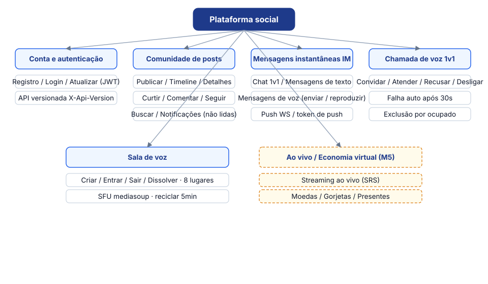
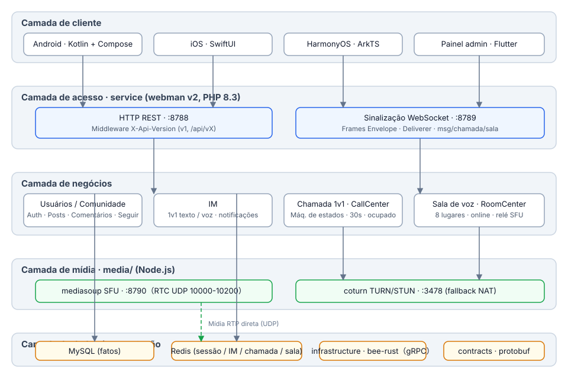
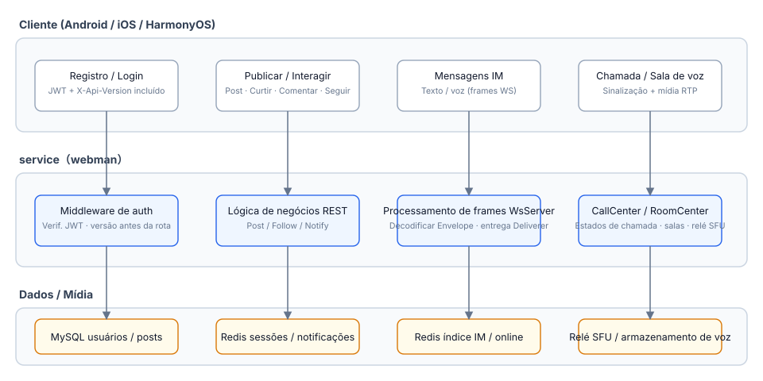
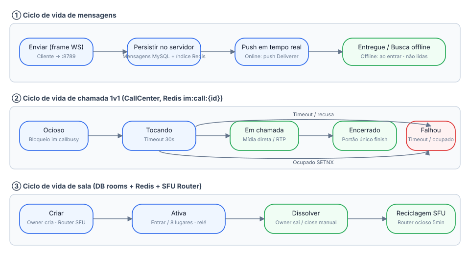
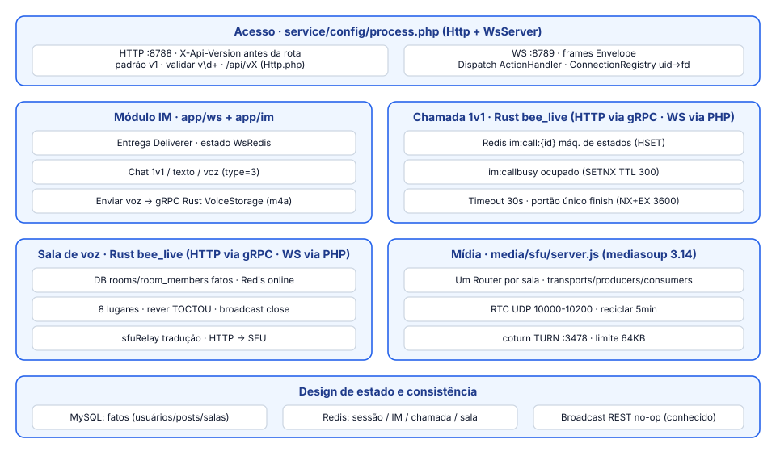

# Plataforma Social

**语言 / Languages:** [中文](../README.md) · [English](README.en.md) · [한국어](README.ko.md) · [Русский](README.ru.md) · [Deutsch](README.de.md) · [Français](README.fr.md) · [Español](README.es.md) · [Português](README.pt.md) · [हिन्दी](README.hi.md) · [العربية](README.ar.md) · [বাংলা](README.bn.md) · [Bahasa Indonesia](README.id.md) · [日本語](README.ja.md)

Monorepo de plataforma social multilíngue: comunidade de texto/imagem + mensagens instantâneas + lives/voz + economia virtual.

## Apresentação do projeto

- **Três clientes nativos**: Android (Kotlin + Compose), iOS (SwiftUI), HarmonyOS (ArkTS), além de um painel administrativo em Flutter
- **Serviços de negócio**: webman v2 (PHP 8.3) atende tanto REST quanto WebSocket; as máquinas de estado de lives/salas de voz/chamadas 1v1 migraram para Rust (infrastructure/bee-rust); os controladores PHP conectam-se diretamente via gRPC; a API é versionada via `X-Api-Version` (padrão v1, compatível com os caminhos antigos `/api/vX`)
- **Camada de mídia própria**: mediasoup SFU + coturn TURN para o encaminhamento de mídia em chamadas de voz 1v1 e salas de voz (8 assentos)
- **Camadas de estado**: MySQL como fonte de verdade dos negócios, Redis para o estado em tempo real de sessão / IM / chamadas / salas
- **Marcos**: M0–M5 entregues (mensagens de voz, chamadas 1v1, salas de voz, transmissão ao vivo); M6a entrega a economia virtual: carteira (saldo/registro, MySQL como fonte única da verdade), gorjetas com presentes e partilha com o streamer, e recarga IAP móvel (App Store / Google Play / Huawei); M6b entrega canais de pagamento: esqueleto de crédito de recarga (verificação de assinatura de callback WeChat/Alipay/Stripe, preços no servidor, crédito idempotente; saque e conciliação entregues)

## Visão geral dos recursos



## Arquitetura



## Processos de negócio principais



## Ciclo de vida



## Design de módulos



## Estrutura do projeto

| Diretório | Descrição | Tecnologia |
|------|------|------|
| contracts/ | Contratos gRPC (proto, ponto de entrada da geração buf) | protobuf / buf |
| service/ | Serviço de negócio do lado do usuário (REST :8788 + WS :8789) | webman v2 (PHP 8.3) |
| admin/ | Painel administrativo (baseado em open-admin) | webman v2 + Flutter |
| infrastructure/ | Camada de computação de alta vazão (serviços gRPC live/voz) | bee-rust (tonic) |
| media/sfu/ | Camada de mídia própria (mediasoup SFU :8790 + coturn :3478) | Node.js (ativado no M4) |
| apps/ | Três clientes nativos | SwiftUI / Kotlin+Compose / ArkTS |

Estrutura interna do service:

```
service/
├── app/
│   ├── controller/   # Controladores REST (auth/post/follow/im/voice/wallet/gift/...)
│   ├── common/        # WalletService (saldo/registro/idempotente) · GiftService (presentes/parte)
│   ├── ws/           # WsServer · protocolo de frames Envelope · push do Deliverer · ConnectionRegistry
│   ├── call/         # CallCenter: máquina de estados de chamada 1v1 (migrado para Rust no M6; o lado PHP é mantido para sinalização WS)
│   ├── room/         # RoomCenter: salas de voz (migrado para Rust no M6; o lado PHP é mantido para sinalização WS)
│   ├── live/         # LiveCenter: salas ao vivo (migrado para Rust no M6; o lado PHP é mantido para sinalização WS)
│   ├── model/        # Modelos de dados
│   ├── process/      # Processos personalizados Http / WsServer
│   └── storage/      # Armazenamento de arquivos de voz (m4a; gerido pelo Rust VoiceStorage desde M6)
├── config/           # route.php (grupo de rotas /api/v1) · process.php (:8788/:8789)
└── tests/            # Testes unitários phpunit + E2E de caixa preta im_e2e.php / voice_e2e.php / live_e2e.php / wallet_e2e.php
```

## Como usar

### Dependências

- PHP ≥ 8.3 (composer)
- Redis (padrão 127.0.0.1:6379)
- Node.js ≥ 18 (depuração local do SFU)
- Docker (containers SFU / coturn)

### Iniciar o serviço de negócio

```bash
cd service
composer install
php start.php start -d      # HTTP :8788 · WS :8789
```

Configure `REDIS` e `SFU_URL` (padrão 127.0.0.1:8790) em `service/.env` conforme necessário.

### Iniciar a camada de mídia

```bash
cd media/sfu
docker compose up -d --build   # SFU :8790 (RTC UDP 10000-10200) · coturn :3478
```

### Clientes

| Plataforma | Como abrir / compilar | Requisitos da plataforma |
|----|----------------|----------|
| Android | `cd apps/android && ./gradlew assembleDebug` | Compilável em Linux / macOS |
| iOS | Abrir `apps/ios/SocialApp` no Xcode | Requer macOS |
| HarmonyOS | Abrir `apps/harmonyos` no DevEco Studio | Requer DevEco Studio |

### Testes

```bash
cd service
vendor/bin/phpunit                    # Testes unitários (79 tests / 230 assertions)

php tests/im_e2e.php                  # E2E de caixa preta IM (requer :8788/:8789 em execução + Redis)
php tests/voice_e2e.php               # E2E de voz: versionamento / mensagens de voz / chamadas / salas de voz
php tests/live_e2e.php                # E2E ao vivo: salas / danmaku / microfones / fechamento (push RTMP, pull HLS)

cd media/sfu
npm run smoke                         # Smoke test do protocolo SFU /signal (requer container Docker ou node local)
```

## Apoio bem-vindo

Se este projeto ajudou você, escaneie o QR code para nos apoiar, obrigado!

**WeChat Pay**


**Alipay**


**Transferência global (transferência bancária)**


Se este projeto foi útil para você, apoie o desenvolvimento com uma transferência bancária internacional.

**Informações do beneficiário**

| Campo | Conteúdo |
|------|------|
| Nome do beneficiário | WANG KEXUN |
| Número da conta do beneficiário | 881015918251 |

**Banco receptor — ZA Bank**

| Campo | Conteúdo |
|------|------|
| SWIFT Code | AABLHKHHXXX |
| Nome do banco | ZA Bank Limited |
| Código do banco | 387 |
| Endereço do banco | Core F, Cyberport 3, 100 Cyberport Road, Hong Kong |

**Banco correspondente para remessas transfronteiriças (se necessário)**

> As informações a seguir são do banco correspondente (banco intermediário) para remessas transfronteiriças, e não do banco receptor. Consulte seu banco remetente para saber se as informações do banco correspondente são necessárias.

O banco correspondente para remessas em dólar de Hong Kong, renminbi e dólar americano é o **Citibank**:

| Campo | Conteúdo |
|------|------|
| Nome do banco | Citibank N.A. Hong Kong |
| SWIFT Code | CITIHKHXXXX |
| Código do banco | 006 |
| Nome da agência | Hong Kong Branch |
| Código da agência | 391 |
| Endereço do banco | Citibank Tower, Citibank Plaza, 3 Garden Road, Central, Hong Kong |

Para remessas em outras moedas, o banco correspondente é o **BNY Mellon**:

| Campo | Conteúdo |
|------|------|
| Nome do banco | THE BANK OF NEW YORK MELLON |
| SWIFT Code | IRVTUS3NXXX |
| Endereço do banco | THE BANK OF NEW YORK MELLON, 240 GREENWICH STREET, NEW YORK, United States |


## Documentação

- Design geral: `superpowers/specs/2026-08-16-social-platform-design.md`
- Design de voz M4: `superpowers/specs/2026-08-17-m4-voice-design.md`
- Plano de implementação: `superpowers/plans/2026-08-17-m4-voice.md`
