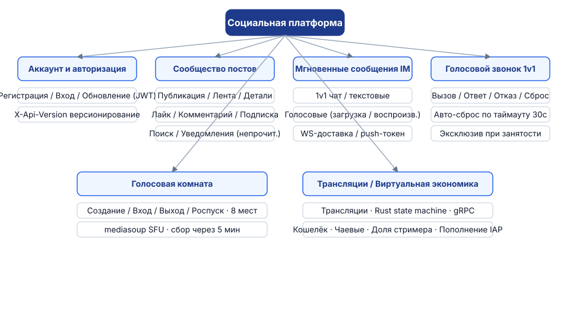
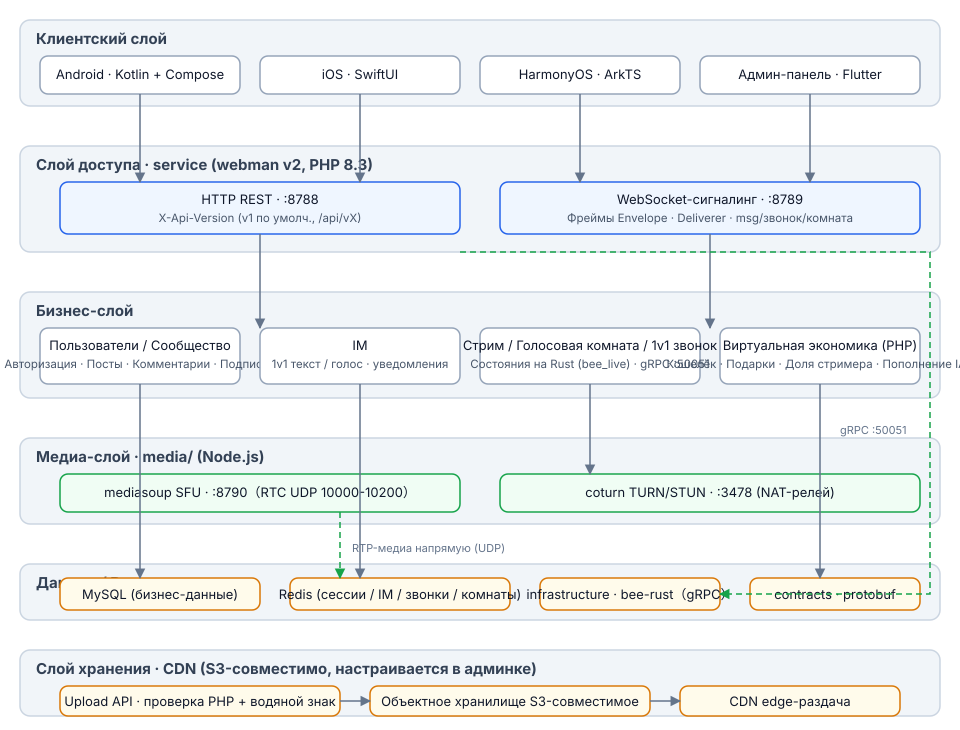
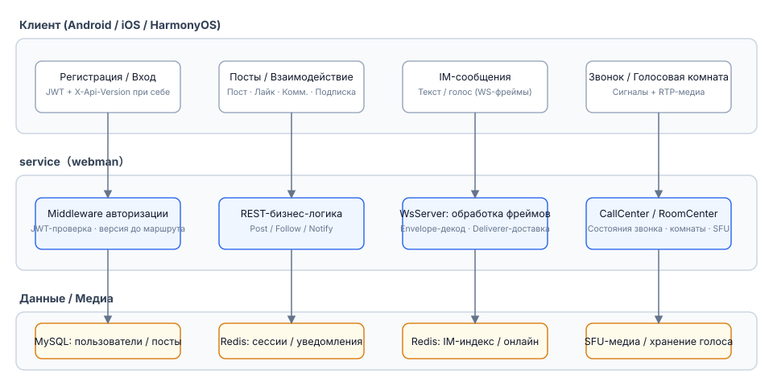
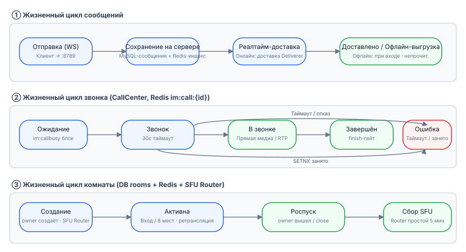
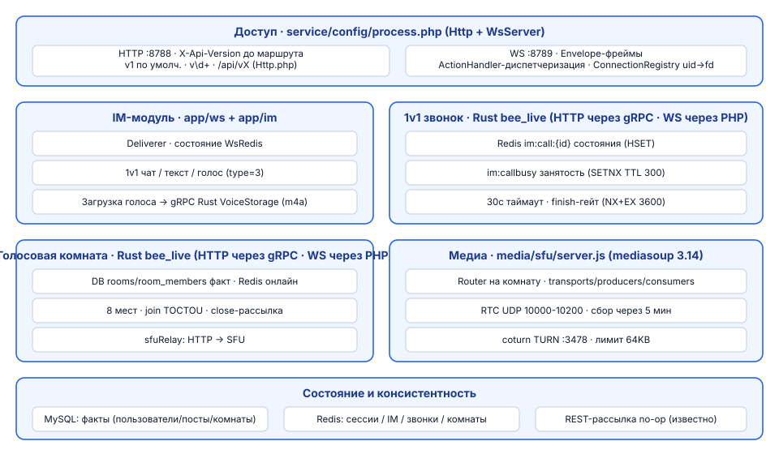

# Социальная платформа

**语言 / Languages:** [中文](../README.md) · [English](README.en.md) · [한국어](README.ko.md) · [Русский](README.ru.md) · [Deutsch](README.de.md) · [Français](README.fr.md) · [Español](README.es.md) · [Português](README.pt.md) · [हिन्दी](README.hi.md) · [العربية](README.ar.md) · [বাংলা](README.bn.md) · [Bahasa Indonesia](README.id.md) · [日本語](README.ja.md)

Монорепозиторий многоязычной социальной платформы: текстово-графическое сообщество + мгновенные сообщения + стримы/голос + виртуальная экономика.

## О проекте

- **Три нативных клиента**: Android (Kotlin + Compose), iOS (SwiftUI), HarmonyOS (ArkTS), плюс админ-панель на Flutter
- **Бизнес-сервис**: webman v2 (PHP 8.3) обслуживает оба канала — REST и WebSocket; API версионируется через `X-Api-Version` (по умолчанию v1, совместимо со старыми путями `/api/vX`)
- **Собственный медиаслой**: mediasoup SFU + coturn TURN для пересылки медиа в голосовых звонках 1v1 и голосовых комнатах (8 мест)
- **Многоуровневое состояние**: MySQL — источник бизнес-данных, Redis — реальное время для состояния сессий / IM / звонков / комнат
- **Вехи**: M0–M5 сданы (голосовые сообщения, звонки 1v1, голосовые комнаты, стриминг); M6 — виртуальная экономика

## Обзор функций



## Архитектура



## Основные бизнес-процессы



## Жизненный цикл



## Дизайн модулей



## Структура проекта

| Каталог | Описание | Технологии |
|------|------|------|
| contracts/ | gRPC-контракты (proto, точка входа генерации buf) | protobuf / buf |
| service/ | Бизнес-сервис для пользователей (REST :8788 + WS :8789) | webman v2 (PHP 8.3) |
| admin/ | Админ-панель (на базе open-admin) | webman v2 + Flutter |
| infrastructure/ | Вычислительный слой высокой пропускной способности | bee-rust (tonic) |
| media/sfu/ | Собственный медиаслой (mediasoup SFU :8790 + coturn :3478) | Node.js (включён с M4) |
| apps/ | Три нативных клиента | SwiftUI / Kotlin+Compose / ArkTS |

Внутренняя структура service:

```
service/
├── app/
│   ├── controller/   # REST-контроллеры (auth/post/follow/im/voice/...)
│   ├── ws/           # WsServer · протокол кадров Envelope · доставка через Deliverer · ConnectionRegistry
│   ├── call/         # CallCenter: конечный автомат звонка 1v1 (таймаут звонка 30 с · взаимное исключение при занятости)
│   ├── room/         # RoomCenter: голосовые комнаты (8 мест · трансляция сигналов SFU)
│   ├── live/         # LiveCenter: стрим-комнаты (push RTMP / pull HLS · данмаку · связь 8 микрофонов)
│   ├── model/        # Модели данных
│   ├── process/      # Пользовательские процессы Http / WsServer
│   └── storage/      # Хранение голосовых файлов (m4a, не в БД)
├── config/           # route.php (группа маршрутов /api/v1) · process.php (:8788/:8789)
└── tests/            # phpunit-тесты + чёрный ящик E2E: im_e2e.php / voice_e2e.php / live_e2e.php
```

## Использование

### Зависимости

- PHP ≥ 8.3 (composer)
- Redis (по умолчанию 127.0.0.1:6379)
- Node.js ≥ 18 (локальная отладка SFU)
- Docker (контейнеры SFU / coturn)

### Запуск бизнес-сервиса

```bash
cd service
composer install
php start.php start -d      # HTTP :8788 · WS :8789
```

При необходимости настройте `REDIS`, `SFU_URL` (по умолчанию 127.0.0.1:8790) в `service/.env`.

### Запуск медиаслоя

```bash
cd media/sfu
docker compose up -d --build   # SFU :8790 (RTC UDP 10000-10200) · coturn :3478
```

### Клиенты

| Платформа | Как открыть / собрать | Требования |
|----|----------------|----------|
| Android | `cd apps/android && ./gradlew assembleDebug` | Сборка на Linux / macOS |
| iOS | Открыть `apps/ios/SocialApp` в Xcode | Требуется macOS |
| HarmonyOS | Открыть `apps/harmonyos` в DevEco Studio | Требуется DevEco Studio |

### Тесты

```bash
cd service
vendor/bin/phpunit                    # Модульные тесты (79 tests / 230 assertions)

php tests/im_e2e.php                  # Чёрный ящик E2E для IM (нужны запущенные :8788/:8789 + Redis)
php tests/voice_e2e.php               # Голосовой E2E: версии / голосовые сообщения / звонки / голосовые комнаты
php tests/live_e2e.php                # Стрим-E2E: комнаты / данмаку / микрофоны / закрытие (push RTMP, pull HLS)

cd media/sfu
npm run smoke                         # Смоук-тест протокола SFU /signal (нужен Docker-контейнер или локальный node)
```

## Поддержка приветствуется

Если этот проект вам помог, отсканируйте QR-код и поддержите нас, спасибо!

**WeChat Pay**


**Alipay**


**Глобальный перевод (банковский перевод)**


Если проект вам полезен, поддержите разработку банковским переводом по всему миру.

**Информация о получателе**

| Поле | Значение |
|------|------|
| Имя получателя | WANG KEXUN |
| Номер счёта получателя | 881015918251 |

**Банк получателя — ZA Bank**

| Поле | Значение |
|------|------|
| SWIFT Code | AABLHKHHXXX |
| Название банка | ZA Bank Limited |
| Код банка | 387 |
| Адрес банка | Core F, Cyberport 3, 100 Cyberport Road, Hong Kong |

**Банк-корреспондент для трансграничных переводов (при необходимости)**

> Ниже приведены данные банка-корреспондента (банка-посредника) для трансграничных переводов, а не банка получателя. Уточните в банке-отправителе, нужны ли данные банка-корреспондента.

Банк-корреспондент для переводов в гонконгских долларах, юанях и долларах США — **Citibank**:

| Поле | Значение |
|------|------|
| Название банка | Citibank N.A. Hong Kong |
| SWIFT Code | CITIHKHXXXX |
| Код банка | 006 |
| Название филиала | Hong Kong Branch |
| Код филиала | 391 |
| Адрес банка | Citibank Tower, Citibank Plaza, 3 Garden Road, Central, Hong Kong |

Для переводов в других валютах банк-корреспондент — **BNY Mellon**:

| Поле | Значение |
|------|------|
| Название банка | THE BANK OF NEW YORK MELLON |
| SWIFT Code | IRVTUS3NXXX |
| Адрес банка | THE BANK OF NEW YORK MELLON, 240 GREENWICH STREET, NEW YORK, United States |


## Документация

- Общий дизайн: `superpowers/specs/2026-08-16-social-platform-design.md`
- Голосовой дизайн M4: `superpowers/specs/2026-08-17-m4-voice-design.md`
- План реализации: `superpowers/plans/2026-08-17-m4-voice.md`
